# TOMEs View System Analysis

## Overview

The TOMEs View system is a sophisticated component that allows users to compose views from both device parameters and user-created events. This analysis details its architectural design, data flow mechanisms, and database structure.

Views are critical to the functioning of the `export` system, which is used to deliver the composed data to various data sources of the customer's choosing (e.g. BBIS for donation data integration)

### Data Flow from Device to Views
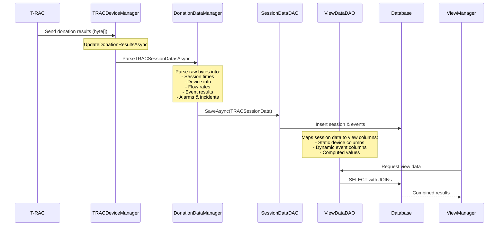

### Real T-RAC Session Data Example

Based on actual test data, here's how a T-RAC session is structured and parsed:

#### 1. Raw Binary Data Structure
```
[48, 0, 0, 0, 0, 0, 77, 69, 45, 84, 82, 65, 67, 50] // "ME-TRAC2" device identifier
[1]                                                   // Session count
[231, 7, 3, 12, 2, 51, 9]                            // Start time bytes
[Event Data...]                                       // Variable length event data
```

#### 2. Parsed Session Components
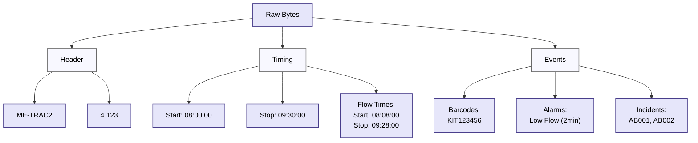

#### 3. Events Data Example
```json
{
    "event": {
        "name": "Event 1",
        "type": 0,  // BARCODE_SCAN
        "value": "KIT123456"
    },
    "incident": {
        "name": "Incident Event 2",
        "manualInput": "AB001",
        "selectedIncidents": [1, 2, 3]
    },
    "alarm": {
        "type": 1,  // LOW_FLOW
        "startTime": "08:45:00",
        "minutes": 2,
        "seconds": 0,
        "information": 110  // Flow rate info
    }
}
```

### Detailed Event Parsing Process

The `DonationDataManagerBase` processes binary data through specialized parsers for different event types. Each parser handles specific data formats and validation rules:

#### Event Type Processing Details


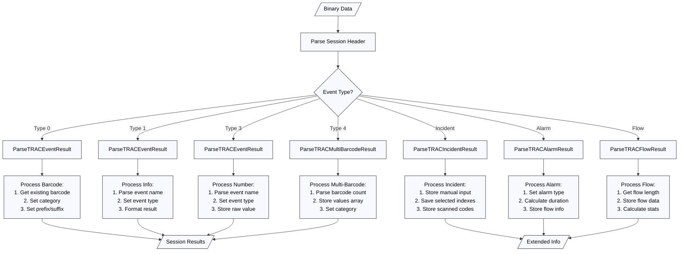

1. **ParseTRACEventResult (Type 0, 1, 3)**
   ```
   [20 bytes] Event Name
   [1 byte]  Event Type
   [25 bytes] Event Result
   ```
   - Type 0 (Barcode): Validates against existing barcodes, sets category
   - Type 1 (Info): Formats result based on event type (`Approval`, `Info`, `Picture`)
   - Type 3 (Number): Stores raw numerical value

2. **ParseTRACMultiBarcodeResult (Type 4)**
   ```
   [20 bytes] Event Name
   [1 byte]  Barcode Count
   [25 bytes × Count] Barcode Values
   ```
   - Handles multiple barcode scans in single event
   - Validates each barcode against patterns
   - Links to existing barcode definitions

3. **ParseTRACIncidentResult**
   ```
   [20 bytes] Event Name
   [2 bytes] Reserved
   [25 bytes] Manual Input
   [1 byte]  Selected Incidents Count
   [1 byte × Count] Selected Indexes
   [1 byte]  Scanned Barcodes Count
   [25 bytes × Count] Scanned Values
   ```
   - Records incident details
   - Maps selected indexes to known incidents
   - Stores associated barcode scans

4. **ParseTRACAlarmResult**
   ```
   [1 byte]  Alarm Type
   [3 bytes] Start Time
   [1 byte]  Minutes
   [1 byte]  Seconds
   [2 bytes] Flow Information
   ```
   - Calculates duration from minutes/seconds
   - Converts time relative to session start
   - Stores flow rate during alarm

5. **ParseTRACFlowResult**
   ```
   [2 bytes] Flow Length
   [N bytes] Flow Data (where N = Length)
   ```

   - Stores raw sensor/weight data


### Database Storage Structure

The system employs a sophisticated multi-table approach for storing session data:

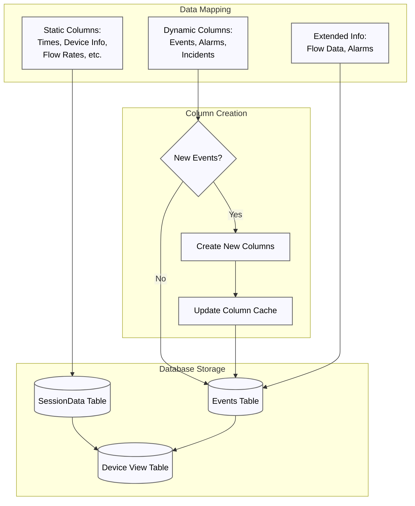

The system supports dynamic column creation through ViewDataDao, which:
1. Automatically detects new event types
2. Creates necessary database columns
3. Maintains a column cache for performance
4. Handles data mapping between session objects and database columns
5. Manages relationships between core tables

## Core Components

#### View Building Process
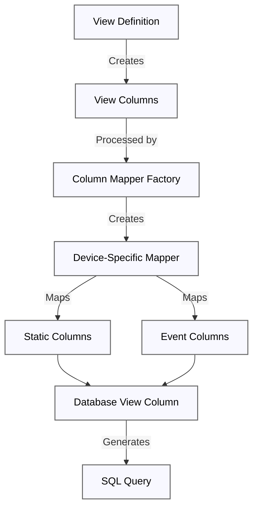

#### Data Transformation Flow
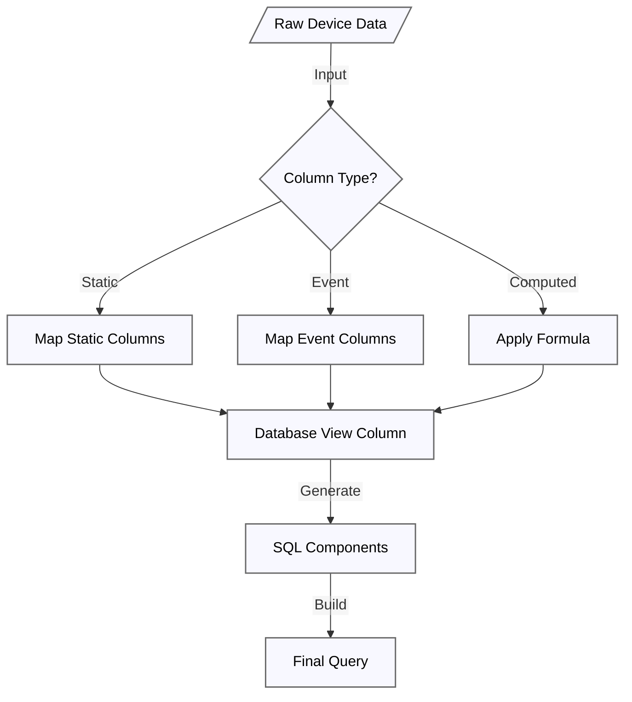

### 1. View Column Structure

#### Database Schema
```sql
CREATE TABLE ViewColumns (
    ID INT PRIMARY KEY,
    COLUMN_NAME VARCHAR(255),     -- Physical column name
    CLASS_NAME VARCHAR(255),      -- e.g., SessionData, EventResult
    VIEW_ID INT,                 -- Parent view reference
    SORT_ORDER INT,             -- Column sort position
    VIEW_ORDER INT,             -- Display order in view
    KEY_NAME VARCHAR(255),      -- Event key identifier
    KEY_VALUE VARCHAR(255),     -- Event key value
    SORT_TYPE INT,             -- Sorting configuration
    WIDTH INT,                 -- Display width
    ALIAS VARCHAR(255),        -- Display name
    HIDDEN BIT,               -- Visibility flag
    IS_CUSTOM BIT,           -- Custom column indicator
    DEVICE_TYPE INT,         -- Type of device (TRAC, TACE, etc.)
    COLUMN_TYPE INT,         -- Data type of the column
    FROM_VIEW_ID INT,        -- Reference to source view
    DEPRECATED BIT          -- Deprecation status
);
```

#### Column Types and Classifications

1. **Static Device Columns**
   - Tied to specific device types (TRAC, TACE, TISs, etc.)
   - Pre-defined mapping in device-specific mappers
   - Example from TRAC:
     ```csharp
     case TRACViewConstants.SessionDataClass:
         switch (viewColumn.ColumnName) {
             case TRACViewConstants.DurationColumn:
             case TRACViewConstants.AlarmsCountColumn:
             // Other device-specific columns
         }
     ```

2. **Dynamic Event Columns**
   - Created from user-defined events
   - Stored in events table with dynamic mapping
   - Identified by CLASS_NAME (EventResult, NumberResult, etc.)

### 2. Column Mapping System

#### Mapping Hierarchy
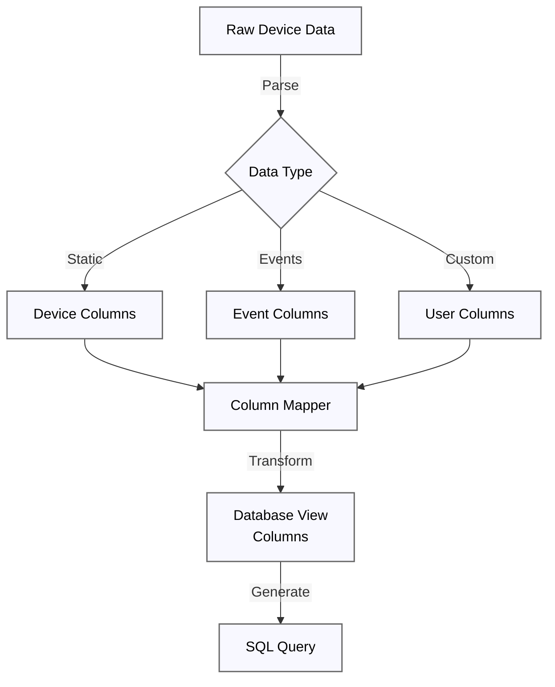

#### Column Mapper Implementation
1. **Base Mapper**
   ```csharp
   public abstract class ColumnMapper : IColumnMapper {
       protected DatabaseViewColumn MapViewDataColumn(
           ViewColumn viewColumn, 
           string tableName, 
           bool isReviewableView, 
           string dbColumnName)
       {
           if (viewColumn.IsExportedColumn()) {
               return MapExportedColumn(...);
           }
           // Standard column mapping
           return new DatabaseViewColumn(tableName, dbColumnName, viewColumn);
       }
   }
   ```

2. **Device-Specific Mapping**
   ```csharp
   public class TRACColumnMapper : DeviceColumnMapper {
       public override DatabaseViewColumn Map(
           ViewColumn viewColumn, 
           string tableName, 
           bool isReviewableView, 
           bool isLocalTime)
       {
           switch (viewColumn.ClassName) {
               case TRACViewConstants.SessionDataClass:
                   // Device-specific mapping logic
               case TRACViewConstants.EventResultClass:
                   // Event data mapping
           }
       }
   }
   ```

### 3. Data Flow

#### View Creation Process
1. User defines view with columns
2. System validates column definitions
3. Columns are stored in ViewColumns table
4. Appropriate mappers are registered for the device type

#### Query Generation
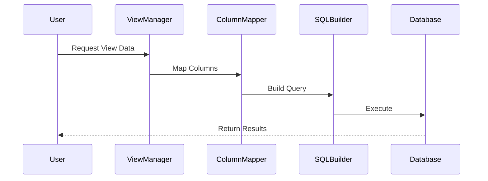

### 4. Special Column Types

#### 1. Barcode Columns
- Special handling for prefix/suffix
- Category and value separation
- Skipped event handling
```csharp
protected override DatabaseViewColumn MapBarcodeColumn(
    ViewColumn viewColumn, 
    string tableName, 
    bool isLocalTime, 
    string dbColumnName)
{
    var column = new DatabaseViewColumn(
        GetViewDataEventsTableName(tableName),
        dbColumnName,
        viewColumn)
    {
        Formula = SqlHelper.GetBarcodeFormula(...)
    };
    return column;
}
```

#### 2. Computed Columns
- Duration calculations
- Count aggregations
- Custom formulas
```csharp
private DatabaseViewColumn MapDurationColumn(
    ViewColumn viewColumn, 
    string tableName)
{
    return new DatabaseViewColumn(
        tableName,
        new List<string> {
            "START_TIME",
            "STOP_TIME"
        },
        viewColumn)
    {
        Formula = "DATEDIFF(...)"
    };
}
```

### 5. View Data Retrieval Process

When an API request is made to retrieve view data, the system follows a sophisticated process to construct and execute the appropriate queries:

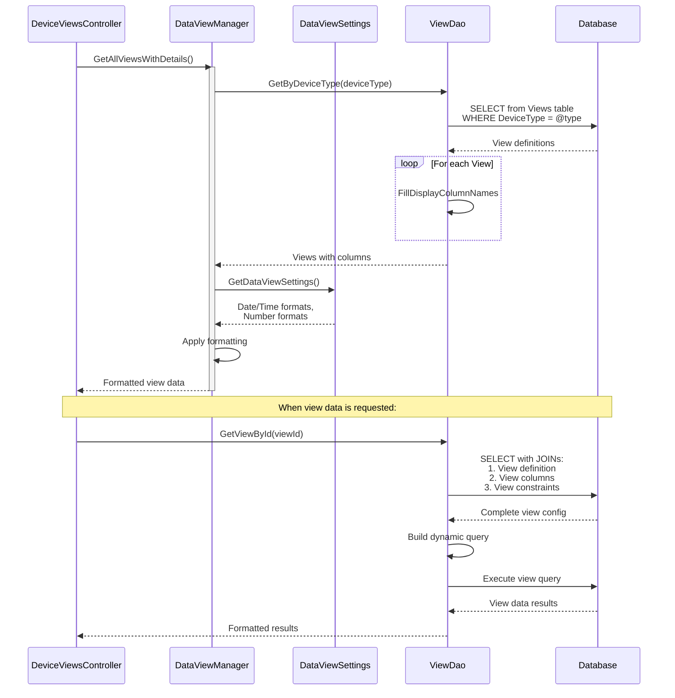

#### Key Components in View Processing

1. **DeviceViewsController**
   - Entry point for view-related API requests
   - Handles view loading and data retrieval
   - Manages view configuration updates

2. **DataViewManager**
   - Coordinates view operations
   - Applies business logic and formatting
   - Manages view state and settings

3. **ViewDao**
   - Handles database operations
   - Builds dynamic SQL queries
   - Manages view definition persistence

4. **DataViewSettings**
   - Controls formatting settings
   - Manages date/time formats
   - Handles number formatting rules

#### Query Construction Process

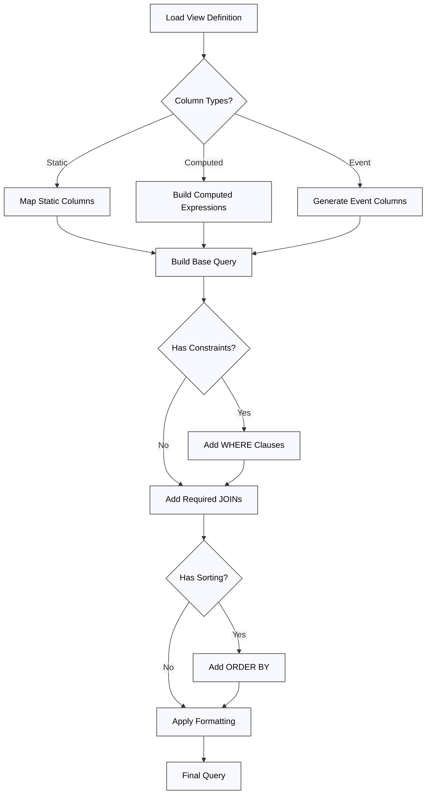

1. **View Definition Loading**
   ```sql
   SELECT *
   FROM Views v
   JOIN ViewColumns vc ON v.Id = vc.ViewId
   WHERE v.Id = @viewId
   ```

2. **Query Components Generation**
   ```sql
   -- Base static columns
   SELECT vd.SessionId, vd.StartTime, vd.StopTime
   
   -- Computed columns
   DATEDIFF(MINUTE, vd.StartTime, vd.StopTime) as Duration
   
   -- Event-based columns
   CASE WHEN ve.Event_Type = 'BARCODE' THEN ve.Event_Value END as BarcodeValue

   -- Constraints
   WHERE vd.DeviceType = @type
   AND vd.StartTime >= @startDate
   
   -- Joins
   FROM TRAC_VIEW_DATA vd
   LEFT JOIN TRAC_VIEW_DATA_EVENTS ve ON vd.SessionId = ve.SessionId
   ```

3. **View Settings and Configuration**

   - Number formatting: Based on DecimalSeparator setting
   - Date formatting: According to DateFormat and TimeFormat
   - Text qualifiers: Applied based on TextQualifier setting

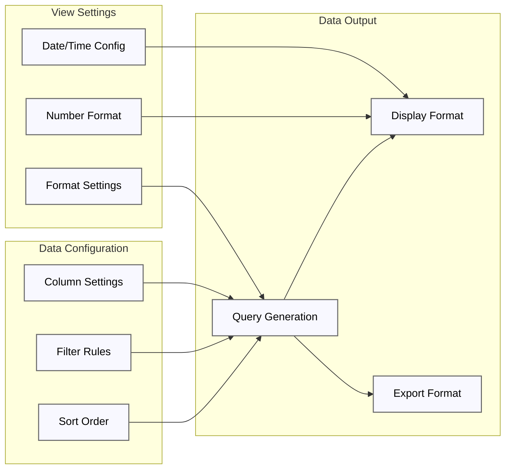

Key configuration components:

1. **Format Settings**
   ```csharp
   public DataViewSettings GetDataViewSettings()
   {
       return new DataViewSettings
       {
           NumberFormatInfo = ConvertToNumberFormatInfo(settings.DecimalSeparator),
           DateTimeFormatInfo = dateTimeFormatInfo,
           DateFormat = ConvertToDateFormat(dateFormat),
           TimeFormat = timeFormat,
           DateTimeFormat = string.Join(" ", dateFormat, timeFormat),
           DataViewRequestTimeout = settings.DataViewRequestTimeout
       };
   }
   ```

2. **View Column Configuration**
   - Handles column visibility and order
   - Manages column width settings
   - Controls column formatting rules

3. **Data Formatting Rules**
   - Text qualifier rules (single/double quotes)
   - Decimal separator configuration (dot/comma)
   - Date/time format localization

4. **Advanced View Configuration and Query Building**

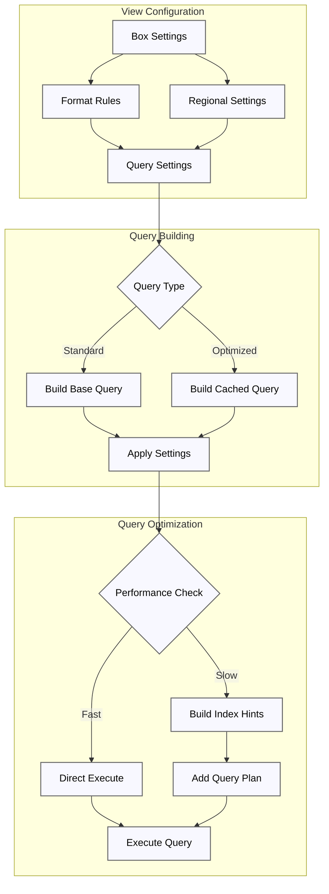

The system employs sophisticated query building and optimization:

1. **Settings Integration**
   ```csharp
   // DataViewSettingsManager integrates box-level settings
   public DataViewSettings GetDataViewSettings()
   {
       var settings = GetSettings();
       return new DataViewSettings
       {
           // Number formatting affects aggregations
           NumberFormatInfo = ConvertToNumberFormatInfo(settings.DecimalSeparator),
           
           // Date/Time settings affect range queries
           DateTimeFormatInfo = GetDateTimeFormatInfo(),
           
           // Query timeout affects execution plan
           DataViewRequestTimeout = settings.DataViewRequestTimeout,
           
           // Regional settings affect sorting
           CultureInfo = Thread.CurrentThread.CurrentCulture
       };
   }
   ```

2. **Query Plan Optimization**
   ```sql
   -- Generated execution plan hints
   SELECT /*+ INDEX(vd IX_TRAC_VIEW_DATA_StartTime) */
          /*+ INDEX(ve IX_TRAC_VIEW_DATA_EVENTS_SessionId) */
       vd.SessionId,
       vd.StartTime,
       ve.Event_Value
   FROM TRAC_VIEW_DATA vd
   LEFT JOIN TRAC_VIEW_DATA_EVENTS ve
       ON vd.SessionId = ve.SessionId
   WHERE vd.StartTime BETWEEN @start AND @end
   ```

3. **Performance Settings**
   - Query timeouts: Configurable per view
   - Batch size: Optimized for data volume
   - Index hints: Based on column statistics
   - Cache configuration: For frequently accessed views

### 6. Implementation Details and Data Examples

#### Example T-RAC Session From Device

```json
{
    "session": {
        "serialNumber": "RS0001",
        "startTime": "2025-02-20T13:28:43",
        "donationInfo": {
            "requestedVolume": 100,
            "collectedVolume": 100,
            "bloodDensity": 1.06,
            "averageFlowRate": 65,
            "maxFlowRate": 72,
            "wholeBloodTime": "01:50:00"
        }
    },
    "alarms": [
        {
            "type": "LOW_FLOW",
            "startTime": "2025-02-20T13:45:00",
            "duration": "00:02:00",
            "flowRate": 45
        }
    ],
    "events": [
        {
            "name": "Event 1",
            "type": "BARCODE",
            "value": "AB001"
        },
        {
            "name": "Event 3",
            "type": "INCIDENT",
            "selectedIndexes": [1, 2, 3],
            "scannedBarcodes": ["AB001", "AB002"]
        }
    ]
}
```

This data arrives as a byte stream and is parsed by ParseTRACSessionDatasAsync into TRACSessionData objects, which are then stored in the database using the following structure:

#### Physical Data Storage Structure

The system implements a dual-table approach for each device type:

1. **Main View Data Table**
```sql
-- Example: TRAC_VIEW_DATA
CREATE TABLE [dbo].[TRAC_VIEW_DATA] (
    SessionId VARCHAR(50) PRIMARY KEY,
    StartTime DATETIME2,
    StopTime DATETIME2,
    DeviceType INT,
    -- Other static device-specific columns
)
```

2. **Events Table**
```sql
-- Example: TRAC_VIEW_DATA_EVENTS
CREATE TABLE [dbo].[TRAC_VIEW_DATA_EVENTS] (
    SessionId VARCHAR(50),  -- Links to main view data
    -- Dynamic columns added based on events
    Event_Barcode_Kit VARCHAR(100),
    Event_Operator_Login VARCHAR(50),
    Event_Status_Change VARCHAR(20)
    -- Additional columns created dynamically
)
```

#### Real Data Flow Example

1. **Session Data Input**
```json
{
    "staticData": {
        "sessionId": "TRAC_2025_001",
        "startTime": "2025-02-20T08:00:00",
        "stopTime": "2025-02-20T09:30:00",
        "deviceType": 1,
        "procedureType": "STANDARD_COLLECTION"
    },
    "events": [
        {
            "type": "BARCODE_SCAN",
            "value": "KIT123456",
            "timestamp": "2025-02-20T08:05:00"
        },
        {
            "type": "OPERATOR_LOGIN",
            "value": "NURSE_789",
            "timestamp": "2025-02-20T08:00:00"
        }
    ]
}
```

2. **Dynamic Column Management**
The system automatically handles new event types through the ViewDataDaoHelper:
```csharp
public static IList<ViewDataColumnsModel> GetViewDataColumnsMap(IEnumerable<ISessionData> sessionDataList)
{
    var eventColumnsMap = sessionDataList.Select(sessionData =>
    {
        var columns = ViewDataHelper.GetViewDataColumns(sessionData);
        return new ViewDataColumnsModel
        {
            StaticColumns = GetStaticColumns(columns).ToList(),
            EventColumns = GetViewDataEventsColumns(columns).ToList(),
        };
    }).ToList();
    return eventColumnsMap;
}
```

3. **Query Generation Example**
```sql
-- Example of generated query combining static and event data
SELECT 
    vd.SessionId,
    vd.StartTime,
    vd.StopTime,
    vd.DeviceType,
    ve.Event_Barcode_Kit as KitNumber,
    ve.Event_Operator_Login as Operator,
    ve.Event_Status_Change as ProcedureStatus
FROM TRAC_VIEW_DATA vd
LEFT JOIN TRAC_VIEW_DATA_EVENTS ve 
    ON vd.SessionId = ve.SessionId
WHERE 
    vd.StartTime >= '2025-02-20'
    AND vd.DeviceType = 1
ORDER BY 
    vd.StartTime DESC
```