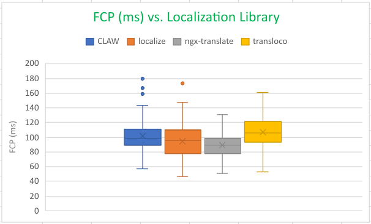

# Angular Localization Libraries Performance Analysis

This document summarizes our performance test comparing four Angular localization libraries in an Angular application:  
- **CLAW**  
- **localize**  
- **ngx-translate**  
- **transloco**

We ran each library **100 times** using an automated script that collects three key performance metrics:
- **TTFB** (Time to First Byte)  
- **FCP** (First Contentful Paint)  
- **LCP** (Largest Contentful Paint)  

According to commonly accepted [Core Web Vitals thresholds](https://web.dev/vitals/) (simplified here):  
- **< 2500 ms** = good  
- **2500–4000 ms** = needs improvement  
- **> 4000 ms** = poor  

All results below fall **well under** 2500 ms and thus are rated **(good)**.

---

## 1. Methodology

1. **Environment**  
   - We used a local development server (`ng serve`) on a machine with typical desktop hardware and minimal network latency (localhost).  
   - The browser was **headless Chromium** launched via [`Puppeteer`](https://pptr.dev/).  
   - Metrics were gathered using the [`web-vitals`](https://github.com/GoogleChrome/web-vitals) library in the Angular app.

2. **Script**  
   - We have a Node.js script [`metric-collector.js`](./metric-collector.js) that:
     1. Opens a headless browser at `http://localhost:4200`.  
     2. Listens for console logs of `"METRIC FCP:"`, `"METRIC LCP:"`, and `"METRIC TTFB:"`.  
     3. Parses the numeric `value` from each metric.  
     4. Writes each run’s data to a CSV.  
     5. Repeats this process 100 times.  

3. **Running Each Library**  
   - For each of the four libraries, we modified the Angular app to use only that library for localization.  
   - We restarted the server if needed, ran the script, and captured the 100 data points (`TTFB`, `FCP`, `LCP`).  

> **Note**: Because all tests occurred locally, real-world network conditions may yield higher values. However, these runs are still valuable for relative comparisons.

---
## 2. The Script
To run the script, follow below steps:

- Install Puppeteer (it is already intalled in this repo):
```bash
npm install --save-dev puppeteer
```

- Start the localization project using: 
```bash
ng serve
```

- `cd` to the `script` directory:
```bash
cd angular-localization-performance-testing/claw2-performance-testing/claw2-performance/src/scripts
```

- Run the `metric-collector.js` scrip using Node:

```bash
node metric-collector.js
```
This will open a headless browser, run 100 times, and save the CSV data in `metrics.csv`.


## 3. Results

We collected **100 runs** per library. Below are tables of **Min**, **Max**, **Average**, **Median**, and **Standard Deviation** for each metric. Since all observed values fall well under 2500 ms, we label them `(good)` based on common Web Vitals thresholds.

The results for the 100 iterations are available here: [`metrics.csv`](./results/localization-metrics-for-angular-libraries.xlsx)

### TTFB (ms)

| **Measure** | **CLAW**         | **localize**       | **ngx-translate**   | **transloco**        |
|:-----------:|:----------------:|:------------------:|:-------------------:|:--------------------:|
| **Min**     | 2.0 (good)       | 2.7 (good)         | 2.4 (good)          | 2.3 (good)           |
| **Max**     | 8.4 (good)       | 14.8 (good)        | 8.3 (good)          | 11.1 (good)          |
| **Average** | 4.5 (good)       | 5.1 (good)         | 4.4 (good)          | 4.7 (good)           |
| **Median**  | 4.6 (good)       | 5.0 (good)         | 4.5 (good)          | 4.7 (good)           |
| **SD**   | 1.2              | 1.7                | 1.1                 | 1.4                  |

### FCP (ms)

| **Measure** | **CLAW**         | **localize**       | **ngx-translate**   | **transloco**        |
|:-----------:|:----------------:|:------------------:|:-------------------:|:--------------------:|
| **Min**     | 57.2 (good)      | 46.8 (good)        | 50.6 (good)         | 53.3 (good)          |
| **Max**     | 179.6 (good)     | 173.2 (good)       | 130.9 (good)        | 161.3 (good)         |
| **Average** | 101.6 (good)     | 94.4 (good)        | 89.1 (good)         | 106.6 (good)         |
| **Median**  | 99.0 (good)      | 95.7 (good)        | 89.2 (good)         | 105.9 (good)         |
| **SD**   | 21.9             | 21.9               | 16.6                | 23.7                 |

### LCP (ms)

| **Measure** | **CLAW**         | **localize**       | **ngx-translate**   | **transloco**        |
|:-----------:|:----------------:|:------------------:|:-------------------:|:--------------------:|
| **Min**     | 57.2 (good)      | 46.8 (good)        | 70.5 (good)         | 64.8 (good)          |
| **Max**     | 306.8 (good)     | 581.8 (good)       | 217.0 (good)        | 222.9 (good)         |
| **Average** | 103.8 (good)     | 99.5 (good)        | 103.2 (good)        | 123.7 (good)         |
| **Median**  | 99.1 (good)      | 95.9 (good)        | 97.3 (good)         | 120.3 (good)         |
| **SD**   | 30.1             | 53.6               | 21.9                | 28.9                 |

> **Note**: All metrics are comfortably below 2500 ms, so each measurement is considered **(good)** according to typical Web Vitals guidelines.

### 3.1. Interpretation

Based on the collected data:

1. **TTFB**  
   - All three libraries (localize, ngx-translate, transloco) have very low TTFB, well under 15 ms.  
   - Differences here are minimal; all are considered `(good)` in a typical local environment.

2. **FCP**  
   - **ngx-translate** appears to have the fastest (lowest) average (~89 ms) and median (~89 ms).  
   - **localize** and **transloco** are close behind, with localize near ~94 ms and transloco around ~106 ms.

3. **LCP**  
   - **localize** has a notable outlier (581.8 ms) but otherwise is around ~95–100 ms median.  
   - **transloco** has a higher median (~120 ms) and average (~124 ms) than the other two, but still considered `(good)` under 2500 ms.  
   - **ngx-translate** is near ~100 ms on average, with fewer extreme outliers.

Overall, **ngx-translate** shows slightly better FCP, while **localize** and **transloco** are very close in practical terms. All are well within **“good”** thresholds.

---

### 3.2. Visualizations

Below are placeholders for box plot charts of each metric.
- The **box** spans from the first quartile (25th percentile) to the third quartile (75th percentile).  
- The **horizontal line** in the box is the **median** (50th percentile).  
- **Whiskers** extend to data points that are within 1.5× the interquartile range (IQR).  
- **Dots** beyond the whiskers may indicate outliers.

A **lower** median indicates faster times (for these performance metrics), and a **shorter** box indicates less variation among runs.

#### TTFB Box Plot


#### FCP Box Plot



#### LCP Box Plot


# 4. Localization Libraries Comparison: Angular `$localize` vs. Transloco vs. ngx-translate

This comparison table highlights the key **features** of **Angular’s built-in localization with `$localize`**, **Transloco**, and **ngx-translate**.

> This is generated by ChatGPT and may contain inaccurate information.

---

### Comparison

| **✨ Category**                     | **Angular `$localize`**                                     | **Transloco**                                                          | **ngx-translate**                                                      |
|------------------------------------|-------------------------------------------------------------|------------------------------------------------------------------------|------------------------------------------------------------------------|
| **🔤 Translation Approach**        | Compile-time or build-time                                  | Runtime                                                                | Runtime                                                                |
| **📂 Supported File Formats**      | XLIFF, XMB, JSON                                                  | JSON                                                                   | JSON                                                                   |
| **🚚 Lazy Loading**                 | ❌ Not Supported                                            | ✅ Supported                                                            | ✅ Supported                                                            |
| **🔢 Pluralization & ICU Support** | ✅ Full support using Angular ICU syntax                    | ✅ Full support                                                        | ⚠️ Limited support                                                     |
| **🌐 Runtime Language Switch**      | ❌ Not Supported                                            | ✅ Supported                                                            | ✅ Supported                                                            |
| **🔒 Scoped Translations**          | ❌ Not Supported                                            | ✅ Supported                                                            | ❌ Not Supported                                                        |
| **🎨 Rich Formatting**              | ⚠️ Limited (Relies on Angular's built-in formatting)        | ✅ Supported                                                            | ⚠️ Limited (Basic formatting capabilities)                            |
| **🛠 Advanced Features**            | Automatic ID generation, translation merging, CLI integration | ✅ State management, fallback strategies, scoped translations          | ⚠️ Fallback language support, various loader options                   |
| **🔧 Plugins and Tooling**          | ⚠️ Limited (Primarily relies on Angular CLI tools)          | ✅ Extensive plugins and tooling available                             | ⚠️ Limited (Relies on community plugins)                              |
| **⚙️ Performance**                  | ✅ Minimal runtime overhead, build-time replacements        | ✅ Efficient runtime management, on-demand loading                     | ✅ Efficient runtime, on-demand loading                                |
| **📦 Bundle Size Impact**           | ✅ Separate bundles per locale, small runtime overhead      | ✅ Small library overhead, translations loaded on-demand               | ⚠️ Moderate library overhead, translations loaded on-demand           |
| **👥 Community & Maintenance**      | ✅ Official Angular solution, maintained by Angular team    | ✅ Actively maintained by [ngneat](https://github.com/ngneat/transloco) community | ✅ Well-established, widely supported by community                      |
| **🎯 Use Cases**                    | 🏢 Large-scale, enterprise apps with build-time translations | 🔄 Projects needing robust runtime translation system with state management and scoped translations | 🚀 Quick setup, dynamic language switching for smaller or existing JSON workflows |
| **📚 Learning Curve**               | 📈 Moderate, requires understanding Angular i18n workflow    | 📉 Relatively simple with some state management concepts               | 📉 Straightforward, similar to older translate libraries                |
| **🔄 Add Languages at Runtime**     | ❌ Not Supported                                            | ✅ Add new languages dynamically at runtime by loading new translation files | ✅ Add new languages dynamically at runtime by loading new translation files |


#### 🎯 **Final Recommendation**

If your project **requires the ability to dynamically add languages** based on user interactions or other runtime conditions, **Transloco** or **ngx-translate** are the preferable choices. They offer the necessary flexibility and runtime management capabilities to handle dynamic localization needs effectively.

- **Choose **Transloco** if:**
  - You need advanced features like **state management** and **scoped translations**.
  - You prefer a **modern architecture** with a robust plugin ecosystem.
  - You require **rich formatting** options for your translations.

- **Choose **ngx-translate** if:**
  - You want a **straightforward setup** with extensive community support.
  - You are integrating localization into an existing **JSON-based workflow** and prefer a well-established library.
  - You need **dynamic language switching** without the need for separate builds.

Conversely, if your application benefits from **compile-time translations**, **minimal runtime overhead**, and you are comfortable with a **fixed set of languages** specified during the build process, **Angular `$localize`** is an excellent official solution.

---

## 6. Spike Files
TBA