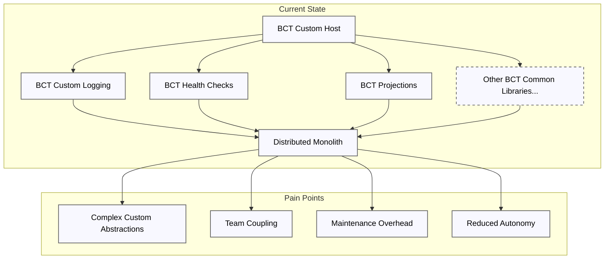
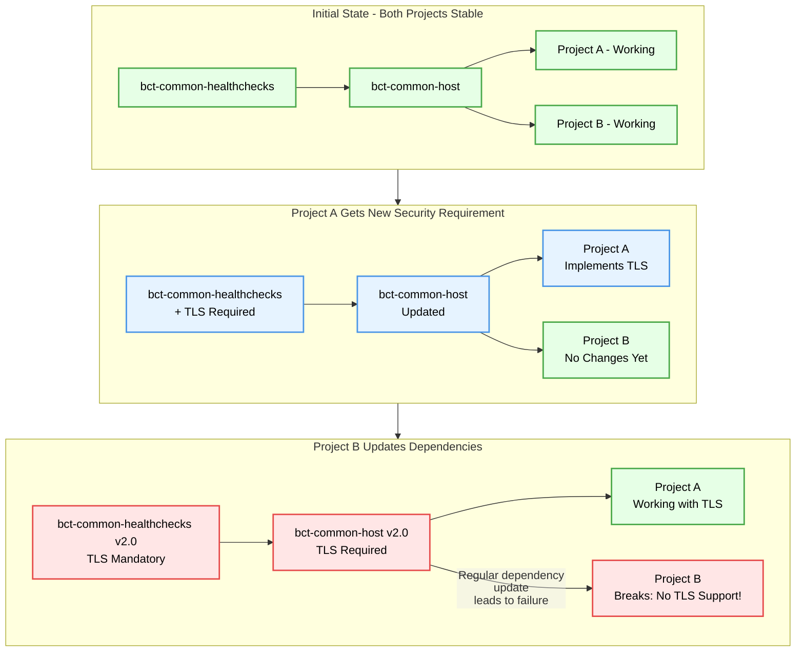
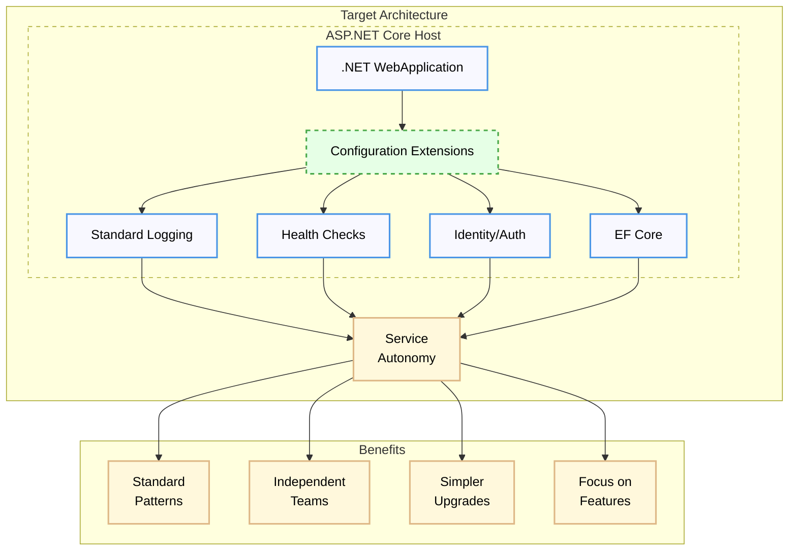
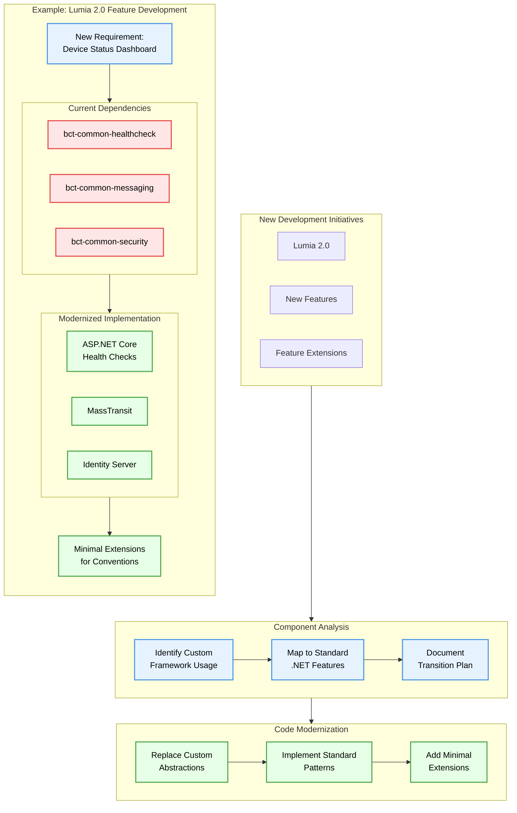

# Architectural Guidance for Application Software

## TL;DR

As the Terumo BCT Software portfolio evolves around the Lumia platform, we have an opportunity to simplify our architecture:

**Current Challenges:**
- Custom frameworks add complexity to standard .NET features
- Dependencies between libraries slow down development
- Teams spend time maintaining code that duplicates existing solutions

**Proposed Direction:**
- Leverage standard .NET features where possible
- Create minimal extensions only for organizational conventions
- Let teams choose the best tools for their specific needs
- Use ongoing development to gradually reduce complexity

🎯 **The Goal**: Build simpler, more maintainable systems that enable teams to focus on delivering business value.

> 🎬 **Food for Thought**:
> - [The #1 Sign of Bad Architecture](https://www.youtube.com/watch?v=j3i3b6PIcOs) - Why small changes shouldn't be expensive
> - [How Software Rots](https://www.youtube.com/watch?v=5AFYWKavQgA) - Understanding the true cost of dependencies

## Table of Contents
- [Introduction](#introduction)
- [Current State](#current-state)
- [Dependency Chain Risk](#dependency-chain-risk)
- [Target State: Embracing Standard .NET](#target-state-embracing-standard-net)
- [Implementation Examples](#implementation-examples)
- [Transition Strategy](#transition-strategy-modernization-through-development)
- [Further Reading](#further-reading)

## Introduction

Over the years, several attempts have been made to develop overarching architectural frameworks at our Application Software team —many of which have yielded only partial success. This document proposes a simpler, more extensible approach that embraces modern .NET practices over custom, in-house libraries. This strategy aims to create software systems that are easier to maintain, faster to evolve, and more aligned with industry standards.

### Why Simple Architectures Succeed

A complex system often becomes fragile when built upon rigid libraries and highly customized abstractions. Small changes can become disproportionately expensive—like constantly adding puzzle pieces to a nearly completed jigsaw, with nowhere to place them. As mentioned in [this insightful video](https://www.youtube.com/watch?v=j3i3b6PIcOs), faulty architectures “lie” to stakeholders by hiding the real cost of small changes, eventually slowing development to a crawl. Our goal is to avoid this pitfall by keeping designs simple, focusing on **vanilla .NET** and **standard libraries**, and reducing the reliance on custom frameworks.

## Current State

Our current enterprise solution includes multiple custom “bct-common-” libraries some of which are:
- bct-common-host  
- bct-common-logging  
- bct-common-dataaccess  
- bct-common-security  
- bct-nservicebus  
- bct-common-ui  
- bct-common-filestorage-minio  
- bct-common-dto  
- bct-common-webapi  
- bct-common-caching  
- bct-common-dapper  
- bct-common-healthcheck-service
- bct-common-*

These libraries evolved over time to address specific needs but now impose significant complexity. They create tight coupling between projects, obscure straightforward .NET practices, and, when updated, can inadvertently break unrelated services.



This approach introduces substantial overhead in several key areas:

1. **Resource Allocation & Maintenance**
   - Each custom library requires dedicated maintainers
   - Multiple teams must coordinate for even minor updates, leading to scheduling conflicts and delayed releases

2. **Knowledge Management Burden**
   - New developers require extensive onboarding to understand proprietary patterns
   - Documentation must be constantly updated across multiple repositories
   - Tribal knowledge becomes a significant risk as team members transition

3. **Technical Debt Accumulation**
   - Custom implementations often lag behind modern features (e.g. `bct-common-dataccess` currently supports only 2 database engines - `psql` and `mssql` while standard approaches such as `EF Core` support countless engines)
   - Security patches must be manually propagated across all custom libraries
   - Integration with third-party tools becomes increasingly complex

4. **Business Impact**
   - Development cycles are lengthened by custom framework maintenance requirements
   - Teams spend significant time maintaining parallel implementations of standard .NET features
   - Custom implementations increase security and reliability risks
   - New feature development is routinely blocked by framework update coordination
   - Modern cloud-native patterns are harder to adopt due to custom abstractions

5. **Project Portfolio Impact**
   - Strategic initiatives are deprioritized in favor of framework maintenance
   - Teams are locked into legacy patterns instead of adopting modern approaches
   - Innovation suffers as developers maintain custom solutions to solved problems
   - Project timelines extend due to custom framework learning curves
   - Integration with modern tools becomes increasingly complex

6. **Market Position Impact**
   - Developer hiring and retention is impacted as talent prefers standard technologies
   - Security compliance becomes more complex with custom implementations

For an organization of our size, developing and maintaining so many custom solutions diverts substantial resources away from actual business needs. By adopting standard .NET components and approaches, we could focus on delivering real business value instead of maintaining custom frameworks. Industry standards and modern .NET libraries already provide proven solutions for most of our needs.

### Architectural Pain Points

1. **Complex Custom Abstractions**  
   Heavy wrappers around standard .NET features lead to convoluted code, confusion, and overhead.

2. **Team Coupling**  
   Multiple projects must coordinate changes if they share custom libraries, creating version and dependency nightmares.

3. **Maintenance Overhead**  
   Internal libraries require continuous updates, bug fixes, and documentation—resources that could be spent delivering features.

4. **Reduced Autonomy**  
   Tight coupling forces all teams to follow the same path, making unique requirements difficult or impossible to accommodate.

Below is a high-level diagram illustrating these pain points:


## Dependency Chain Risk

Small changes to one custom library can break unrelated services and/or consuming libraries. When a library changes (e.g., in this example - enabling native TLS), every project referencing it must adapt immediately—even if they have no short-term need for that feature. Routine updates become high-risk maneuvers:



## Target State: Embracing Standard .NET

Our target architecture emphasizes simplicity and standard patterns over custom frameworks. The key principles are:

### 1. Adopt Vanilla .NET
Modern .NET provides robust, well-tested implementations for most enterprise needs:
- **Logging**: Use Serilog or Microsoft.Extensions.Logging directly
- **Data Access**: Entity Framework Core with clean DbContext patterns
- **Security**: ASP.NET Core Identity and standard OAuth/OIDC flows
- **Messaging**: Direct use of MassTransit
- **Health Checks**: Built-in ASP.NET Core health check middleware
- **Configuration**: Standard configuration providers and options patterns

### 2. Minimal Extensions Over Custom Frameworks
Instead of full wrapper libraries, create focused extension methods that:
- Configure standard libraries according to organizational conventions
- Set up default paths, connection strings, and common settings
- Enable consistent patterns across services WITHOUT abstraction layers
- Example: `.AddBctLogging()` just configures Serilog, doesn't wrap it, and returns the builder back to the bootstrapping app

### 3. Service Autonomy
Empower teams to:
- Choose appropriate libraries for their specific needs
- Upgrade dependencies independently of other services
- Implement features without cross-team coordination
- Own their deployment schedules and technology decisions

### 4. Iterative Modernization
Progress through measured steps:
- Identify standard alternatives for each custom library
- Create minimal configuration extensions where needed
- Migrate services gradually as teams have capacity
- Maintain backward compatibility during transition



## Implementation Examples

> **⚠️ WARNING: Keep Extensions Minimal**
>
> Extension methods should provide ONLY the bare minimum organizational defaults:
> - Avoid any business logic or complex configuration
> - Only include genuinely shared conventions (paths, basic settings)
> - If in doubt, let the service own the configuration
> - Remember: We're moving FROM centralized control TO service autonomy
> - The goal is to empower teams, not restrict them
>
> Extension methods are purely optional - services should always be able to use standard libraries directly.

### Minimal Extensions vs Wrapping

The key difference between minimal extensions and wrapper libraries is flexibility. Here's how to provide defaults while keeping services autonomous:

```csharp
// In BCT.Extensions.Logging
public static class LoggingExtensions
{
    // Provides organizational defaults without wrapping
    public static IServiceCollection AddBctLogging(this IServiceCollection services)
    {
        // Just add standard configuration - no abstraction layer
        services.AddLogging(builder =>
        {
            builder.AddSerilog();
            // Set org-wide defaults like log path, retention, etc.
            builder.AddConfiguration("logging.json");
        });
        
        return services;
    }
}

// In your service
public class Startup
{
    public void ConfigureServices(IServiceCollection services)
    {
        // Use organizational defaults
        services.AddBctLogging();
        
        // AND customize further as needed - direct access to standard library
        services.AddLogging(builder =>
        {
            // Add service-specific sinks
            builder.AddSeq("http://seq.local");
            // Override retention for this service
            builder.SetMinimumLevel(LogLevel.Debug);
        });
    }
}
```

Key points:
- Extensions only provide convention-based configuration
- Services can use defaults AND add their own configuration
- No abstractions between service and standard library
- Teams maintain full access to underlying library features

### More Examples

#### Health Checks
```csharp
// In BCT.Extensions.HealthChecks
public static class HealthCheckExtensions
{
    // Provide default path and response format
    public static IHealthChecksBuilder AddBctDefaults(this IHealthChecksBuilder builder)
    {
        builder.AddDefaultEndpoint("/health", "BCT Health Check");
        return builder;
    }
}

// In your service
public void Configure(IApplicationBuilder app)
{
    // Use defaults
    app.UseHealthChecks().AddBctDefaults()
        // AND add service-specific checks
        .AddCheck("cache", new RedisHealthCheck())
        .AddCheck("api", () => CustomApiCheck());
}
```

#### Configuration
```csharp
// In BCT.Extensions.Configuration
public static class ConfigurationExtensions
{
    // Set up standard config sources
    public static IConfigurationBuilder AddBctDefaults(
        this IConfigurationBuilder builder,
        string environment)
    {
        return builder
            .SetBasePath("/etc/bct/config")
            .AddJsonFile($"appsettings.{environment}.json");
    }
}

// In your service
public static IHostBuilder CreateHostBuilder(string[] args) =>
    Host.CreateDefaultBuilder(args)
        .ConfigureAppConfiguration((context, config) =>
        {
            // Use org defaults
            config.AddBctDefaults(context.HostingEnvironment.EnvironmentName);
            
            // AND add service-specific sources
            config.AddKeyVault("myapp-secrets")
                 .AddCommandLine(args);
        });
```

This pattern of providing defaults while maintaining extensibility applies across all standard .NET features. Teams get organizational conventions by default but retain full control to customize as needed.

### Service Autonomy in Practice

Here's how services can work with standard libraries in different ways:

```csharp
public class Startup
{
    public void ConfigureServices(IServiceCollection services)
    {
        // Option 1: Use organization defaults
        services.AddBctLogging();

        // Option 2: Use defaults + service-specific additions
        services.AddBctLogging()
               .AddLogging(builder =>
               {
                   builder.AddSeq();
                   builder.SetMinimumLevel(LogLevel.Debug);
               });

        // Option 3: Skip extensions, use standard libraries directly
        services.AddLogging(builder =>
        {
            // Service owns all logging configuration
            builder.ClearProviders()
                  .AddConsole()
                  .AddApplicationInsights()
                  .AddDebug();
        });
    }
}
```

Each approach is valid - teams choose based on their needs:
- Use extension defaults when they align with service requirements
- Extend default configuration when adding service-specific features
- Bypass extensions completely when different approaches are needed

The key is that **teams remain in control** - extension methods help but never restrict.

## Transition Strategy: Modernization Through Development

The path to simpler architecture aligns with our development roadmap. As teams build new features and extend existing ones, each interaction with the code becomes an opportunity for modernization.



### Natural Evolution with Platform Development

As the Terumo BCT Software portfolio evolves around the Lumia platform, each development activity presents an opportunity to simplify our architecture:

1. **Organic Modernization**
   - Review components during planned feature work
   - Consider standard .NET alternatives when extending functionality
   - Allow teams to choose implementation approaches that suit their needs
   - Let business priorities guide the pace of improvement

2. **Gradual Simplification**
   - Build new features using standard .NET patterns
   - Migrate existing components when natural opportunities arise
   - Adopt proven libraries over maintaining custom solutions
   - Balance modernization with feature delivery

3. **Sustainable Progress**
   - Identify standard alternatives through practical experience
   - Create minimal extensions where genuinely needed
   - Share learning and patterns across teams
   - Maintain momentum through incremental improvements

This approach integrates architectural evolution into our natural development flow, ensuring sustainable progress while delivering business value.

## Further Reading


### Physical books

* [`Extreme Programming Explained: Embrace Change (First Edition)`](https://www.amazon.com/Extreme-Programming-Explained-Embrace-Change/dp/0201616416)
* [`The Clean Coder: A Code of Conduct for Professional Programmers`](https://www.amazon.com/Clean-Coder-Conduct-Professional-Programmers/dp/0137081073/ref=sr_1_3?crid=EPVCLX5AJCAK&dib=eyJ2IjoiMSJ9.eUeDq4BPqNYI52SOU-OcJ3C2KDn8vVIU9hv6jH6zzhvEwHsAMXH6Z-EhwlLMSL3DuosTU8ER9RBwjMfxitHBXf8R_WAgJVM3We9UdTMZVFA.fDOfEmqizbpEtpyv2z8CXpSxFOr8SxbJH0EKG75C2Lw&dib_tag=se&keywords=bob+martin+clean+code&qid=1740633959&sprefix=bob+martin+clean+cod%2Caps%2C146&sr=8-3)

### Official .NET Documentation
- [ASP.NET Core Fundamentals](https://docs.microsoft.com/en-us/aspnet/core/fundamentals/)
- [.NET Dependency Injection](https://docs.microsoft.com/en-us/dotnet/core/extensions/dependency-injection)
- [Configuration in .NET](https://docs.microsoft.com/en-us/dotnet/core/extensions/configuration)
- [Logging in .NET](https://docs.microsoft.com/en-us/dotnet/core/extensions/logging)
- [Health Checks](https://docs.microsoft.com/en-us/aspnet/core/host-and-deploy/health-checks)

### Modern .NET Best Practices
- [Clean Architecture](https://docs.microsoft.com/en-us/dotnet/architecture/modern-web-apps-azure/common-web-application-architectures)
- [Security Best Practices](https://docs.microsoft.com/en-us/aspnet/core/security/)
- [Cloud Design Patterns](https://docs.microsoft.com/en-us/azure/architecture/patterns/)
- [Microservices with .NET](https://docs.microsoft.com/en-us/dotnet/architecture/microservices/)

### Authentication & Authorization
- [ASP.NET Core Identity](https://docs.microsoft.com/en-us/aspnet/core/security/authentication/identity)
- [OpenIddict Documentation](https://documentation.openiddict.com/)
- [OAuth 2.0 and OpenID Connect](https://docs.microsoft.com/en-us/azure/active-directory/develop/active-directory-v2-protocols)
