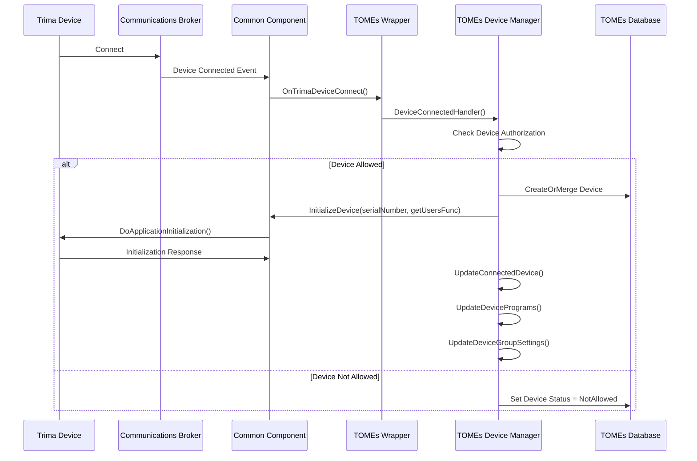
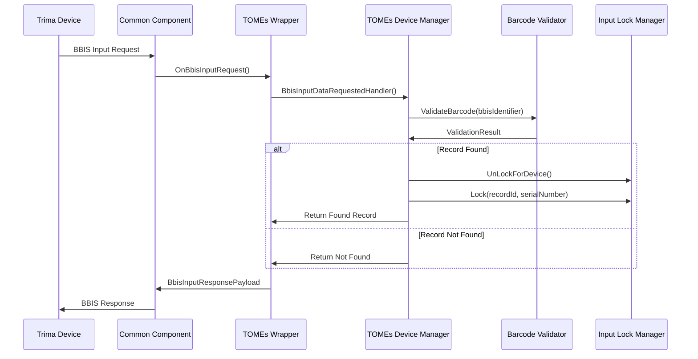
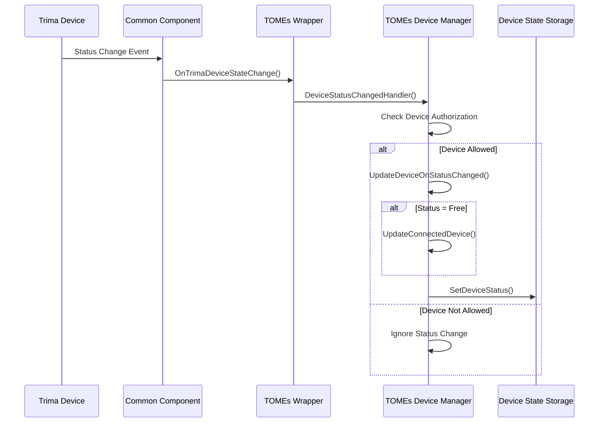

# TOMEs Trima Integration Interface Control Document (ICD)

## Table of Contents
1. [Overview](#overview)
2. [TOMEs Architecture Integration](#tomes-architecture-integration)
3. [TOMEs-Specific Components](#tomes-specific-components)
4. [Message Flow and Event Handling](#message-flow-and-event-handling)
5. [Device Management Lifecycle](#device-management-lifecycle)
6. [Data Transfer Objects and Models](#data-transfer-objects-and-models)
7. [Service Layer Integration](#service-layer-integration)
8. [Configuration and Connection Management](#configuration-and-connection-management)
9. [Error Handling and Validation](#error-handling-and-validation)
10. [Extended Message Definitions](#extended-message-definitions)

## 1. Overview

This document extends the BCT Common Component ICD to describe how TOMEs (TerumoBCT Operational Management and Enterprise System) integrates with and utilizes the Trima Device Manager library. TOMEs acts as the host application that consumes the Common Component library to manage Trima V7 devices in a healthcare environment.

### Key Integration Points
- **DAA (Data Access and Acquisition) Layer**: Primary integration point for device communication
- **WSA (Web Service Application) Layer**: Web-based management interface
- **External Libraries Wrapper**: TOMEs-specific abstraction over Common Component
- **Event-Driven Architecture**: Asynchronous handling of device events and state changes

## 2. TOMEs Architecture Integration

### 2.1 Layered Architecture
```
┌─────────────────────────────────────────────────────────────┐
│                    TOMEs Web Interface (WSA)                │
├─────────────────────────────────────────────────────────────┤
│                TOMEs Business Logic Layer                   │
├─────────────────────────────────────────────────────────────┤
│              TOMEs Data Access Layer (DAA)                  │
├─────────────────────────────────────────────────────────────┤
│            TOMEs External Libraries Wrapper                 │
├─────────────────────────────────────────────────────────────┤
│              BCT Common Component Library                   │
├─────────────────────────────────────────────────────────────┤
│                Communications Broker                       │
├─────────────────────────────────────────────────────────────┤
│                    Trima V7 Device                         │
└─────────────────────────────────────────────────────────────┘
```

### 2.2 Component Relationships
- **TOMEs.DAA.BusinessLogic.Trima.Device.TrimaDeviceManager**: Primary device management implementation
- **TOMEs.WSA.BusinessLogic.Trima.Devices.TrimaDeviceManager**: Web service layer device management
- **TOMEs.ExternalLibraries.CommonComponent**: Wrapper and abstraction layer
- **TOMEs.DAA.Services.Trima.TrimaSpecificService**: WCF service for DAA-WSA communication

## 3. TOMEs-Specific Components

### 3.1 TOMEs Device Manager (DAA Layer)
**Location**: `TOMEs/TOMEs/DAA/BusinessLogic.Trima/Device/TrimaDeviceManager.cs`

**Purpose**: Manages Trima device lifecycle, state, and communication within the TOMEs DAA service.

**Key Responsibilities**:
- Device connection/disconnection handling
- Device initialization and configuration
- Program and group settings management
- BBIS (Blood Bank Information System) input processing
- Device state synchronization with TOMEs database
- License validation and device authorization

**Key Methods**:
```csharp
// Event Handlers
void DeviceConnectedHandler(object sender, TrimaDeviceConnectedEventArgs args)
void DeviceReconnectedHandler(object sender, TrimaDeviceReconnectedEventArgs args)
void DeviceDisconnectedHandler(object sender, TrimaDeviceDisconnectedEventArgs args)
void DeviceStatusChangedHandler(object sender, TrimaDeviceStatusChangedEventArgs args)
void BbisInputDataRequestedHandler(object sender, TrimaDeviceRequestedBbisEventArgs args)
void LookupHandler(object sender, TrimaLookupArgs args)

// Device Management
void UpdateDevicePrograms(string serialNumber)
void UpdateDeviceGroupSettings(string serialNumber, TrimaDeviceGroup deviceGroup)
void ForceUpdateDeviceGroupSettings(string serialNumber, TrimaDeviceGroup deviceGroup)
void UpdateNotLicensedDevicesState()
```

### 3.2 TOMEs Common Component Wrapper
**Location**: `TOMEs/TOMEs/External Libraries/CommonComponent/CommonComponent.cs`

**Purpose**: Provides TOMEs-specific abstraction over the BCT Common Component library.

**Key Features**:
- Event delegation and transformation
- TOMEs-specific data type mapping
- Configuration management
- Error handling and logging integration

**Event Mapping**:
```csharp
// Common Component Events → TOMEs Events
TrimaDeviceManager.OnTrimaDeviceConnectEvent = OnTrimaDeviceConnect;
TrimaDeviceManager.OnTrimaDeviceReconnectEvent = OnTrimaDeviceReconnect;
TrimaDeviceManager.OnTrimaDeviceDisconnectEvent = OnTrimaDeviceDisconnect;
TrimaDeviceManager.OnTrimaDeviceStateChange = OnTrimaDeviceStateChange;
TrimaDeviceManager.OnBbisInputRequest = OnBbisInputRequest;
TrimaDeviceManager.OnBarcodeLookup = OnBarcodeLookup;
TrimaDeviceManager.OnTrimaProcedurePriorityListRequest = OnTrimaProcedurePriorityListRequest;
```

### 3.3 TOMEs Communication Helper
**Location**: `TOMEs/TOMEs/External Libraries/CommonComponent/DataContracts/Helpers/TrimaCommunicationHelper.cs`

**Purpose**: Handles device communication operations with proper TOMEs integration.

**Key Methods**:
```csharp
TrimaProgramExportResultViewModel SendDeviceProgramList(string serialNumber, TrimaProgramsListImportExportViewModel programList)
bool SendDeviceGroupSettings(string serialNumber, TrimaDeviceGroup deviceGroup)
Task<bool> SendDeviceLanguageAsync(string serialNumber, byte? language)
TrimaProgramsListImportExportViewModel GetDeviceProgramList(string serialNumber, TrimaProgram defaultProgram)
```

## 4. Message Flow and Event Handling

### 4.1 Device Connection Flow


### 4.2 BBIS Input Request Flow


### 4.3 Device Status Change Flow


## 5. Device Management Lifecycle

### 5.1 Device States in TOMEs
```csharp
public enum TrimaDeviceStatus
{
    Inactive = 0,      // Device disconnected or not communicating
    Free = 1,          // Device connected and available for procedures
    InUse = 2,         // Device currently running a procedure
    NotAllowed = 3,    // Device not authorized in current group
    Maintenance = 4    // Device in maintenance mode
}
```

### 5.2 Device Communication States
```csharp
public enum DeviceCommunicationState
{
    Allowed = 0,                    // Device allowed in current group
    NotAllowedInCustomGroup = 1,    // Device not allowed in custom group
    AllowedInDefaultGroup = 2       // Device allowed only in default group
}
```

### 5.3 Device Lifecycle Management

**Device Registration**:
1. Device connects to Communications Broker
2. TOMEs receives connection event
3. Device authorization check against licenses and groups
4. Device record created/updated in TOMEs database
5. Device initialization with user list and settings

**Device Configuration**:
1. Program list download/upload
2. Group settings configuration
3. Language settings
4. Feature key validation
5. Screen configuration setup

**Device Monitoring**:
1. Continuous status monitoring
2. Procedure status updates
3. Alarm and event handling
4. Performance parameter tracking

## 6. Data Transfer Objects and Models

### 6.1 TOMEs Device Models
```csharp
// Primary device entity
public class TrimaDevice : Device
{
    public string SerialNumber { get; set; }
    public string FirmwareVersion { get; set; }
    public string IPAddress { get; set; }
    public byte? Language { get; set; }
    public List<TrimaDeviceLanguage> AvailableLanguages { get; set; }
    public TrimaDeviceGroup Group { get; set; }
    public TrimaProgramVersion ProgramVersion { get; set; }
    public bool Allowed { get; set; }
    public bool IsSupported { get; set; }
    // ... additional properties
}

// Device group configuration
public class TrimaDeviceGroup : DeviceGroup
{
    public byte[] AttachedPrograms { get; set; }
    public string GroupName { get; set; }
    public bool IsDefault { get; set; }
    // ... group-specific settings
}
```

### 6.2 Event Argument Models
```csharp
// Device connection event
public class TrimaDeviceConnectedEventArgs : TrimaDeviceConnectedBaseEventArgs
{
    public byte? Language { get; private set; }
    public IList<TrimaDeviceLanguage> AvailableLanguages { get; private set; }
    public string IpAddress { get; private set; }
    public string FirmwareVersion { get; private set; }
}

// Device status change event
public class TrimaDeviceStatusChangedEventArgs : TrimaDeviceEventArgs
{
    public TrimaDeviceStatus NewStatus { get; private set; }
}

// BBIS input request event
public class TrimaDeviceRequestedBbisEventArgs : TrimaDeviceEventArgs
{
    public string BBISIdentifier { get; set; }
    public BbisRequestResult Result { get; set; }
    public TrimaInputRecord FoundRecord { get; set; }
    public uint CRC { get; set; }
    public List<string> CriticalFieldNames { get; set; }
}
```

## 7. Service Layer Integration

### 7.1 TOMEs Specific Service
**Location**: `TOMEs/TOMEs/DAA/Services.Trima/TrimaSpecificService.cs`

**Purpose**: WCF service providing DAA-WSA communication for Trima-specific operations.

**Key Operations**:
```csharp
// Program management
TrimaProgramExportResultViewModel ExportProgramsToDevice(string serialNumber, TrimaProgramsListImportExportViewModel programsList)

// Device management
void UpdateDevicePrograms(string serialNumber)
void UpdateDeviceGroupSettings(string serialNumber, TrimaDeviceGroup deviceGroup)

// Input processing
void ProcessTrimaInputRecords(List<InputViewDataRecordModel> records)
```

### 7.2 Common Component Bootstrap
**Location**: `TOMEs/TOMEs/DAA/Services.Trima/CommonComponentBootstrap.cs`

**Purpose**: Manages Common Component lifecycle within TOMEs DAA service.

**Responsibilities**:
- Service startup/shutdown coordination
- Event handler registration
- Configuration management
- Error handling and recovery

## 8. Configuration and Connection Management

### 8.1 Connection Properties
```csharp
public class TrimaConnectionPropertiesConfigurationSection : ConfigurationSection
{
    [ConfigurationProperty("commBrokerIp")]
    public string CommBrokerIp { get; set; }
    
    [ConfigurationProperty("commBrokerPort")]
    public int CommBrokerPort { get; set; }
    
    [ConfigurationProperty("webServiceAddress")]
    public string WebServiceAddress { get; set; }
    
    [ConfigurationProperty("behaviorName")]
    public string BehaviorName { get; set; }
}
```

### 8.2 Setup Connection Parameters
```csharp
public class SetupConnectionParameters
{
    public int PingIntervalInMilliseconds { get; set; }
    public int PongTimeoutInMilliseconds { get; set; }
    public int ConnectionWaitTimeInMilliseconds { get; set; }
    public int SendWaitTimeInMilliseconds { get; set; }
    public bool AreAllParametersSet { get; }
}
```

## 9. Error Handling and Validation

### 9.1 TOMEs-Specific Exceptions
```csharp
public class TrimaDeviceManagerException : Exception
{
    // Thrown when device manager initialization fails
}
```

### 9.2 Validation Components
- **TrimaBarcodeValidator**: Validates BBIS barcodes and input records
- **CommonComponentValidator**: Validates Common Component data structures
- **TrimaGroupSettingsValidationHelper**: Validates device group configurations
- **TrimaProgramValidationHelper**: Validates program configurations

### 9.3 Logging Integration
- **ISimpleCommunicationLogManager**: Device communication logging
- **SystemLogManager**: System-level error and info logging
- **ValidationLogHelper**: Validation-specific logging

## 10. Extended Message Definitions

### 10.1 TOMEs-Specific Message Extensions

#### Program Export Result
```csharp
public class TrimaProgramExportResultViewModel
{
    public bool IsSuccessfull { get; set; }
    public bool IsAllBlockSent { get; set; }
    public List<TrimaProgramBlockExportResultViewModel> BlockResults { get; set; }
}

public class TrimaProgramBlockExportResultViewModel
{
    public string BlockName { get; set; }
    public bool IsSuccesfull { get; set; }
}
```

#### Device Monitoring Parameters
```csharp
public class TrimaDeviceMonitoringParameters
{
    public string SerialNumber { get; set; }
    public DateTime LastUpdate { get; set; }
    public Dictionary<string, object> Parameters { get; set; }
    // Procedure-specific monitoring data
}
```

#### Input Record Models
```csharp
public class TrimaInputRecord
{
    public string DonorId { get; set; }
    public string DonorPicture { get; set; }
    public string FirstName { get; set; }
    public string LastName { get; set; }
    public DateTime? DateOfBirth { get; set; }
    public string BloodType { get; set; }
    // ... additional donor information
}
```

### 10.2 Lookup and Barcode Processing

#### Lookup Arguments
```csharp
public class TrimaLookupArgs
{
    public string BarcodeValue { get; }
    public TrimaIndirectLookup Lookup { get; }
    public string TimeZoneId { get; }
    public int? PrefixLength { get; set; }
    public int? SuffixLength { get; set; }
    public LookupResult Result { get; set; }
}
```

#### Barcode Validation Result
```csharp
public class TrimaBarcodeValidationResult
{
    public BbisRequestResult RequestResult { get; set; }
    public TrimaInputRecord TrimaInputRecord { get; set; }
    public GeneralInput Input { get; set; }
    public InputViewDataRecordModel InputRecord { get; set; }
}
```

## Summary

This ICD documents how TOMEs extends and utilizes the BCT Common Component library to provide comprehensive Trima device management in a healthcare environment. The integration provides:

1. **Robust Device Management**: Complete device lifecycle management with state tracking
2. **Event-Driven Architecture**: Asynchronous handling of device events and state changes
3. **Data Integration**: Seamless integration with TOMEs database and business logic
4. **Service-Oriented Design**: Clear separation between DAA and WSA layers
5. **Comprehensive Validation**: Multi-layer validation for data integrity
6. **Extensible Framework**: Modular design allowing for future enhancements

The TOMEs integration demonstrates how the Common Component library can be effectively utilized in enterprise healthcare applications while maintaining separation of concerns and providing robust error handling and logging capabilities.