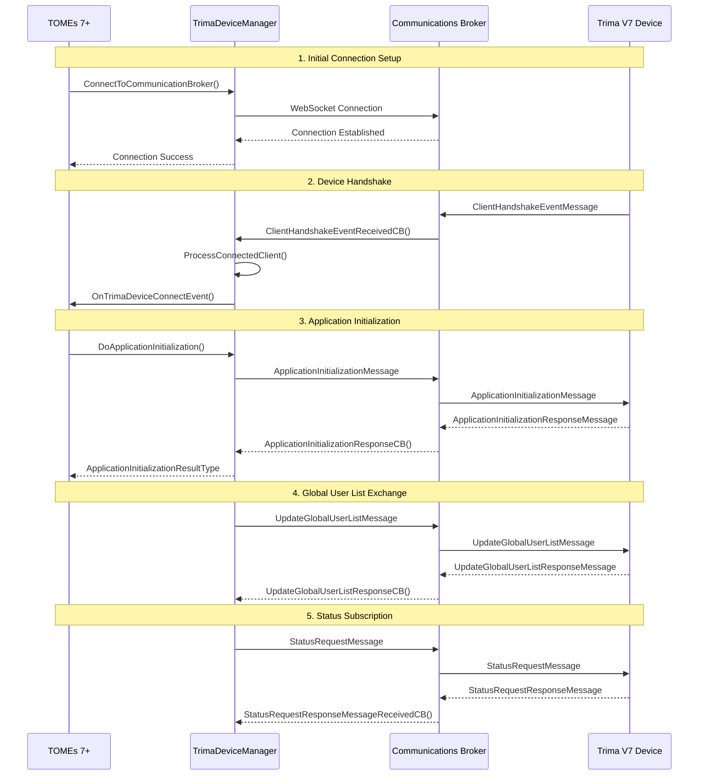
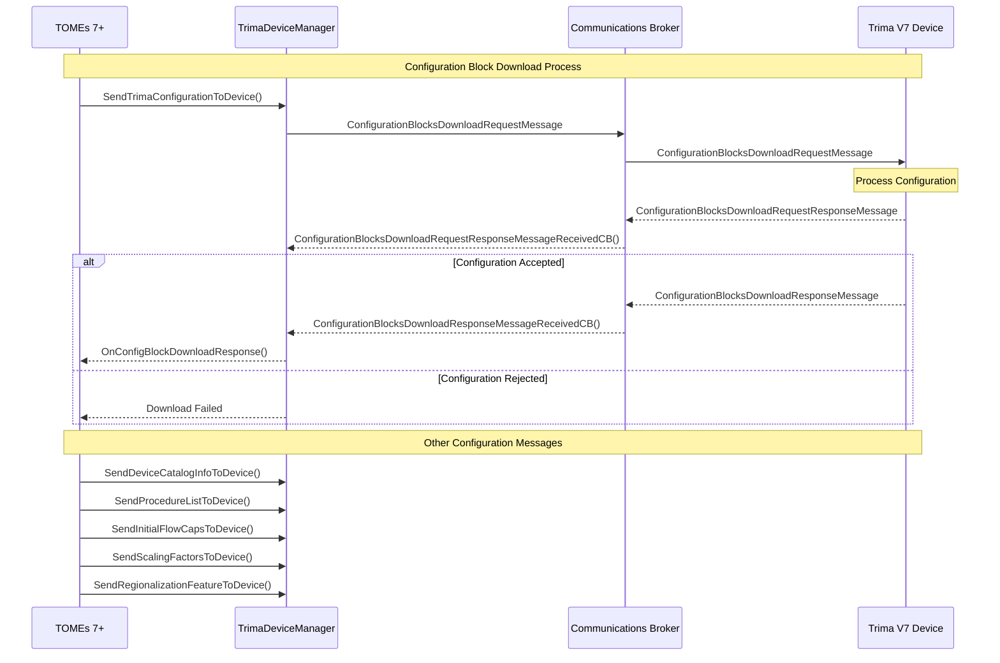
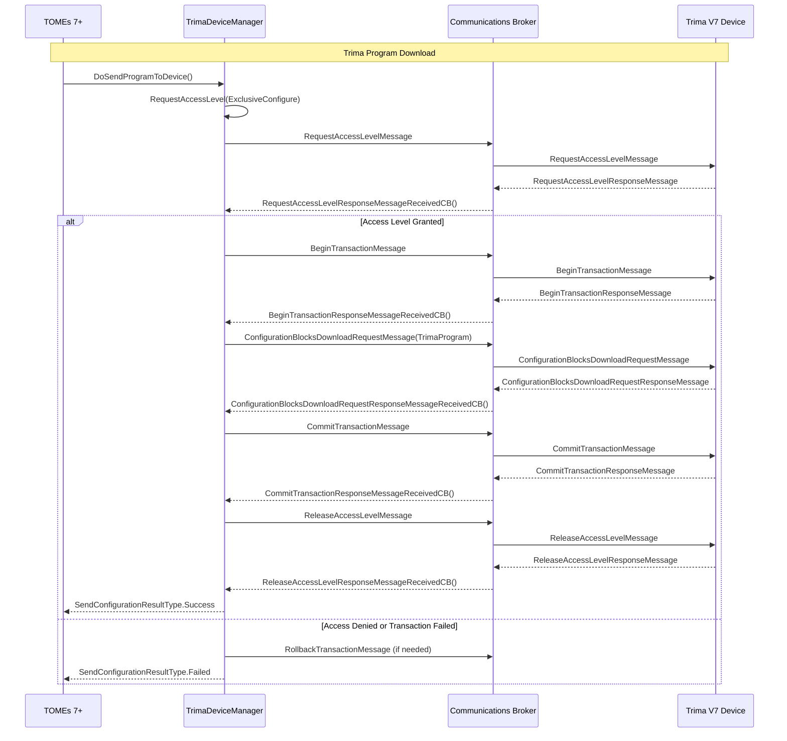
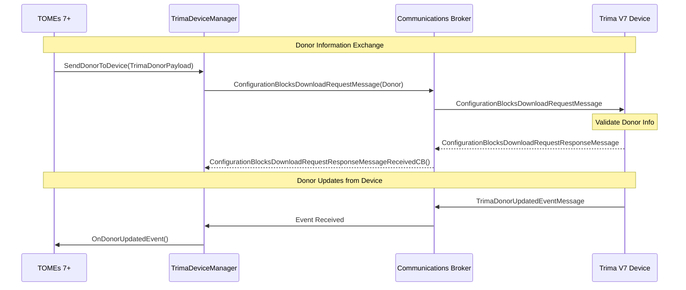
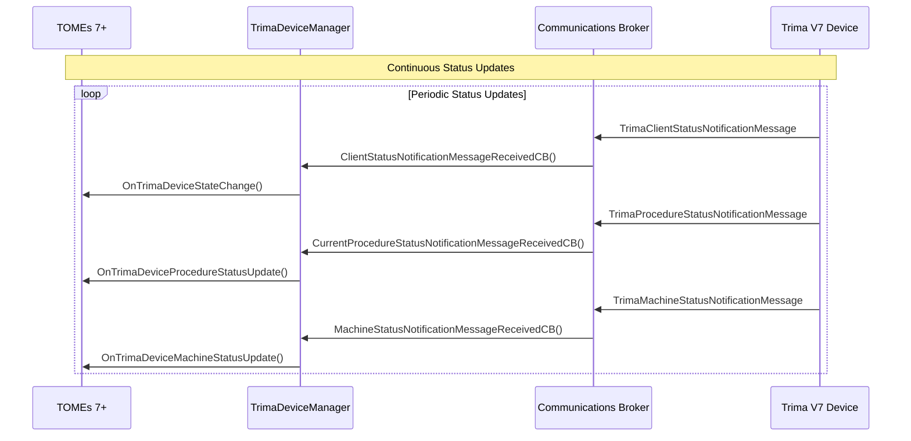
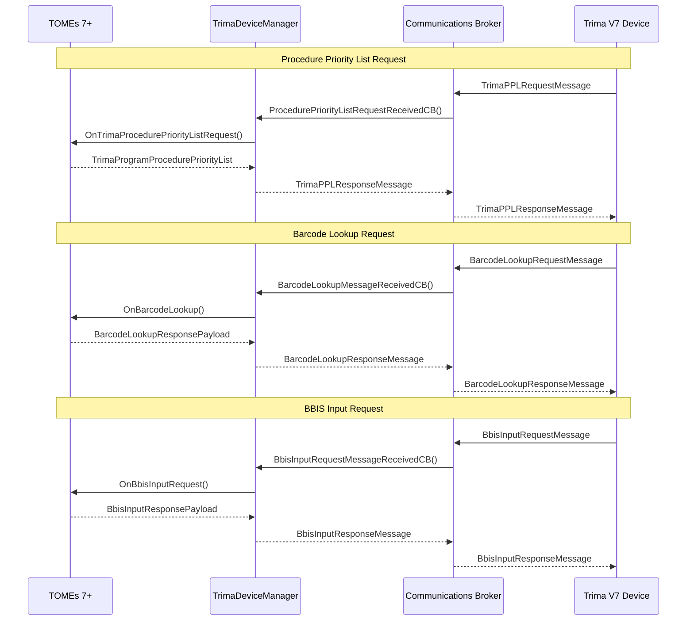
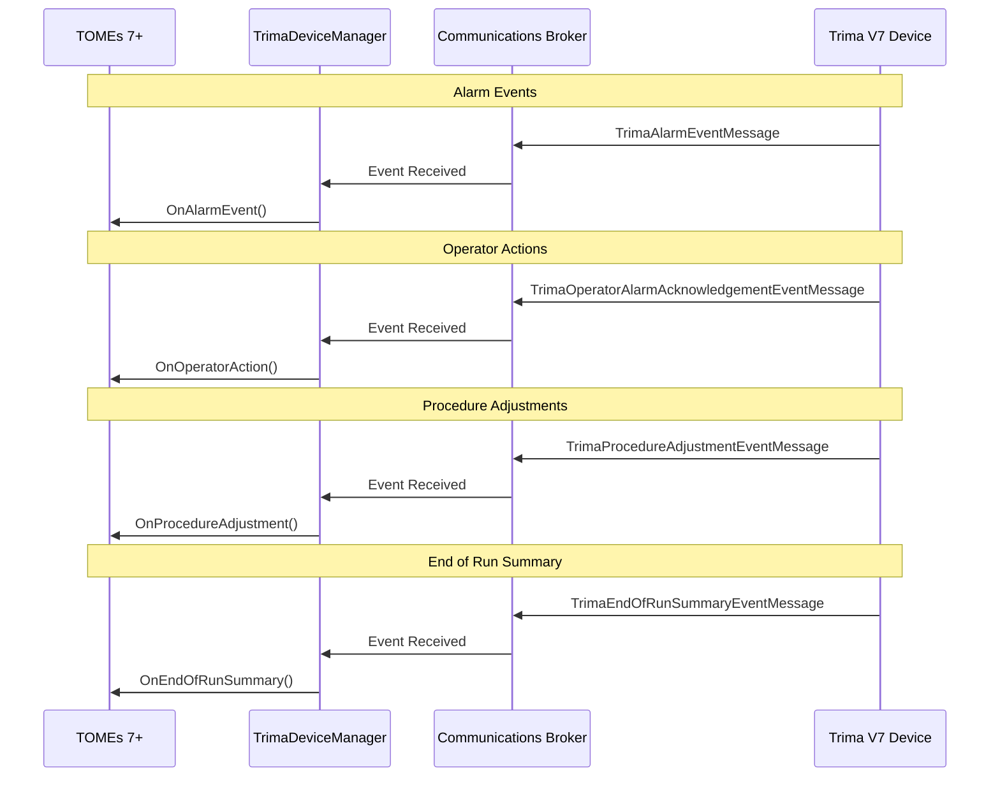
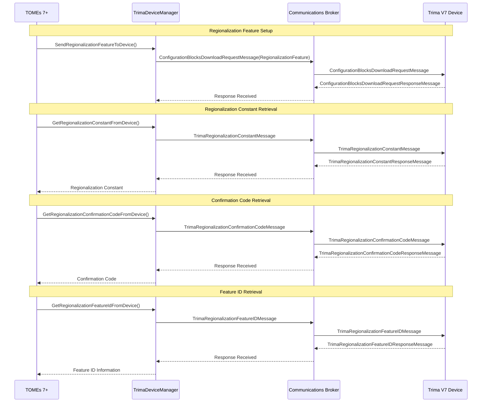
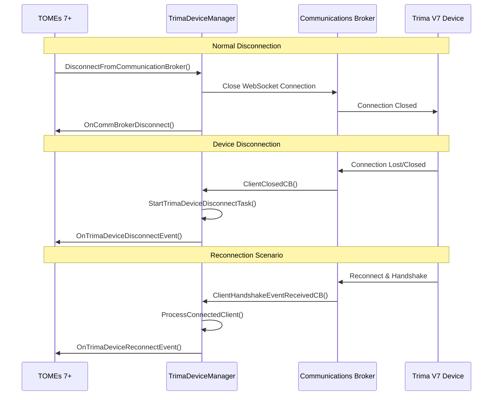
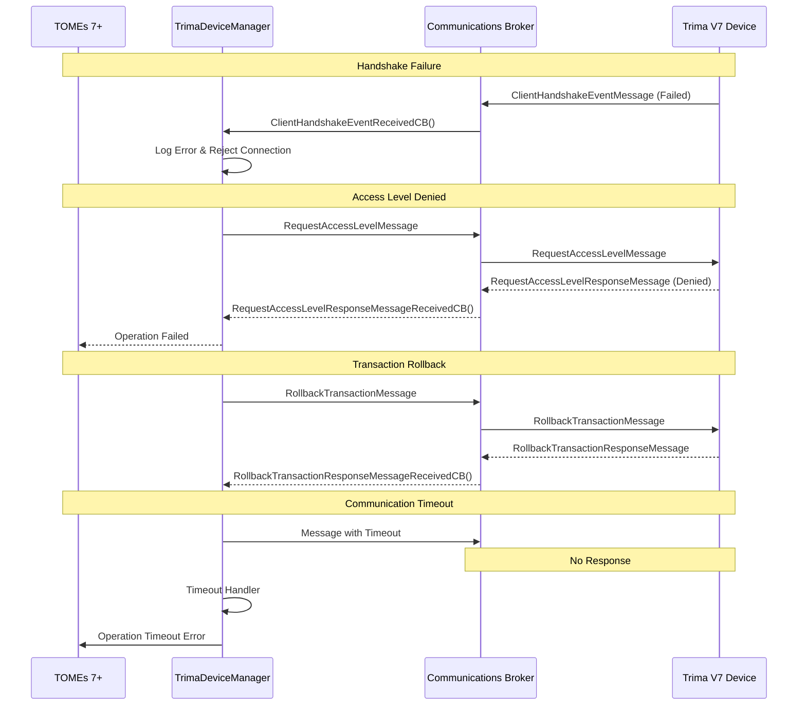

# BCT.CommonComponent Interface Control Document (ICD)

## Table of Contents
1. [Overview](#overview)
2. [System Architecture](#system-architecture)
3. [API Interfaces](#api-interfaces)
4. [Message Categories](#message-categories)
5. [Message Definitions](#message-definitions)
6. [Logging Definitions](#logging-definitions)
7. [Data Types and Enumerations](#data-types-and-enumerations)
8. [Connection Properties](#connection-properties)
9. [Error Handling](#error-handling)
10. [Feature Keys](#feature-keys)

## 1. Overview

The BCT Common Component ecosystem provides a comprehensive communication framework for medical device integration. This ICD documents the complete message architecture from the foundational Terminal components through to device-specific implementations like Trima V7.

### Architecture Layers

#### 1.1 Foundation Layer (Terminal)
- **BCT.CommonComponent.Terminal**: Core terminal and client management
- **BCT.CommonComponent.CommunicationAPI**: Base API interfaces and message framework
- **BCT.CommonComponent.CommunicationAPI.Messages**: Foundational message definitions
- **BCT.CommonComponent.MessagingBase**: Core messaging infrastructure
- **BCT.CommonComponent.CommunicationsBroker**: Message routing and broker services

#### 1.2 Device Controller Layer (Trima)
- **BCT.CommonComponent.DeviceControllers.Trima**: Trima-specific API implementations
- **BCT.CommonComponent.DeviceControllers.Trima.Messages**: Trima message definitions and payloads
- **BCT.CommonComponent.DeviceControllers.Trima.FeatureKey**: Feature authorization and configuration
- **BCT.CommonComponent.DeviceControllers.TrimaManager**: Device management and connection handling

### Message Hierarchy
```
BaseMessage (Terminal)
├── BaseUserMessage (Terminal)
│   ├── TrimaAlarmEventMessage (Trima)
│   ├── TrimaPPLRequestMessage (Trima)
│   └── [Other Trima Messages]
├── BaseUserResponseMessage (Terminal)
│   ├── TrimaPPLResponseMessage (Trima)
│   └── [Other Trima Response Messages]
└── [Other Base Message Types]
```

## 2. System Architecture

### Communication Flow
```
TOMEs 7+ ←→ Communications Broker ←→ Trima V7 Device
```

### Primary Interfaces
1. **ITrimaDeviceControllerApi**: Used by TOMEs to communicate with Trima devices
2. **ITrimaDeviceApi**: Used by simulators and device-side implementations
3. **ITrimaDeviceManager**: Manages multiple Trima device connections

## 3. API Interfaces

### 3.1 ITrimaDeviceControllerApi
**Purpose**: Primary interface for TOMEs to interact with Trima devices

**Key Methods**:
- `Connect()`: Establish connection to Communications Broker
- `SendDeviceCatalogInfoToDevice()`: Download catalog information (VISTA)
- `SendProcedureListToDevice()`: Download procedure list (VISTA)
- `SendInitialFlowCapsToDevice()`: Configure initial flow caps
- `SendScalingFactorsToDevice()`: Send scaling factors
- `SendRegionalizationFeatureToDevice()`: Set regionalization features
- `SendTrimaConfigurationToDevice()`: Configure Trima settings
- `SendDonorToDevice()`: Download donor information (VISTA only)
- `GetRegionalizationConstantFromDevice()`: Retrieve regionalization constants
- `GetRegionalizationConfirmationCodeFromDevice()`: Get confirmation codes
- `GetRegionalizationFeatureIdFromDevice()`: Get feature IDs

### 3.2 ITrimaDeviceApi
**Purpose**: Interface for device-side implementations and simulators

**Key Methods**:
- `Connect()`: Connect to Communications Broker
- `Disconnect()`: Disconnect from Communications Broker
- `SendAlarmEvent()`: Send alarm notifications
- `SendOperatorAlarmAcknowledgementEvent()`: Send alarm acknowledgements
- `SendProcedureAdjustmentEvent()`: Send procedure adjustments
- `SendEndOfRunSummaryEvent()`: Send end-of-run summaries
- `SendDonorUpdatedEvent()`: Send donor updates
- `SendProcedureStatusNotification()`: Send procedure status
- `SendMachineStatusNotification()`: Send machine status
- `SendClientStatusNotification()`: Send client status
- `SendTrimaPPLRequestMessage()`: Request Procedure Priority Lists
- `SendBarcodeLookupRequestMessage()`: Request barcode lookups
- `SendBbisInputRequestMessage()`: Send BBIS input requests

## 4. Message Categories

### 4.1 Event Messages
Messages sent to notify of device events and state changes.

### 4.2 Request Messages
Messages requesting information or actions from the receiving system.

### 4.3 Response Messages
Messages responding to previous requests.

### 4.4 Configuration Messages
Messages for configuring device settings and parameters.

### 4.5 Status Notification Messages
Messages providing periodic status updates.

### 4.6 Logging Messages
Messages for audit trail and logging purposes.

## 5. Message Definitions

### 5.1 Foundation Messages (Terminal Layer)

#### 5.1.1 Base Message Types

##### BaseMessage
**Purpose**: Root base class for all messages in the system  
**Namespace**: BCT.CommonComponent.MessagingBase  

**Core Properties**:
- Message routing and identification
- Serialization support
- Version management
- Timestamp handling

##### BaseUserMessage
**Type**: User, Request  
**Purpose**: Base class for all user-initiated messages  
**Derives From**: BaseMessage  
**Namespace**: BCT.CommonComponent.CommunicationAPI.Messages  

**Characteristics**:
- Abstract class - cannot be instantiated directly
- Public serialization enabled
- Supports all destination types

##### BaseUserResponseMessage
**Type**: User, Response  
**Purpose**: Base class for all user response messages  
**Derives From**: BaseResponseMessage  
**Namespace**: BCT.CommonComponent.CommunicationAPI.Messages  

**Characteristics**:
- Abstract class for response messages
- Inherits response handling capabilities
- Public serialization enabled

#### 5.1.2 Connection and Handshake Messages

##### ClientHandshakeEventMessage
**Type**: Internal, Event  
**Direction**: Communications Broker → Client  
**Purpose**: Notification when another client completes handshake  

**Fields**:
- `Info` (ClientHandshakePayload): Handshake information payload

##### ConnectionHandshakeMessage
**Type**: Internal, Request  
**Purpose**: Initial connection handshake between client and broker

##### ConnectionHandshakeResponseMessage
**Type**: Internal, Response  
**Purpose**: Response to connection handshake

#### 5.1.3 Application Initialization Messages

##### ApplicationInitializationMessage
**Type**: User, Request  
**Direction**: TOMEs → Device  
**Purpose**: Initialize application connection with device  
**Derives From**: BaseUserMessage  

**Fields**:
- `Payload` (ApplicationInitializationPayload): Initialization parameters

##### ApplicationInitializationResponseMessage
**Type**: User, Response  
**Direction**: Device → TOMEs  
**Purpose**: Response to application initialization  

##### UpdateGlobalUserListMessage
**Type**: User, Request  
**Purpose**: Update device with global user list  

**Fields**:
- `Payload` (UpdateGlobalUserListPayload): User list data

##### UpdateGlobalUserListResponseMessage
**Type**: User, Response  
**Purpose**: Confirmation of user list update

#### 5.1.4 Configuration Messages

##### ConfigurationBlocksDownloadMessage
**Type**: Request, User  
**Purpose**: Download configuration blocks to device  
**Derives From**: BaseUserMessage  

**Fields**:
- `Blocks` (Array of ConfigurationBlockPayload): Configuration blocks to download

##### ConfigurationBlocksDownloadRequestResponseMessage
**Type**: Request, Response  
**Purpose**: Response to configuration download request

##### RequestConfigurationBlocksMessage
**Type**: User, Request  
**Purpose**: Request configuration blocks from device

##### RequestConfigurationBlocksResponseMessage
**Type**: User, Response  
**Purpose**: Response with requested configuration blocks

#### 5.1.5 Access Level and Transaction Messages

##### RequestAccessLevelMessage
**Type**: User, Request  
**Purpose**: Request specific access level on device

##### RequestAccessLevelResponseMessage
**Type**: User, Response  
**Purpose**: Response to access level request

##### ReleaseAccessLevelMessage
**Type**: User, Request  
**Purpose**: Release previously acquired access level

##### ReleaseAccessLevelResponseMessage
**Type**: User, Response  
**Purpose**: Confirmation of access level release

##### BeginTransactionMessage
**Type**: User, Request  
**Purpose**: Start a transactional operation

##### BeginTransactionResponseMessage
**Type**: User, Response  
**Purpose**: Confirmation of transaction start

##### CommitTransactionMessage
**Type**: User, Request  
**Purpose**: Commit a transactional operation

##### CommitTransactionResponseMessage
**Type**: User, Response  
**Purpose**: Confirmation of transaction commit

##### RollbackTransactionMessage
**Type**: User, Request  
**Purpose**: Rollback a transactional operation

##### RollbackTransactionResponseMessage
**Type**: User, Response  
**Purpose**: Confirmation of transaction rollback

#### 5.1.6 Status and Notification Messages

##### StatusNotificationMessage
**Type**: Status, User  
**Purpose**: Base class for status notifications  
**Derives From**: BaseUserMessage  

**Fields**:
- `Payload` (StatusNotificationBasePayload): Status notification data

##### StatusRequestMessage
**Type**: User, Request  
**Purpose**: Request status notifications from device

##### StatusRequestResponseMessage
**Type**: User, Response  
**Purpose**: Response to status request

#### 5.1.7 Donor Management Messages

##### DonorDownloadMessage
**Type**: User, Request  
**Purpose**: Download donor information to device

##### DonorDownloadRequestMessage
**Type**: User, Request  
**Purpose**: Request donor download

##### DonorDownloadRequestResponseMessage
**Type**: User, Response  
**Purpose**: Response to donor download request

##### DonorDownloadResponseMessage
**Type**: User, Response  
**Purpose**: Confirmation of donor download

##### DonorCommitEventMessage
**Type**: User, Event  
**Purpose**: Notification of donor commit

##### DonorRejectedEventMessage
**Type**: User, Event  
**Purpose**: Notification of donor rejection

##### DonorUpdatedEventMessage
**Type**: User, Event  
**Purpose**: Notification of donor information update

#### 5.1.8 Device Event Messages

##### ButtonPushEventMessage
**Type**: User, Event  
**Purpose**: Notification of button press on device

##### StartOfRunEventMessage
**Type**: User, Event  
**Purpose**: Notification of procedure start

##### EndOfRunEventMessage
**Type**: User, Event  
**Purpose**: Notification of procedure end

##### EndOfRunSummaryEventMessage
**Type**: User, Event  
**Purpose**: End of run summary information

##### AlarmEventMessage
**Type**: User, Event  
**Purpose**: Alarm notification from device

#### 5.1.9 File Transfer Messages

##### FileTransferRequestMessage
**Type**: User, Request  
**Purpose**: Request file transfer

##### FileTransferResponseMessage
**Type**: User, Response  
**Purpose**: Response to file transfer request

##### RequestFileListMessage
**Type**: User, Request  
**Purpose**: Request list of files

##### RequestFileListResponseMessage
**Type**: User, Response  
**Purpose**: Response with file list

##### RequestFileListBySequenceNumberMessage
**Type**: User, Request  
**Purpose**: Request files by sequence number

##### RequestFileListBySequenceNumberResponseMessage
**Type**: User, Response  
**Purpose**: Response with files by sequence number

#### 5.1.10 Language and Localization Messages

##### SetActiveLanguageMessage
**Type**: User, Request  
**Purpose**: Set active language on device

##### SetActiveLanguageResponseMessage
**Type**: User, Response  
**Purpose**: Confirmation of language change

#### 5.1.11 Utility Messages

##### WriteToLogRequestMessage
**Type**: User, Request  
**Purpose**: Request to write entry to device log

##### SetTimeMessage
**Type**: User, Request  
**Purpose**: Set time on device

##### BroadcastMessage
**Type**: User, Broadcast  
**Purpose**: Broadcast message to multiple clients

##### BroadCastResponseMessage
**Type**: User, Response  
**Purpose**: Response to broadcast message

#### 5.1.12 Metrics and Monitoring Messages

##### QueryMetricsMessage
**Type**: User, Request  
**Purpose**: Request system metrics

##### MetricsResponseMessage
**Type**: User, Response  
**Purpose**: Response with system metrics

##### LatencyTestRequestMessage
**Type**: User, Request  
**Purpose**: Request latency test

##### LatencyTestRequestMessageResponse
**Type**: User, Response  
**Purpose**: Response to latency test

#### 5.1.13 Foundation Data Types

##### DonorInfoBasePayload
**Purpose**: Base donor information structure

**Fields**:
- `DonorName` (string): Donor name (max 129 chars)
- `DonorDOB` (int64): Date of birth (Unix epoch time)
- `Gender` (Gender): Donor gender
- `DonorBloodType` (BloodTypes): Blood type

##### StatusNotificationBasePayload
**Purpose**: Base status notification structure (abstract)

**Fields**:
- `ClientId` (TerminalClientId): Terminal client identifier

##### ConfigurationBlockPayload
**Purpose**: Configuration block data structure

##### ApplicationInitializationPayload
**Purpose**: Application initialization parameters

##### ClientHandshakePayload
**Purpose**: Client handshake information

##### EndOfRunSummaryPayload
**Purpose**: End of run summary data

##### DonorUpdatedPayload
**Purpose**: Updated donor information

### 5.2 Trima-Specific Messages (Device Layer)

#### 5.2.1 Alarm and Event Messages

#### TrimaAlarmEventMessage
**Type**: User, Event  
**Direction**: Device → TOMEs  
**Purpose**: Notification when an alarm is triggered  

**Fields**:
- `Number` (int): The alarm number

#### TrimaOperatorAlarmAcknowledgementEventMessage
**Type**: User, Event  
**Direction**: Device → TOMEs  
**Purpose**: Notification of alarm acknowledgement  

**Payload**: TrimaOperatorAlarmAcknowledgementPayload

#### TrimaProcedureAdjustmentEventMessage
**Type**: User, Event  
**Direction**: Device → TOMEs  
**Purpose**: Notification of procedure adjustments  

**Payload**: TrimaProcedureAdjustmentBasePayload

### 5.2 Request/Response Messages

#### TrimaPPLRequestMessage
**Type**: User, Request  
**Direction**: Device → TOMEs  
**Purpose**: Request for Procedure Priority List  

**Fields**:
- `PPLName` (string): Name of requested PPL

#### TrimaPPLResponseMessage
**Type**: User, Response  
**Direction**: TOMEs → Device  
**Purpose**: Response to PPL request  

#### TrimaRegionalizationConstantMessage
**Type**: User, Request  
**Direction**: TOMEs → Device  
**Purpose**: Request regionalization constant  

#### TrimaRegionalizationConstantResponseMessage
**Type**: User, Response, Request  
**Direction**: Device → TOMEs  
**Purpose**: Response with regionalization constant  

#### TrimaRegionalizationConfirmationCodeMessage
**Type**: User, Request  
**Direction**: TOMEs → Device  
**Purpose**: Request confirmation code  

#### TrimaRegionalizationConfirmationCodeResponseMessage
**Type**: User, Response, Request  
**Direction**: Device → TOMEs  
**Purpose**: Response with confirmation code  

#### TrimaRegionalizationFeatureIDMessage
**Type**: User, Request  
**Direction**: TOMEs → Device  
**Purpose**: Request feature ID information  

#### TrimaRegionalizationFeatureIDResponseMessage
**Type**: User, Response, Request  
**Direction**: Device → TOMEs  
**Purpose**: Response with feature ID information  

### 5.3 Configuration Payloads

#### TrimaConfigurationPayload
**Purpose**: Configure Trima device settings  

**Key Fields**:
- `OneTimeConfig` (bool): Temporary vs permanent configuration
- `HeightUnits` (HeightUnitsType): Height measurement units
- `WeightUnits` (WeightUnitsType): Weight measurement units
- `DateFormat` (TrimaDateFormatType): Date display format
- `TimeFormat` (TimeFormatType): Time display format
- `DecimalDelimiter` (DecimalDelimiterType): Decimal point delimiter
- `RBCMeasurement` (RbcMeasurementType): RBC measurement type
- `AudioLevel` (TrimaAudioLevelType): Speaker audio level
- `ReturnPressureHighLimit` (double): Maximum return pressure (230-310)
- `DrawPressureLowLimit` (double): Maximum draw pressure (-250 to -100)
- `PlateletACRatio` (double): Inlet AC ratio for platelets (6.0-13.7)
- `PlasmaACRatio` (double): AC ratio for plasma (6.0-13.7)
- `PostHematocrit` (double): Minimum post hematocrit (30.0-55.0)
- `TBVPercentage` (int): TBV removal percentage (1-15)
- `WeightSetting` (double): Weight threshold for TBV (40-226 kg)
- `PostProcedurePlateletCount` (double): Min post-procedure platelet count
- `MaximumProcedureDuration` (int): Max procedure duration (10-150 min)
- `MaximumQualificationDuration` (int): Max qualification duration (10-150 min)
- `ACRate` (int): AC infusion curve setting (1-6)
- `VolumeRemovalStrategy` (TrimaVolumeRemovalTypes): Volume removal strategy
- `MaxDrawFlow` (TrimaMaxDrawFlowType): Inlet flow limit
- `MinimumReplacementVolume` (int): Replacement fluid threshold (0-1000 ml)
- `DRBCSplitNotification` (bool): DRBC split alert
- `DRBCThreshold` (int): DRBC dose definition (150-450 ml)
- `PlasmaRinseback` (bool): Plasma rinseback protocol
- `SalineRinseback` (bool): Saline rinseback protocol
- `ProductBagAirRemoval` (bool): Air removal during testing
- `AutoFlow` (bool): Enable/disable autoflow
- `FlowRateEntry` (bool): Flow rate entry capability
- `AutoFlowDelta` (TrimaAutoFlowDeltaType): Auto flow rate delta
- `CollectPlateletsInOneBag` (bool): Single bag platelet collection
- `DefaultPlateletCount` (int): Default platelet count (50-600)
- `RbcACRatio` (TrimaRbcACRatioType): Inlet/AC ratio for RBC
- `ReplacementSolution` (bool): Use replacement fluid
- `ReplacementSolutionPercent` (double): Fluid balance percentage (80-120)
- `AMAPPlasmaMinimum` (int): Min plasma volume for AMAP (0-1000 ml)
- `AMAPPlasmaMaximum` (int): Max plasma volume for AMAP (0-1000 ml)
- `InletManagement` (int): Inlet flow setting (1-6)
- `ReturnManagement` (int): Return management setting (1-6)
- `FFPVolume` (int): FFP collection volume (0-1000 ml)

#### TrimaDonorPayload
**Purpose**: Donor information for procedures  
**Derives From**: DonorInfoBasePayload

**Fields**:
- `Height` (double): Height in cm (121.92-243.84)
- `Weight` (double): Weight in kg (22.68-226.76)
- `Hematocrit` (double): Hematocrit percentage (30.0-55.4)
- `PreCount` (double): Pre-count in 10³/μl (50.0-600.0)
- `SampleVolume` (double): Blood sample volume in ml (0.0-100.0)
- `Picture` (string): Base64 encoded donor picture (max 53726 chars)
- `PictureCRC` (uint): CRC of picture byte array

#### TrimaDonorUpdatedPayload
**Purpose**: Updated donor information  
**Derives From**: DonorUpdatedPayload

#### TrimaEndOfRunSummaryPayload
**Purpose**: End-of-run procedure summary  
**Derives From**: EndOfRunSummaryPayload

### 5.4 Status Notification Payloads

#### TrimaProcedureStatusNotificationPayload
**Purpose**: Real-time procedure status updates  
**Derives From**: StatusNotificationBasePayload

**Key Fields**:
- `ProcedureNumber` (uint): Current procedure number
- `TargetProcedureTime` (float): Target time in minutes (0-300)
- `CurrentProcedureTime` (float): Current time in minutes (0-300)
- `RemainingProcedureTime` (float): Remaining time in minutes (0-300)
- `SolutionAdditionTime` (float): Solution addition elapsed time (0-300)
- `TargetPlateletYield` (int): Target platelet yield in 10¹¹ units (0-150)
- `CurrentPlateletYield` (int): Current platelet yield in 10¹¹ units (0-150)
- `TargetPlasmaVolume` (int): Target plasma volume in ml (0-1000)
- `CurrentPlasmaVolume` (int): Current plasma volume in ml (0-1000)
- `TargetRBCVolume` (int): Target RBC volume in ml (0-1000)
- `CurrentRBCVolume` (int): Current RBC volume in ml (0-1000)
- `TargetRBCCollectHematocrit` (float): Target hematocrit (0.0-1.0)
- `CurrentRBCCollectHematocrit` (float): Current hematocrit (0.0-1.0)
- `TargetPlateletVolume` (int): Target platelet volume in ml (0-1200)
- `CurrentPlateletVolume` (int): Current platelet volume in ml (0-1200)
- `TargetPCO` (float): Target plasma carryover percentage (0.0-1.0)
- `TargetPASvolume` (int): Target PAS volume in ml (0-1200)
- `CurrentPASvolume` (int): Current PAS volume in ml (0-1200)
- `TargetRAS1Volume` (int): Target RAS #1 volume in ml (0-500)
- `CurrentRAS1Volume` (int): Current RAS #1 volume in ml (0-500)
- `TargetRAS2Volume` (int): Target RAS #2 volume in ml (0-500)
- `CurrentRAS2Volume` (int): Current RAS #2 volume in ml (0-500)
- `CurrentPlateletACVolume` (int): Current AC in platelet bag (0-1200 ml)
- `CurrentPlasmaACVolume` (int): Current AC in plasma bag (0-1200 ml)
- `CurrentRBC1ACVolume` (int): Current AC in RBC #1 (0-1200 ml)
- `CurrentRBC2ACVolume` (int): Current AC in RBC #2 (0-1200 ml)
- `TotalBloodProcessed` (int): Total blood processed in ml (0-65535)
- `DonorTBV` (int): Donor total blood volume in ml (0-13000)
- `Substate` (string): Current executing substate (max 36 chars)
- `RecoveryState` (string): Current recovery state (max 36 chars)
- `AlarmState` (string): Alarm text for status screen (max 500 chars)
- `CurrentLogName` (string): Current log file name (max 500 chars)
- `SystemStateFlow` (TrimaSystemStateType): Current system state

#### TrimaMachineStatusNotificationPayload
**Purpose**: Machine status updates  
**Derives From**: StatusNotificationBasePayload

#### TrimaClientStatusNotificationPayload
**Purpose**: Client status updates  
**Derives From**: StatusNotificationBasePayload

### 5.5 Program Configuration Messages

#### TrimaCatalogInfo
**Purpose**: Device catalog information for VISTA

#### TrimaProcedureListPayload
**Purpose**: Available procedures list for VISTA

#### TrimaInitialFlowCapsPayload
**Purpose**: Initial flow rate capabilities configuration

#### TrimaProductScalingFactorsPayload
**Purpose**: Product scaling factors for calculations

#### TrimaRegionalizationFeaturePayload
**Purpose**: Regionalization feature settings

#### TrimaPPLConfigPayload
**Purpose**: Procedure Priority List configuration

### 5.6 Operator Action Messages

#### TrimaOperatorActionBasePayload
**Purpose**: Base payload for operator actions

**Fields**:
- `Timestamp` (int64): Action timestamp

#### TrimaProcedureAdjustmentBasePayload
**Purpose**: Procedure adjustment actions  
**Derives From**: TrimaOperatorActionBasePayload

#### TrimaOperatorAlarmAcknowledgementPayload
**Purpose**: Alarm acknowledgement actions

### 5.7 Connection and Critical Data

#### TrimaConnectionPropertiesPayload
**Purpose**: Connection configuration properties

#### TrimaCriticalDataFieldPayload
**Purpose**: Critical data field definitions

#### TrimaTubingInfo
**Purpose**: Tubing set information

## 6. Logging Definitions

### 6.1 AlarmLogEntry
**Purpose**: Audit trail for alarms, advisories, and alerts

**Fields**:
- `ReferenceID` (uint): Unique ID for linking related entries
- `Timestamp` (int64): Alarm timestamp
- `Name` (string): Alarm message text
- `Type` (AlarmType): Alarm type (A1, A2, R1, R2, W)
- `Enum` (int): Alarm enumeration for troubleshooting

### 6.2 OperatorActionLogEntry
**Purpose**: Audit trail for operator actions

**Fields**:
- `ReferenceID` (uint): Unique reference ID for event linking
- `ActionType` (TrimaOperatorActionType): Type of action performed
- `ActionTime` (int64): Time action was taken
- `ConfigSignatureType` (AuthenticateByType): Required authentication type
- `OperatorActionPayload` (TrimaOperatorActionBasePayload): Action details

### 6.3 ProcedureOfferedLogEntry
**Purpose**: Log of procedures offered to operators

**Fields**:
- `ProcedurePayload` (ProcedurePayload): Procedure details

### 6.4 ProcedurePriorityListLogEntry
**Purpose**: Log of PPL operations

### 6.5 ProgramConfigurationReceivedLogEntry
**Purpose**: Log of program configuration updates

## 7. Data Types and Enumerations

### 7.1 System State Types
- `TrimaSystemStateType`: Device system states
- `TrimaSystemEventType`: System event types

### 7.2 Configuration Types
- `TrimaDateFormatType`: Date format options
- `TrimaAudioLevelType`: Audio level settings
- `TrimaMaxDrawFlowType`: Maximum draw flow settings
- `TrimaAutoFlowDeltaType`: Auto flow delta options
- `TrimaVolumeRemovalTypes`: Volume removal strategies
- `TrimaRbcACRatioType`: RBC AC ratio options

### 7.3 Operator and Access Types
- `TrimaOperatorActionType`: Operator action categories
- `TrimaAccessLevelTypes`: Access level definitions
- `TrimaAlarmResponseType`: Alarm response options

### 7.4 Procedure Types
- `TrimaProcedureAdjustmentType`: Procedure adjustment types
- `TrimaProcedureAdjustmentSourceType`: Adjustment source types
- `TrimaVolumeReasonCodeType`: Volume reason codes

### 7.5 Product Types
- `PCXType`: PCX-related types
- `PlateletGenderType`: Platelet gender specifications
- `TrimaControlIdType`: Control ID types

### 7.6 Program Types
- `TrimaProgramVersionType`: Program version information
- `ApplicationInitializationResultType`: Initialization results
- `ReceiveConfigurationResultType`: Configuration receive results
- `SendConfigurationResultType`: Configuration send results

### 7.7 Lookup Types
- `PplLookupOptionType`: PPL lookup options

## 8. Connection Properties

### 8.1 ITrimaDeviceControllerApiConnectionProperties
**Purpose**: Connection configuration for TOMEs

### 8.2 ITrimaDeviceApiConnectionProperties
**Purpose**: Connection configuration for devices

**Key Properties**:
- Client ID and identification
- Software and marketing versions
- Language settings
- Component information
- Client start time

## 9. Error Handling

### 9.1 Connection Errors
- WebSocket connection failures
- Handshake timeout errors
- Authentication failures

### 9.2 Message Errors
- Serialization/deserialization errors
- Invalid message format
- Missing required fields
- Field validation errors

### 9.3 Device Errors
- Device not responding
- Invalid device state
- Configuration conflicts

## 10. Feature Keys

### 10.1 Boolean Features
The system supports various boolean feature flags that control device behavior:

- `TrimaBooleanFeature.JapanFeatures`: Japan-specific features
- `TrimaBooleanFeature.AiroutMitigation`: Air removal mitigation
- `TrimaBooleanFeature.AllowAdjustFlowRatesOnProcedureSelect`: Flow rate adjustment

### 10.2 Value Features
Configurable value-based features for device customization.

### 10.3 Feature Authorization
- Feature key validation
- Authorization levels
- Feature group management

## Appendices

### A. Message Flow Diagrams

#### A.1 Device Connection and Initialization Flow



#### A.2 Configuration Download Flow (VISTA)



#### A.3 Program Download Flow



#### A.4 Donor Information Flow



#### A.5 Status Notification Flow



#### A.6 Request/Response Flow (PPL, Barcode, BBIS)



#### A.7 Alarm and Event Flow



#### A.8 Regionalization Flow



#### A.9 Disconnection Flow



#### A.10 Error Handling Flow

