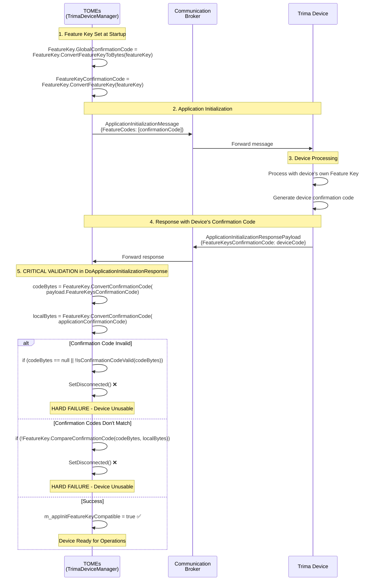
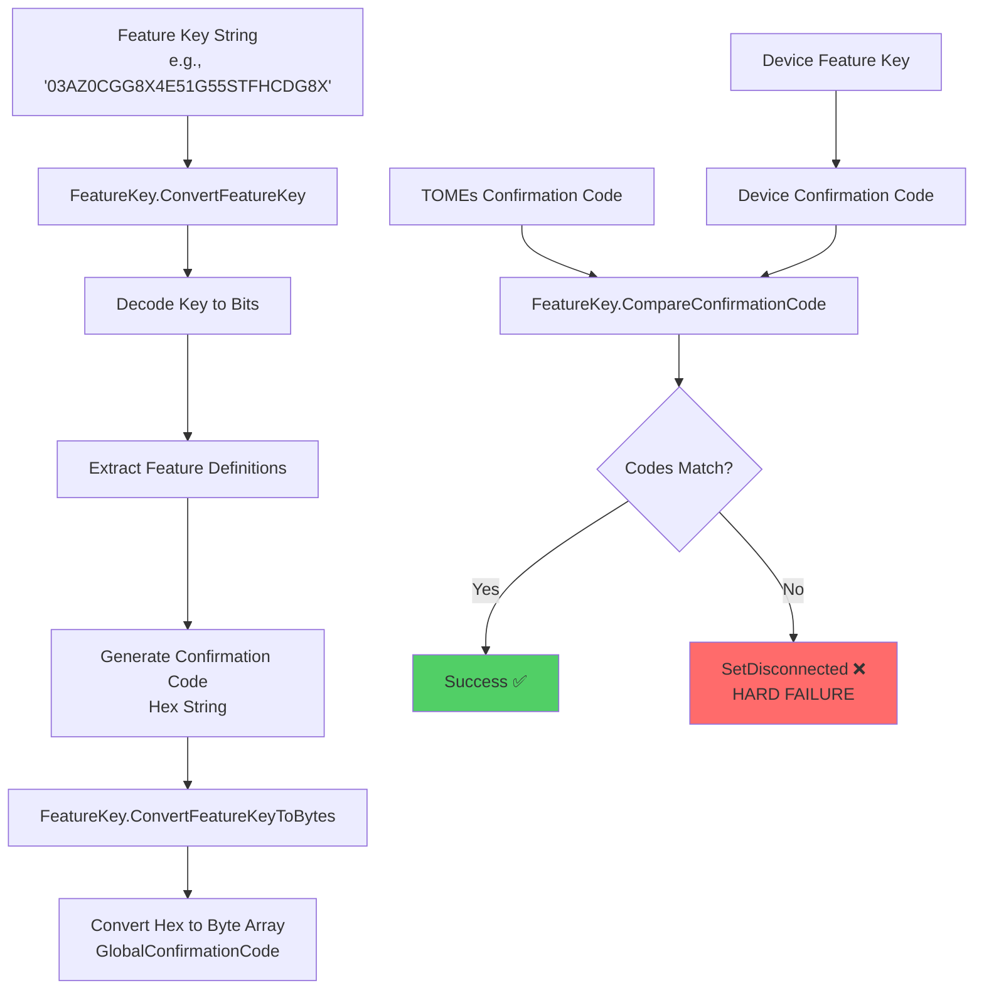
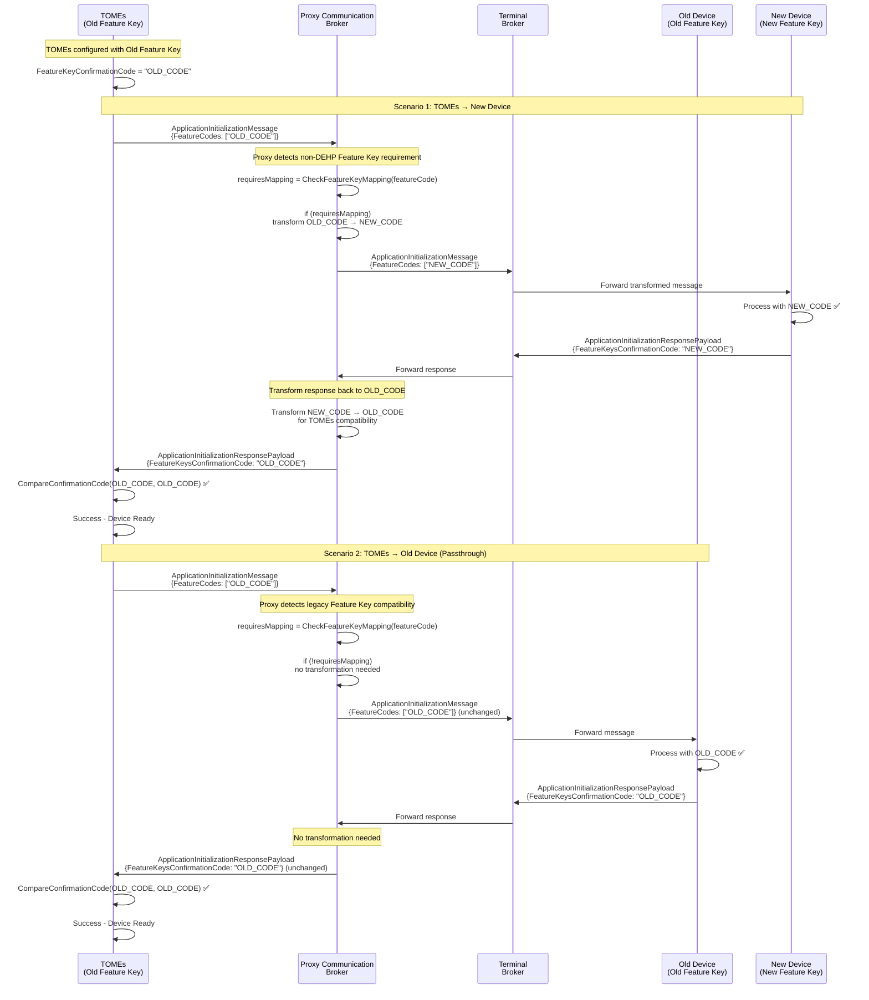
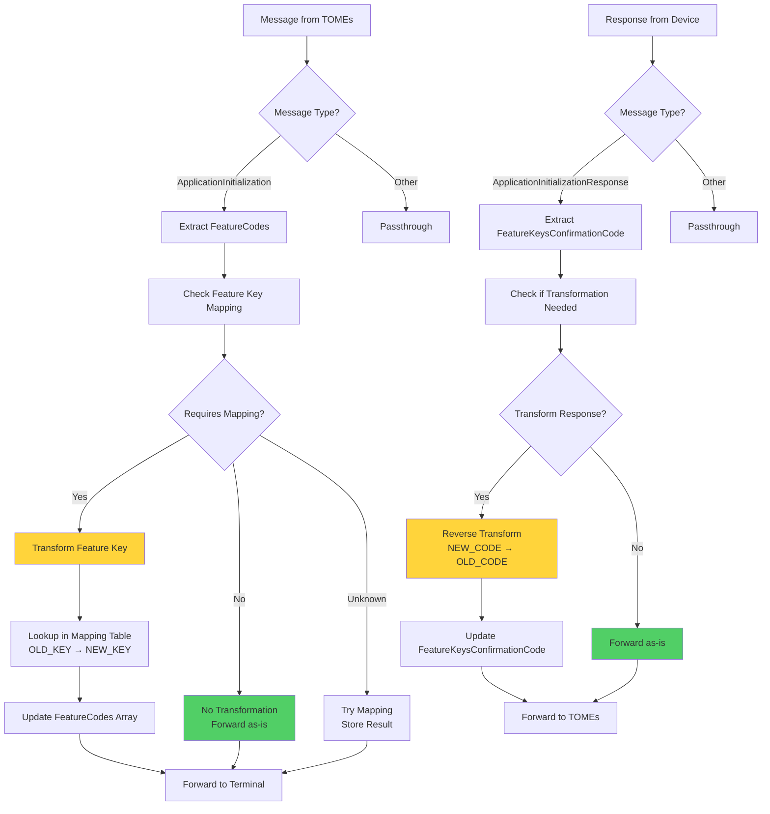

# Multi-Feature Key Support: Final Approach Plan

## Executive Summary

This document presents the recommended approach for supporting multiple Feature Keys in the TOMEs system during fleet firmware upgrade transitions. After comprehensive analysis of the codebase, constraints, and use case requirements, we recommend implementing a **Proxy Communication Broker** solution that enables TOMEs to connect to both old and new firmware devices without modifying existing TOMEs or Terminal codebases.

## Problem Statement

### The Real Use Case: Fleet Firmware Upgrade Transition

The multi-Feature Key requirement stems from **fleet firmware upgrade scenarios**:

- **Mixed Trima V7 Fleet Environment**: During firmware upgrades, some Trima V7 devices run old firmware (old Feature Keys) while others run new firmware with non-DEHP support (new Feature Keys)
- **Extended Transition Period**: Fleet upgrades take significant time, requiring TOMEs to support both Trima V7 device firmware types simultaneously
- **End State**: After upgrade completion, all Trima V7 devices will use the same new non-DEHP-compatible Feature Key
- **Business Need**: Maintain operational continuity during the transition period

### Current System Constraints

#### 1. TOMEs Architecture Constraints
- **Singleton TrimaDeviceManager**: Single instance manages all device connections
- **Global Feature Key State**: `FeatureKey.GlobalConfirmationCode` set once at startup
- **Single Feature Key Configuration**: TOMEs configured with one Feature Key per instance
- **Minimal Code Changes Required**: Preference to avoid extensive TOMEs modifications

#### 2. DeviceControllers Library Constraints
- **2017 Legacy Codebase**: Cannot modify the DeviceControllers library
- **Hard Feature Key Validation**: `ApiFactory.CreateTrimaDeviceManager()` fails on invalid keys
- **Bidirectional Confirmation Code Validation**: Strict comparison between TOMEs and device codes
- **Hard Failure on Mismatch**: `SetDisconnected()` called when confirmation codes don't match

#### 3. Terminal/Communication Broker Constraints
- **Ancient Messaging Platform**: Preference to avoid modifying the existing Terminal codebase
- **WebSocket Protocol**: Custom messaging protocol with auto-generated message classes
- **Existing Protocol Support**: Already supports multiple Feature Codes in `ApplicationInitializationPayload`

## Analysis of Alternative Approaches

### Option 1: Modify TOMEs CommonComponent Wrapper

**Approach**: Extend TOMEs wrapper to handle multiple Feature Keys before calling DeviceControllers.

**Pros**:
- Contained within TOMEs codebase
- No external dependencies

**Cons**:
- Violates singleton TrimaDeviceManager constraint
- Requires significant TOMEs code changes
- Complex Feature Key compatibility detection logic
- Risk of breaking existing functionality

**Verdict**: ❌ **Rejected** - Too many changes to TOMEs architecture

### Option 2: Modify DeviceControllers Library

**Approach**: Update the 2017 DeviceControllers library to support multiple Feature Keys natively.

**Pros**:
- Clean architectural solution
- Native multi-key support

**Cons**:
- Requires modifying ancient, stable codebase
- High risk of introducing bugs
- Extensive testing required
- Deployment complexity

**Verdict**: ❌ **Rejected** - Cannot modify 2017 legacy library

### Option 3: Proxy Communication Broker (Recommended)

**Approach**: Deploy a lightweight proxy between TOMEs and the existing Communication Broker that transforms Feature Key messages.

**Pros**:
- Zero changes to TOMEs or Terminal codebases
- Leverages existing protocol support for multiple Feature Codes
- Transparent to both endpoints
- Configuration-driven mapping
- Easy deployment and rollback

**Cons**:
- Additional component to maintain
- Single point of failure (mitigated with high availability)
- Slight performance overhead

**Verdict**: ✅ **RECOMMENDED** - Best balance of functionality and risk

## Recommended Solution: Proxy Communication Broker

### Current System: Confirmation Code Validation Flow

The following diagram illustrates the exact mechanism of Feature Key validation and the critical points where mismatches cause device disconnection:



### Feature Key to Confirmation Code Conversion Process



### Proxy Solution: Message Transformation Flow

The following diagram shows how the proxy intercepts and transforms Feature Key messages to enable compatibility between TOMEs and mixed fleet devices:



### Proxy Internal Logic Flow



### Architecture Overview

```
TOMEs (Single Feature Key) → [Proxy Broker] → [Terminal Broker] → Mixed Trima V7 Fleet
                                    ↓
                            Feature Key Mapping
                                    ↓
                          Legacy Firmware ← Old Keys
                          Non-DEHP Firmware ← New Keys
```

### Core Components

#### 1. Feature Key Mapping Service
```csharp
public class FeatureKeyMappingService
{
    private Dictionary<string, string> _oldToNewMapping;
    private Dictionary<string, string> _newToOldMapping;
    
    public string MapOldToNew(string oldConfirmationCode);
    public string MapNewToOld(string newConfirmationCode);
    public bool IsLegacyKey(string confirmationCode);
    public bool IsNonDEHPKey(string confirmationCode);
    public bool RequiresMapping(string confirmationCode);
}
```

#### 2. Proxy Communication Broker
```csharp
public class FeatureKeyProxyBroker
{
    private WebSocketServer _tomesListener;        // TOMEs connects here
    private WebSocketClient _terminalConnection;   // Connects to real Terminal
    private FeatureKeyMappingService _mappingService;
    private Dictionary<string, bool> _featureKeyMappingCache;
    
    // Transform messages from TOMEs to Terminal
    public void OnMessageFromTOMEs(string clientId, string message);
    
    // Transform responses from Terminal to TOMEs
    public void OnMessageFromTerminal(string clientId, string message);
}
```

### Implementation Details

#### Message Transformation Logic

**1. TOMEs → Device (ApplicationInitialization)**
```csharp
public void OnMessageFromTOMEs(string clientId, string message)
{
    if (IsApplicationInitializationMessage(message))
    {
        var payload = JsonConvert.DeserializeObject<ApplicationInitializationPayload>(message);
        var tomesConfirmationCode = payload.FeatureCodes?.FirstOrDefault();
        
        // Check if Feature Key mapping is required
        var requiresMapping = _mappingService.RequiresMapping(tomesConfirmationCode);
        
        if (requiresMapping)
        {
            var targetKey = _mappingService.MapOldToNew(tomesConfirmationCode);
            payload.FeatureCodes = new List<string> { targetKey };
            message = JsonConvert.SerializeObject(payload);
        }
    }
    
    _terminalConnection.Send(message);
}
```

**2. Device → TOMEs (ApplicationInitializationResponse)**
```csharp
public void OnMessageFromTerminal(string clientId, string message)
{
    if (IsApplicationInitializationResponseMessage(message))
    {
        var response = JsonConvert.DeserializeObject<ApplicationInitializationResponsePayload>(message);
        var deviceConfirmationCode = response.FeatureKeysConfirmationCode;
        var tomesExpectedCode = _tomesConfiguration.FeatureKeyConfirmationCode;
        
        // Transform device response to match TOMEs expectation
        if (_mappingService.IsNonDEHPKey(deviceConfirmationCode))
        {
            response.FeatureKeysConfirmationCode = _mappingService.MapNewToOld(deviceConfirmationCode);
            message = JsonConvert.SerializeObject(response);
        }
    }
    
    _tomesConnection.Send(message);
}
```

#### Feature Key Mapping Strategy

**Primary Approach: FeatureKey to ConfirmationCode Mapping**
```csharp
public bool RequiresMapping(string confirmationCode)
{
    // Check if this confirmation code needs to be mapped to non-DEHP-compatible version
    return _oldToNewMapping.ContainsKey(confirmationCode);
}

public string MapToCompatibleKey(string originalConfirmationCode)
{
    // Map legacy Feature Key to non-DEHP-compatible Feature Key for Trima V7
    if (_oldToNewMapping.TryGetValue(originalConfirmationCode, out var mappedKey))
    {
        return mappedKey;
    }
    
    return originalConfirmationCode; // No mapping needed
}
```

**Validation Approach: Confirmation Code Verification**
```csharp
public bool ValidateMapping(string originalCode, string mappedCode)
{
    // Verify that the mapping preserves feature compatibility for Trima V7
    var originalFeatures = FeatureKey.ConvertConfirmationCode(originalCode);
    var mappedFeatures = FeatureKey.ConvertConfirmationCode(mappedCode);
    
    return AreFeatureCompatible(originalFeatures, mappedFeatures);
}
```

### Configuration Management

#### Mapping Table Configuration
```json
{
  "featureKeyMappings": {
    "oldToNew": {
      "03AZ0CGG8X4E51G55STFHCDG8X": "03X32638Z2ZHP629Y9T7PPM0X",
      "0YR4GB5SVIV7WBRE0X": "03ZE408K6Y2X2X918FNYUFWFP",
      "03ZE408K6Y2X2X918FNYUFWFP": "03X32638Z2ZHP629Y9T7PPM0X"
    },
    "confirmationCodeMappings": {
      "old_confirmation_code_1": "new_confirmation_code_1",
      "old_confirmation_code_2": "new_confirmation_code_2"
    }
  },
  "tomesConfiguration": {
    "featureKey": "03AZ0CGG8X4E51G55STFHCDG8X",
    "confirmationCode": "computed_confirmation_code"
  },
  "proxySettings": {
    "tomesListenPort": 8080,
    "terminalTargetHost": "localhost",
    "terminalTargetPort": 8081,
    "enableLogging": true,
    "fallbackBehavior": "passthrough"
  }
}
```

#### TOMEs Configuration Changes
```xml
<!-- Minimal change: Point TOMEs to proxy instead of Terminal -->
<add key="CommBrokerIp" value="localhost" />
<add key="CommBrokerPort" value="8080" />  <!-- Proxy port -->
```

## Risk Assessment and Mitigation

### High Risk Items

#### 1. Confirmation Code Mapping Accuracy
**Risk**: Incorrect mappings cause device disconnections
**Mitigation**: 
- Comprehensive mapping validation
- Automated testing of all key combinations
- Rollback procedures for mapping updates

#### 2. Proxy Availability
**Risk**: Proxy failure breaks all device connections
**Mitigation**:
- High availability deployment
- Health monitoring and alerting
- Automatic failover to direct connection

#### 3. Performance Impact
**Risk**: Message transformation adds latency
**Mitigation**:
- Optimize JSON parsing and transformation
- Implement caching for mapping lookups
- Monitor and alert on performance degradation

### Medium Risk Items

#### 1. Feature Key Mapping Accuracy
**Risk**: Incorrect Feature Key mapping causes connection failures
**Mitigation**:
- ConfirmationCode-based mapping verification approach
- Fallback mechanisms for unmapped keys
- Comprehensive logging for troubleshooting

#### 2. Configuration Management Complexity
**Risk**: Complex mapping configurations lead to errors
**Mitigation**:
- Configuration validation tools
- Version control for mapping tables
- Automated configuration testing

### Low Risk Items

#### 1. WebSocket Protocol Compatibility
**Risk**: Proxy doesn't handle all message types correctly
**Mitigation**:
- Comprehensive protocol testing
- Passthrough mode for unknown messages
- Gradual feature rollout

## Conclusion

The Proxy Communication Broker approach provides the optimal solution for supporting multi-Feature Key requirements during fleet firmware upgrades. It respects all architectural constraints, minimizes changes to existing systems, and provides a clean transition path for mixed fleet environments.

**Key Benefits**:
- ✅ Zero changes to TOMEs or Terminal codebases
- ✅ Supports mixed fleet during transition period
- ✅ Maintains strict Feature Key validation integrity
- ✅ Configuration-driven with easy rollback
- ✅ Transparent operation to existing systems

**Recommendation**: Proceed with Proxy Communication Broker implementation as the primary solution for multi-Feature Key support during fleet firmware upgrade transitions.