# Multi-Feature Key Proxy: Implementation Roadmap & PoC Plan

## Overview

This document outlines a practical, phased approach to implementing the Proxy Communication Broker solution, starting with a minimal PoC to validate the approach and progressing to a production-ready implementation.

## Phase 0: Discovery & Validation

### Objective: Validate Technical Feasibility

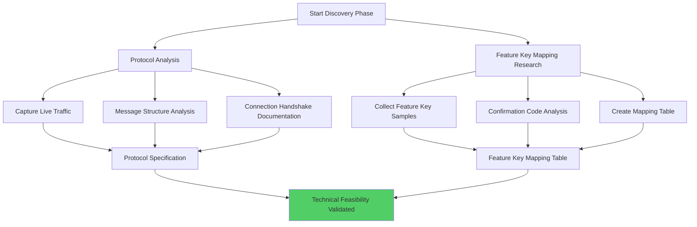

#### 0.1 Protocol Analysis Deep Dive
**Goal**: Understand the exact WebSocket protocol between TOMEs and Terminal

**Tasks**:
1. **Capture Live Traffic**
   ```bash
   # Use Wireshark or similar to capture WebSocket traffic
   # Document message formats, handshake, and protocol specifics
   ```

2. **Message Structure Analysis**
   - Examine actual `ApplicationInitializationPayload` JSON structure
   - Document all message types that flow through the broker
   - Identify message headers, routing information, and payload formats

3. **Connection Handshake Documentation**
   - Document authentication/authorization requirements
   - Understand connection lifecycle and error handling
   - Map out reconnection and failover behaviors

**Deliverables**:
- Protocol specification document
- Sample message captures
- Connection flow documentation

#### 0.2 Feature Key Mapping Research
**Goal**: Create the actual mapping between old and new Feature Keys

**Tasks**:
1. **Collect Feature Key Samples**
   ```csharp
   // Document actual Feature Keys from both firmware versions
   var oldKeys = new[] {
       "03AZ0CGG8X4E51G55STFHCDG8X",  // Old firmware key 1
       "0YR4GB5SVIV7WBRE0X",          // Old firmware key 2
       // ... collect all old keys
   };
   
   var newKeys = new[] {
       "03X32638Z2ZHP629Y9T7PPM0X",  // New firmware key 1
       "03ZE408K6Y2X2X918FNYUFWFP",  // New firmware key 2
       // ... collect all new keys
   };
   ```

2. **Confirmation Code Analysis**
   ```csharp
   // Test the actual conversion process
   foreach (var key in oldKeys)
   {
       var confirmationCode = FeatureKey.ConvertFeatureKey(key);
       var bytes = FeatureKey.ConvertFeatureKeyToBytes(key);
       // Document the mappings
   }
   ```

3. **Create Mapping Table**
   - Build bidirectional mapping between old/new keys
   - Validate that mappings preserve feature compatibility
   - Test confirmation code transformations

**Deliverables**:
- Complete Feature Key mapping table
- Confirmation code transformation rules
- Validation test results

## Phase 1: Minimal PoC

### Objective: Prove the Proxy Concept Works

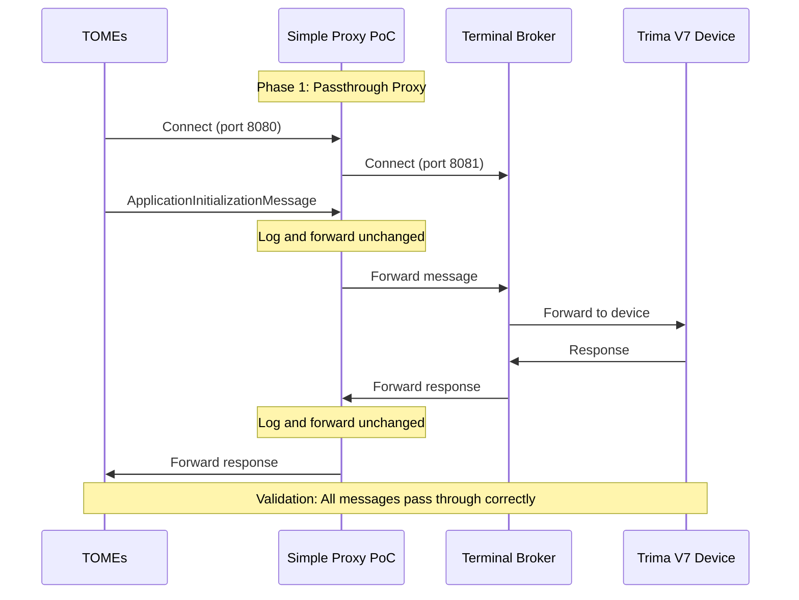

#### 1.1 Simple Passthrough Proxy
**Goal**: Create a basic WebSocket proxy that forwards all messages unchanged

```csharp
// PoC Proxy - Minimal Implementation
public class SimpleProxyPoC
{
    private WebSocketServer _tomesServer;
    private WebSocketClient _terminalClient;
    
    public async Task Start()
    {
        // Listen for TOMEs connections
        _tomesServer = new WebSocketServer("ws://localhost:8080");
        _tomesServer.OnMessage += OnTOMEsMessage;
        
        // Connect to real Terminal
        _terminalClient = new WebSocketClient("ws://localhost:8081");
        _terminalClient.OnMessage += OnTerminalMessage;
        
        await _tomesServer.Start();
        await _terminalClient.Connect();
    }
    
    private void OnTOMEsMessage(string message)
    {
        Console.WriteLine($"TOMEs → Terminal: {message}");
        _terminalClient.Send(message);  // Simple passthrough
    }
    
    private void OnTerminalMessage(string message)
    {
        Console.WriteLine($"Terminal → TOMEs: {message}");
        _tomesServer.Broadcast(message);  // Simple passthrough
    }
}
```

**Validation Steps**:
1. Configure TOMEs to connect to proxy (port 8080)
2. Configure proxy to connect to Terminal (port 8081)
3. Verify all messages pass through correctly
4. Test device connections and basic functionality

#### 1.2 Message Inspection Layer
**Goal**: Add logging and message parsing to understand traffic

```csharp
public class MessageInspectionProxy : SimpleProxyPoC
{
    private void OnTOMEsMessage(string message)
    {
        var parsed = TryParseMessage(message);
        if (parsed?.MessageType == "ApplicationInitializationMessage")
        {
            var payload = JsonConvert.DeserializeObject<ApplicationInitializationPayload>(parsed.Payload);
            Console.WriteLine($"Feature Codes: {string.Join(", ", payload.FeatureCodes)}");
        }
        
        base.OnTOMEsMessage(message);
    }
    
    private void OnTerminalMessage(string message)
    {
        var parsed = TryParseMessage(message);
        if (parsed?.MessageType == "ApplicationInitializationResponsePayload")
        {
            var payload = JsonConvert.DeserializeObject<ApplicationInitializationResponsePayload>(parsed.Payload);
            Console.WriteLine($"Device Confirmation Code: {payload.FeatureKeysConfirmationCode}");
        }
        
        base.OnTerminalMessage(message);
    }
}
```

**Deliverables**:
- Working passthrough proxy
- Message traffic logs and analysis
- Validation that proxy doesn't break existing functionality

## Phase 2: Feature Key Transformation PoC

### Objective: Implement and Test Message Transformation

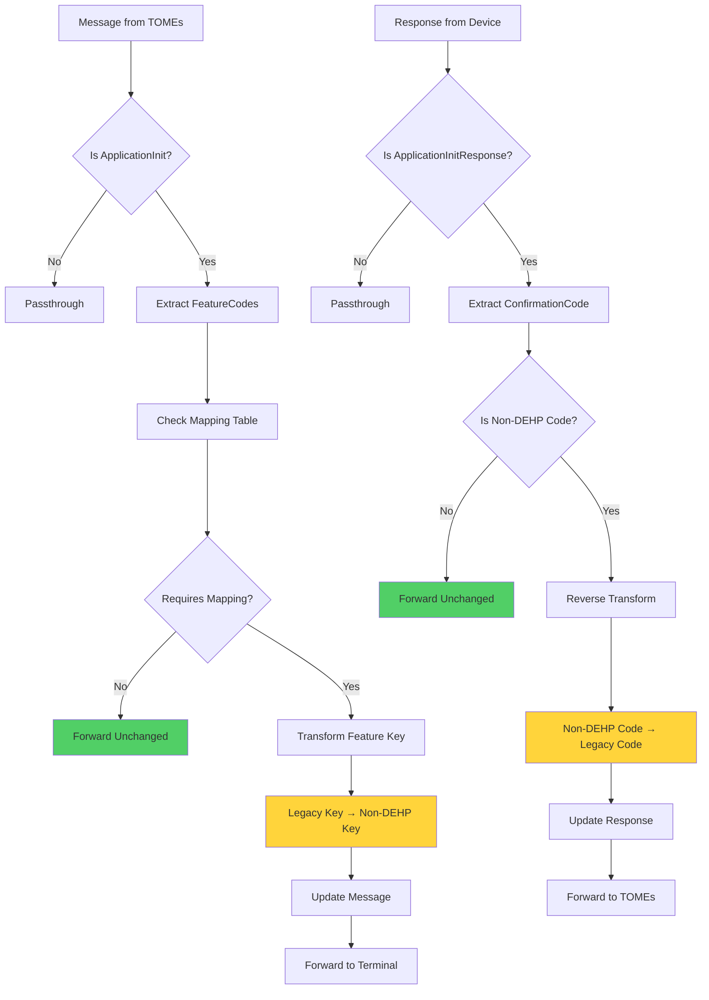

#### 2.1 Basic Transformation Logic
```csharp
public class FeatureKeyTransformationProxy : MessageInspectionProxy
{
    private readonly Dictionary<string, string> _oldToNewMapping = new()
    {
        ["03AZ0CGG8X4E51G55STFHCDG8X"] = "03X32638Z2ZHP629Y9T7PPM0X",
        ["0YR4GB5SVIV7WBRE0X"] = "03ZE408K6Y2X2X918FNYUFWFP"
    };
    
    private readonly Dictionary<string, string> _confirmationCodeMapping = new()
    {
        ["old_confirmation_1"] = "new_confirmation_1",
        ["old_confirmation_2"] = "new_confirmation_2"
    };
    
    protected override void OnTOMEsMessage(string message)
    {
        var transformed = TransformTOMEsMessage(message);
        _terminalClient.Send(transformed);
    }
    
    protected override void OnTerminalMessage(string message)
    {
        var transformed = TransformTerminalMessage(message);
        _tomesServer.Broadcast(transformed);
    }
    
    private string TransformTOMEsMessage(string message)
    {
        if (!IsApplicationInitializationMessage(message))
            return message;
            
        var payload = ParseApplicationInitializationPayload(message);
        var originalCode = payload.FeatureCodes?.FirstOrDefault();
        
        if (originalCode != null && _oldToNewMapping.ContainsKey(originalCode))
        {
            payload.FeatureCodes = new List<string> { _oldToNewMapping[originalCode] };
            Console.WriteLine($"Transformed: {originalCode} → {_oldToNewMapping[originalCode]}");
        }
        
        return SerializeMessage(payload);
    }
    
    private string TransformTerminalMessage(string message)
    {
        if (!IsApplicationInitializationResponseMessage(message))
            return message;
            
        var payload = ParseApplicationInitializationResponsePayload(message);
        var deviceCode = payload.FeatureKeysConfirmationCode;
        
        if (deviceCode != null && _confirmationCodeMapping.ContainsValue(deviceCode))
        {
            var originalCode = _confirmationCodeMapping.FirstOrDefault(x => x.Value == deviceCode).Key;
            if (originalCode != null)
            {
                payload.FeatureKeysConfirmationCode = originalCode;
                Console.WriteLine($"Response transformed: {deviceCode} → {originalCode}");
            }
        }
        
        return SerializeMessage(payload);
    }
}
```

#### 2.2 Feature Key Mapping Validation
```csharp
public class FeatureKeyMappingValidationProxy : FeatureKeyTransformationProxy
{
    private readonly Dictionary<string, bool> _mappingValidationCache = new();
    
    private bool RequiresMapping(string confirmationCode)
    {
        // Check if this confirmation code needs mapping for Trima V7 non-DEHP compatibility
        if (_mappingValidationCache.TryGetValue(confirmationCode, out var cached))
            return cached;
            
        var requiresMapping = _oldToNewMapping.ContainsKey(confirmationCode);
        _mappingValidationCache[confirmationCode] = requiresMapping;
        
        return requiresMapping;
    }
    
    private bool ValidateMapping(string originalCode, string mappedCode)
    {
        // Verify mapping preserves Trima V7 feature compatibility
        try
        {
            var originalBytes = FeatureKey.ConvertConfirmationCode(originalCode);
            var mappedBytes = FeatureKey.ConvertConfirmationCode(mappedCode);
            
            return originalBytes != null && mappedBytes != null;
        }
        catch
        {
            return false;
        }
    }
    
    protected override string TransformTOMEsMessage(string clientId, string message)
    {
        if (!IsApplicationInitializationMessage(message))
            return message;
            
        var payload = ParseApplicationInitializationPayload(message);
        var confirmationCode = payload.FeatureCodes?.FirstOrDefault();
        
        // Use FeatureKey mapping approach instead of device type detection
        if (confirmationCode != null && RequiresMapping(confirmationCode))
        {
            return base.TransformTOMEsMessage(message);
        }
        
        return message; // No mapping needed for this Feature Key
    }
}
```

**Testing Strategy**:
1. **Controlled Environment Testing**
   - Set up test TOMEs instance with old Feature Key
   - Create mock devices with both old and new Feature Keys
   - Verify transformation logic works correctly

2. **Validation Tests**
   ```csharp
   [Test]
   public void TestFeatureKeyTransformation()
   {
       var proxy = new FeatureKeyTransformationProxy();
       var oldMessage = CreateApplicationInitMessage("03AZ0CGG8X4E51G55STFHCDG8X");
       var transformedMessage = proxy.TransformTOMEsMessage(oldMessage);
       
       var payload = ParseMessage(transformedMessage);
       Assert.AreEqual("03X32638Z2ZHP629Y9T7PPM0X", payload.FeatureCodes[0]);
   }
   
   [Test]
   public void TestConfirmationCodeReverseTransformation()
   {
       var proxy = new FeatureKeyTransformationProxy();
       var deviceResponse = CreateApplicationInitResponse("new_confirmation_code");
       var transformedResponse = proxy.TransformTerminalMessage(deviceResponse);
       
       var payload = ParseMessage(transformedResponse);
       Assert.AreEqual("old_confirmation_code", payload.FeatureKeysConfirmationCode);
   }
   ```

**Deliverables**:
- Working transformation proxy
- Device type detection logic
- Comprehensive test suite
- Validation with real Feature Key mappings

## Phase 3: Production-Ready Implementation

### Objective: Build Robust, Production-Quality Proxy

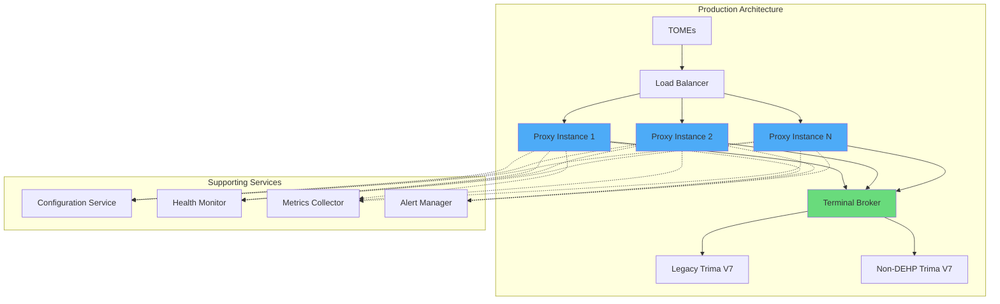

#### 3.1 Architecture Improvements
```csharp
public interface IFeatureKeyMappingService
{
    string MapOldToNew(string oldKey);
    string MapNewToOld(string newKey);
    string MapConfirmationCode(string confirmationCode, TransformDirection direction);
    bool RequiresTransformation(string sourceKey, DeviceType targetDevice);
}

public interface IFeatureKeyValidationService
{
    bool RequiresMapping(string confirmationCode);
    bool ValidateMapping(string originalCode, string mappedCode);
    void CacheValidationResult(string confirmationCode, bool requiresMapping);
}

public interface IMessageTransformationService
{
    string TransformMessage(string message, string clientId, MessageDirection direction);
    bool IsTransformableMessage(string message);
}

public class ProductionProxyBroker
{
    private readonly IFeatureKeyMappingService _mappingService;
    private readonly IFeatureKeyValidationService _keyValidation;
    private readonly IMessageTransformationService _messageTransformation;
    private readonly ILogger _logger;
    private readonly IHealthMonitor _healthMonitor;
    
    // Robust implementation with proper error handling, logging, monitoring
}
```

#### 3.2 Configuration Management
```json
{
  "proxy": {
    "tomesListener": {
      "host": "0.0.0.0",
      "port": 8080,
      "ssl": false
    },
    "terminalTarget": {
      "host": "localhost",
      "port": 8081,
      "ssl": false,
      "connectionTimeout": 30000,
      "reconnectInterval": 5000
    }
  },
  "featureKeyMappings": {
    "oldToNew": {
      "03AZ0CGG8X4E51G55STFHCDG8X": "03X32638Z2ZHP629Y9T7PPM0X"
    },
    "confirmationCodeMappings": {
      "old_conf_1": "new_conf_1"
    }
  },
  "featureKeyValidation": {
    "mappingValidationEnabled": true,
    "cacheTimeout": 3600000,
    "trimaV7NonDEHPCompatibility": true
  },
  "logging": {
    "level": "Information",
    "includeMessagePayloads": false,
    "auditTransformations": true
  },
  "monitoring": {
    "healthCheckInterval": 30000,
    "performanceMetrics": true,
    "alertThresholds": {
      "latencyMs": 100,
      "errorRate": 0.01
    }
  }
}
```

#### 3.3 High Availability Features
```csharp
public class HighAvailabilityProxyBroker : ProductionProxyBroker
{
    private readonly IFailoverManager _failoverManager;
    private readonly ILoadBalancer _loadBalancer;
    
    public async Task StartWithFailover()
    {
        try
        {
            await Start();
        }
        catch (Exception ex)
        {
            _logger.LogError(ex, "Proxy startup failed, initiating failover");
            await _failoverManager.InitiateFailover();
        }
    }
    
    private async Task MonitorHealth()
    {
        while (_isRunning)
        {
            var health = await _healthMonitor.CheckHealth();
            if (!health.IsHealthy)
            {
                _logger.LogWarning("Health check failed: {Reason}", health.Reason);
                await _failoverManager.ConsiderFailover(health);
            }
            
            await Task.Delay(TimeSpan.FromSeconds(30));
        }
    }
}
```

**Deliverables**:
- Production-ready proxy implementation
- Comprehensive configuration system
- High availability and failover capabilities
- Performance monitoring and alerting

## Phase 4: Integration & Testing

### Objective: Integrate with Real Systems and Comprehensive Testing

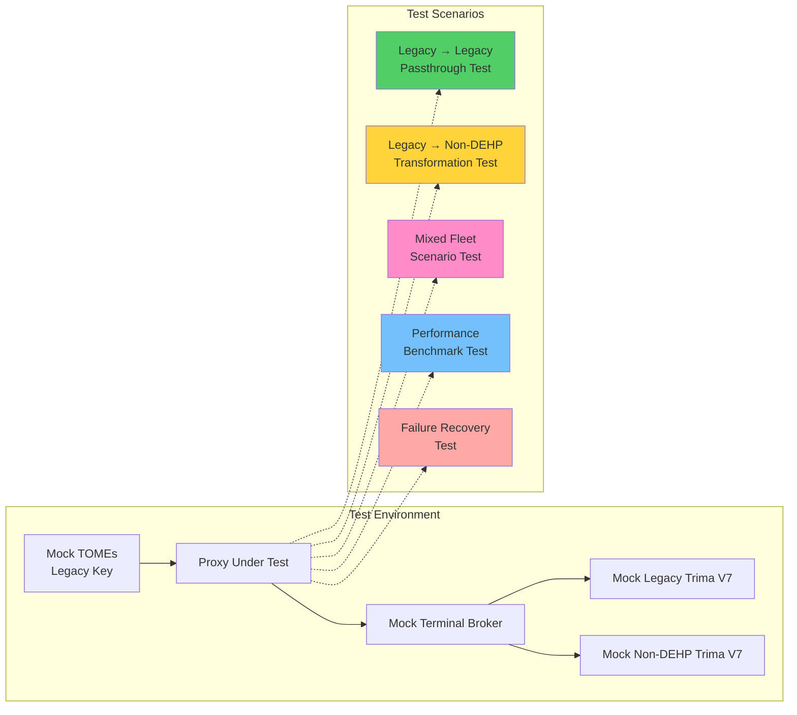

#### 4.1 Test Execution Flow

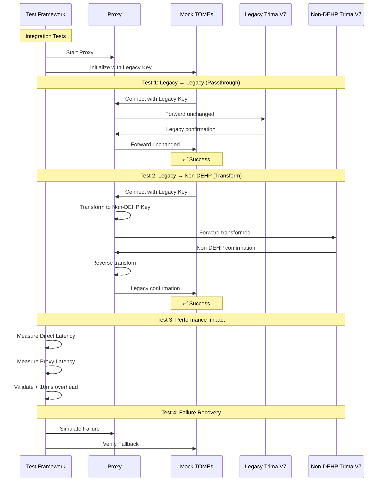

#### 4.2 Test Coverage Matrix

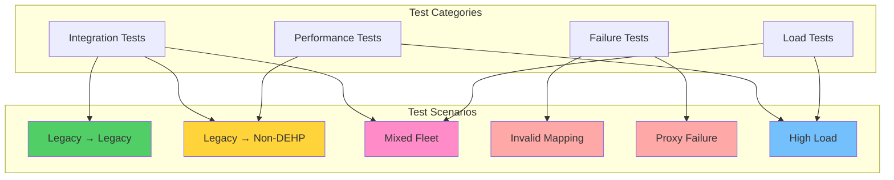

**Deliverables**:
- Comprehensive integration test suite
- Performance benchmarks and validation
- Failure scenario testing and recovery procedures
- Load testing results and capacity planning

## Phase 5: Deployment & Monitoring

### Objective: Deploy to Production Environment with Full Monitoring

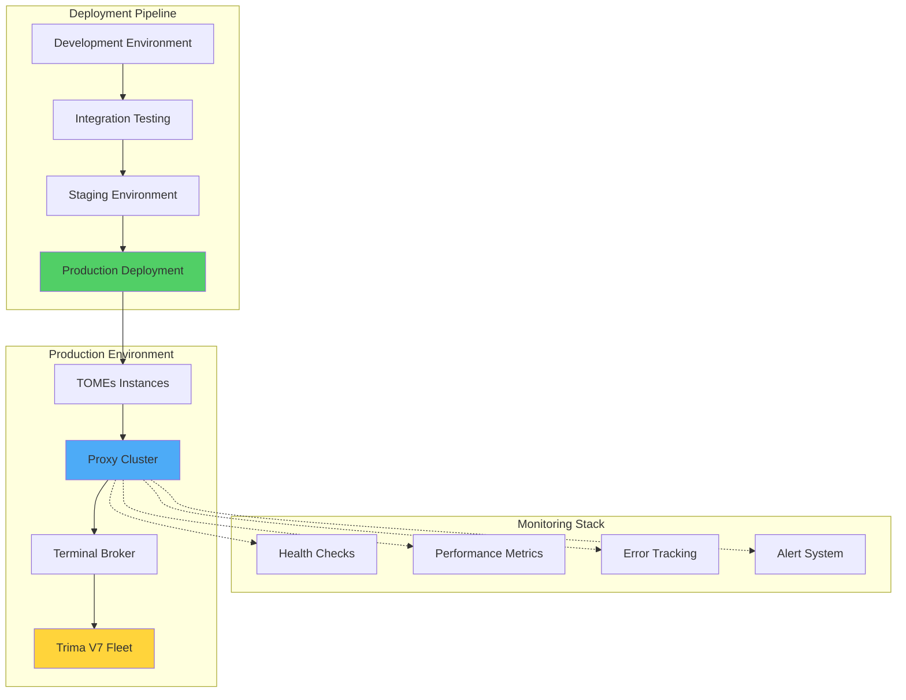

#### 5.1 Deployment Strategy

**Windows Service with Kestrel**
```csharp
// Program.cs - Windows Service Configuration
public class Program
{
    public static void Main(string[] args)
    {
        CreateHostBuilder(args).Build().Run();
    }

    public static IHostBuilder CreateHostBuilder(string[] args) =>
        Host.CreateDefaultBuilder(args)
            .UseWindowsService(options =>
            {
                options.ServiceName = "TOMEs Feature Key Proxy";
            })
            .ConfigureWebHostDefaults(webBuilder =>
            {
                webBuilder.UseKestrel(options =>
                {
                    options.ListenAnyIP(8080); // TOMEs connection port
                });
                webBuilder.UseStartup<Startup>();
            })
            .ConfigureLogging(logging =>
            {
                logging.AddEventLog();
                logging.AddFile("Logs/proxy-{Date}.log");
            });
}
```

**Service Installation Script**
```powershell
# install-proxy-service.ps1
$serviceName = "TOMEs Feature Key Proxy"
$binaryPath = "C:\Program Files\TOMEs\FeatureKeyProxy\FeatureKeyProxy.exe"
$configPath = "C:\Program Files\TOMEs\FeatureKeyProxy\config\proxy.json"

# Install Windows Service
New-Service -Name $serviceName -BinaryPathName $binaryPath -DisplayName $serviceName -StartupType Automatic

# Configure service recovery
sc.exe failure $serviceName reset= 86400 actions= restart/5000/restart/10000/restart/30000

# Start service
Start-Service -Name $serviceName
```

**Configuration Management**
```json
{
  "Kestrel": {
    "Endpoints": {
      "Http": {
        "Url": "http://*:8080"
      }
    }
  },
  "Proxy": {
    "TerminalBroker": {
      "Host": "localhost",
      "Port": 8081,
      "ConnectionTimeout": 30000,
      "ReconnectInterval": 5000
    }
  },
  "Logging": {
    "LogLevel": {
      "Default": "Information",
      "Microsoft": "Warning"
    },
    "EventLog": {
      "LogLevel": {
        "Default": "Warning"
      }
    }
  }
}
```

#### 5.2 Monitoring and Alerting
```csharp
public class ProxyMonitoringService
{
    private readonly IMetricsCollector _metrics;
    private readonly IAlertManager _alerts;
    
    public void RecordTransformation(string fromKey, string toKey, TimeSpan duration)
    {
        _metrics.Increment("proxy.transformations.total");
        _metrics.Histogram("proxy.transformation.duration", duration.TotalMilliseconds);
        _metrics.Counter($"proxy.transformations.{fromKey}_to_{toKey}").Increment();
    }
    
    public void RecordError(string errorType, Exception ex)
    {
        _metrics.Increment($"proxy.errors.{errorType}");
        _alerts.SendAlert(AlertLevel.Warning, $"Proxy error: {errorType}", ex);
    }
    
    public async Task<HealthStatus> CheckHealth()
    {
        var checks = new[]
        {
            CheckTOMEsConnection(),
            CheckTerminalConnection(),
            CheckMappingServiceHealth(),
            CheckPerformanceMetrics()
        };
        
        var results = await Task.WhenAll(checks);
        return new HealthStatus
        {
            IsHealthy = results.All(r => r.IsHealthy),
            Details = results.ToDictionary(r => r.Component, r => r.Status)
        };
    }
}
```

#### 5.3 Operational Procedures
```markdown
## Deployment Checklist

### Pre-Deployment
- [ ] Validate mapping table accuracy
- [ ] Test with representative Feature Keys
- [ ] Verify failover mechanisms
- [ ] Confirm monitoring and alerting setup

### Deployment Steps
1. Deploy proxy in parallel to existing Terminal
2. Configure TOMEs to use proxy (port 8080)
3. Verify connections work for both device types
4. Monitor for 24 hours before declaring success

### Post-Deployment Monitoring
- [ ] Connection success rates
- [ ] Transformation accuracy
- [ ] Performance metrics
- [ ] Error rates and types

### Rollback Procedure
1. Update TOMEs configuration to bypass proxy
2. Verify direct connections work
3. Investigate and fix proxy issues
4. Re-deploy when ready
```

**Deliverables**:
- Production deployment scripts and procedures
- Comprehensive monitoring and alerting setup
- Operational runbooks and troubleshooting guides
- Performance baselines and SLA definitions

## Phase 6: Monitoring & Operations

### Objective: Continuous Monitoring and Operational Excellence

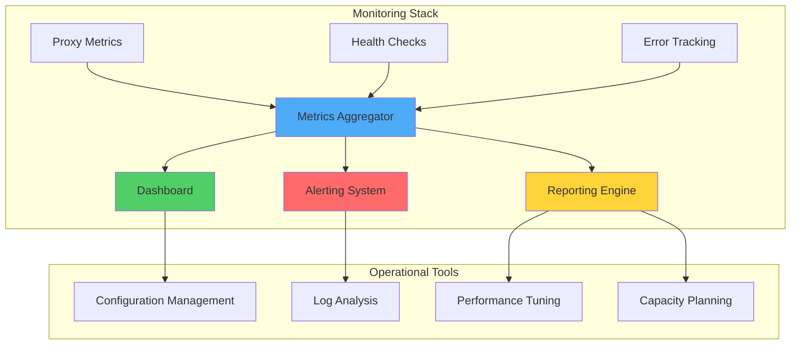

#### 6.1 Key Metrics & Alerts

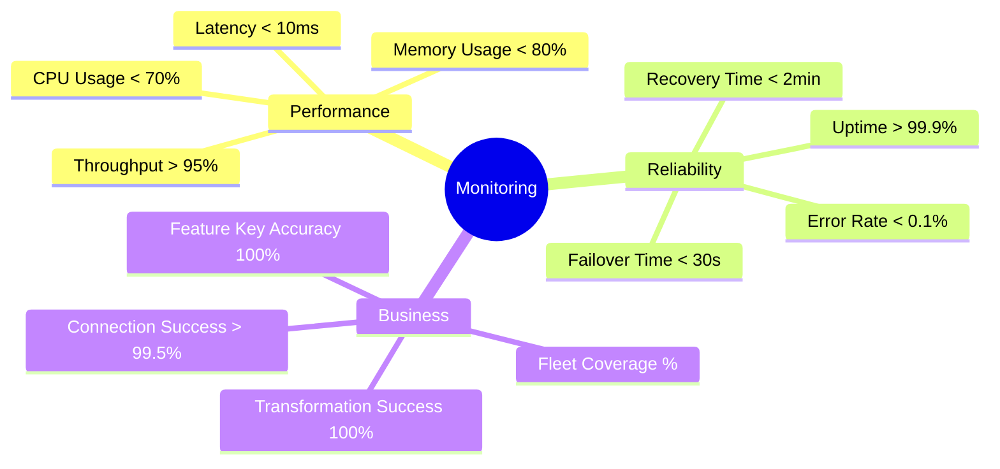

**Deliverables**:
- Comprehensive monitoring dashboard
- Automated alerting system
- Performance optimization tools
- Operational runbooks

## Fleet Migration Timeline

```mermaid
gantt
    title Trima V7 Fleet Migration Timeline
    dateFormat  X
    axisFormat %s
    
    section Fleet Status
    Legacy Trima V7 Devices    :active, legacy, 0, 100
    Non-DEHP Upgrades         :upgrade, 20, 80
    Fully Non-DEHP Fleet     :done, final, 80, 100
    
    section Proxy Operations
    Proxy Deployment         :proxy-deploy, 15, 20
    Proxy Active              :proxy, 20, 85
    Monitoring & Adjustment   :monitor, 20, 80
    Proxy Removal Planning    :removal, 75, 85
    Proxy Decommission       :done, decomm, 85, 90
    
    section TOMEs Migration
    Legacy Feature Key        :tomes-old, 0, 85
    Feature Key Update        :tomes-new, 85, 100
    
    section Critical Milestones
    Proxy Go-Live            :milestone, m1, 20, 0d
    50% Fleet Upgraded       :milestone, m2, 50, 0d
    95% Fleet Upgraded       :milestone, m3, 80, 0d
    Proxy Removal Complete   :milestone, m4, 90, 0d
```

## Success Metrics

### Technical Metrics
- **Connection Success Rate**: > 99.5% for both old and new devices
- **Transformation Accuracy**: 100% correct Feature Key mappings
- **Performance Impact**: < 10ms additional latency
- **Availability**: > 99.9% proxy uptime

### Business Metrics
- **Fleet Upgrade Support**: Successful connection to mixed fleet
- **Operational Continuity**: No service interruptions during upgrades
- **Transition Efficiency**: Smooth migration without manual intervention
- **Cost Effectiveness**: Minimal development and operational overhead

## Risk Mitigation

### Technical Risks
- **Mapping Errors**: Comprehensive testing and validation
- **Performance Degradation**: Continuous monitoring and optimization
- **Proxy Failures**: High availability and automatic failover

### Operational Risks
- **Complex Deployment**: Phased rollout with extensive testing
- **Monitoring Gaps**: Comprehensive metrics and alerting
- **Team Knowledge**: Documentation and training programs

## Implementation Overview

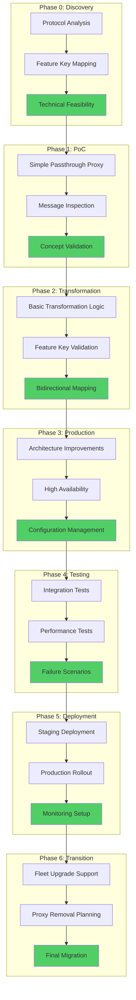

## Success Criteria & Risk Mitigation

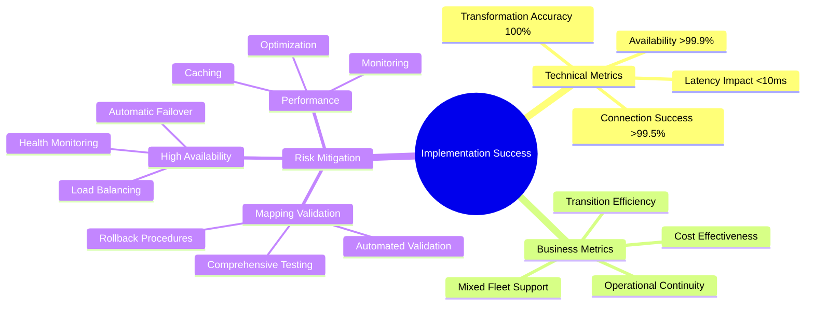

## Conclusion

This phased implementation approach provides a practical path from concept to production, with each phase building on the previous one and providing clear validation points. The PoC phases ensure technical feasibility before committing to full implementation, while the production phases ensure robust, maintainable solution.

**Key Benefits of This Approach**:
- ✅ **Phased Implementation**: Each phase builds on the previous, reducing risk
- ✅ **Early Validation**: PoC phases prove feasibility before full commitment
- ✅ **Incremental Complexity**: Start simple, add sophistication gradually
- ✅ **Clear Success Criteria**: Measurable outcomes at each phase
- ✅ **Risk Mitigation**: Multiple fallback strategies and monitoring

The implementation can begin immediately with Phase 0 discovery work, providing quick validation of the technical approach and building team confidence in the solution.