# TOMEs Common Component Integration Architecture

## System Context (C4 Level 1)

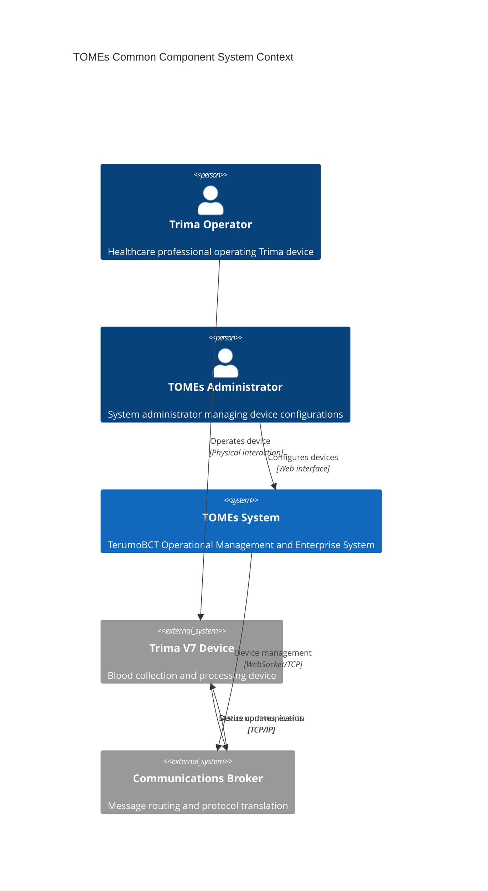

## Container Diagram (C4 Level 2)

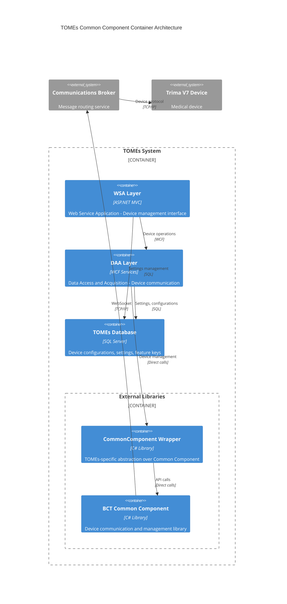

## Component Diagram (C4 Level 3) - DAA Layer

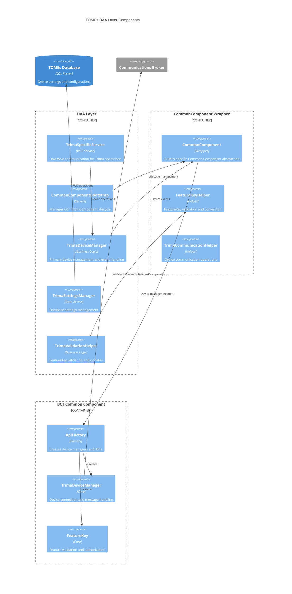

## FeatureKey System Architecture

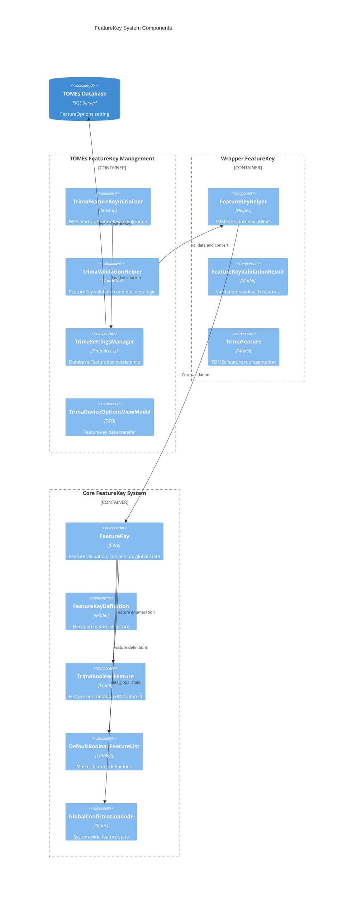

## System Startup Sequence

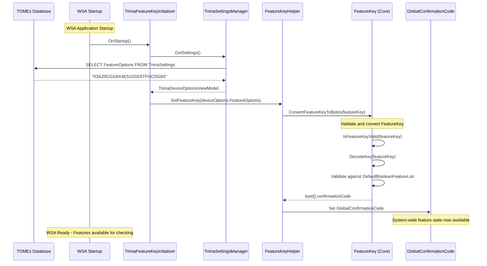

## DAA Service Startup Sequence

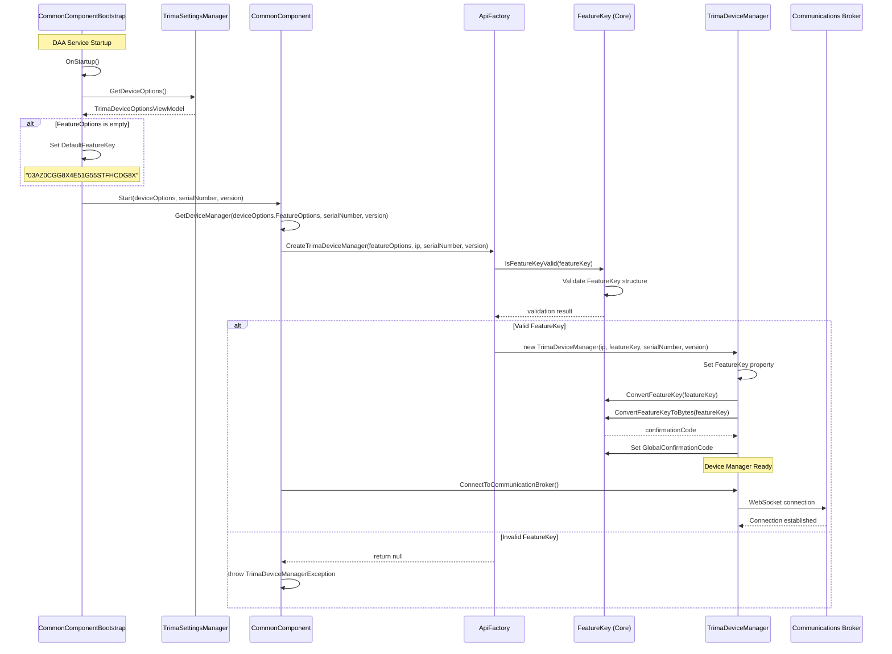

## Device Connection Flow

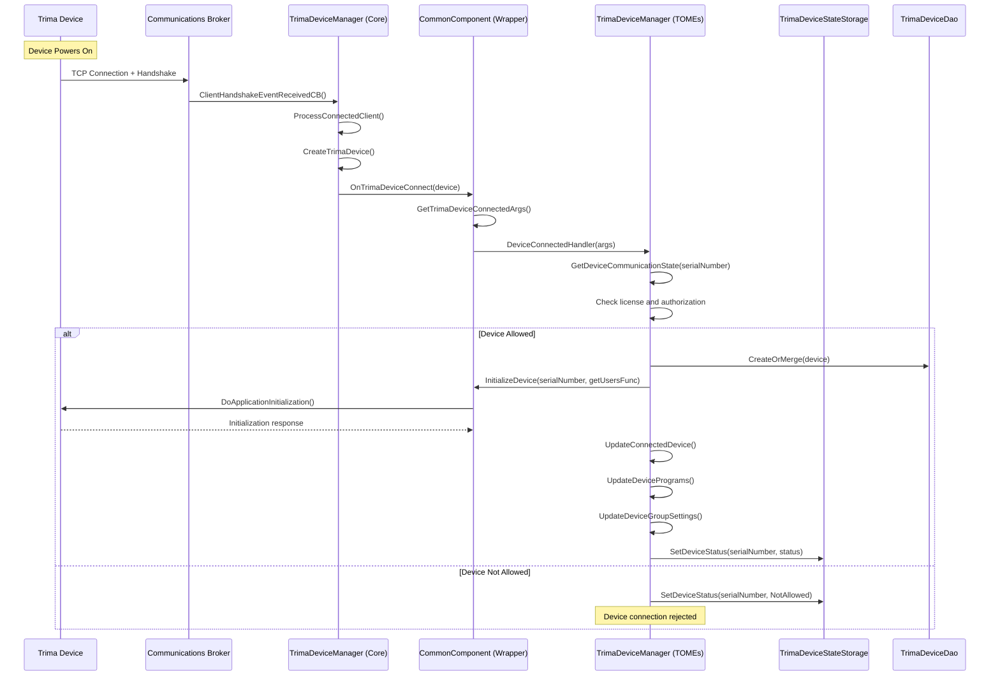

## FeatureKey Update Flow

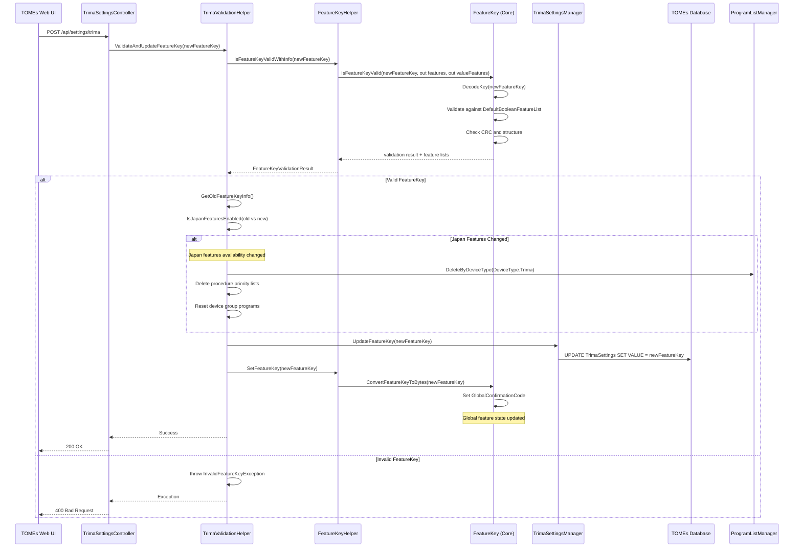

## BBIS Input Request Flow

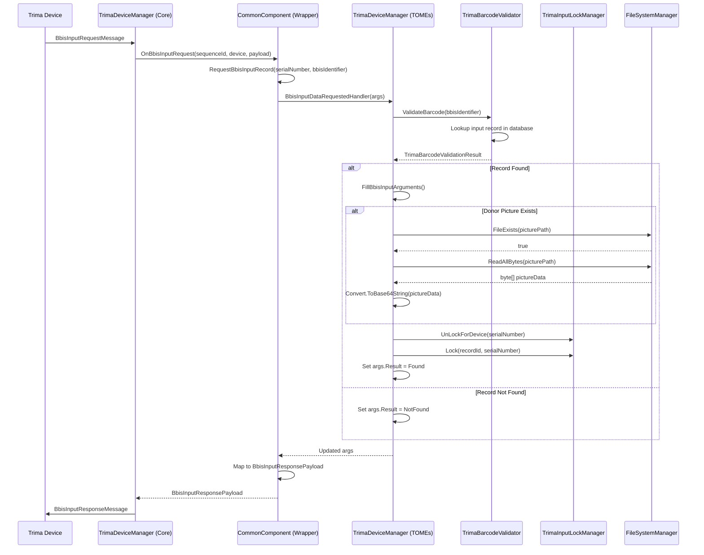

## Device Status Change Flow

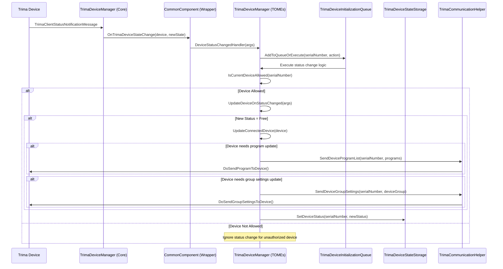

## Program Download Flow

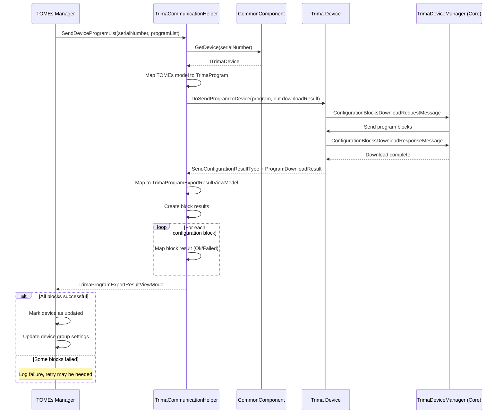

## Feature Checking Runtime Flow

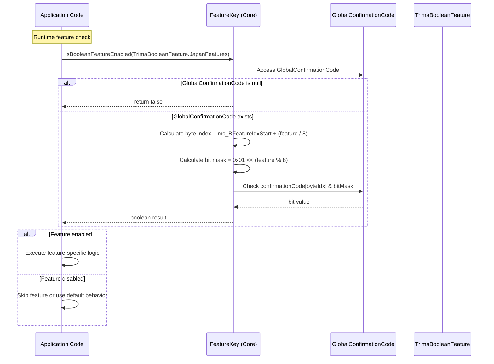

## Error Handling and Recovery

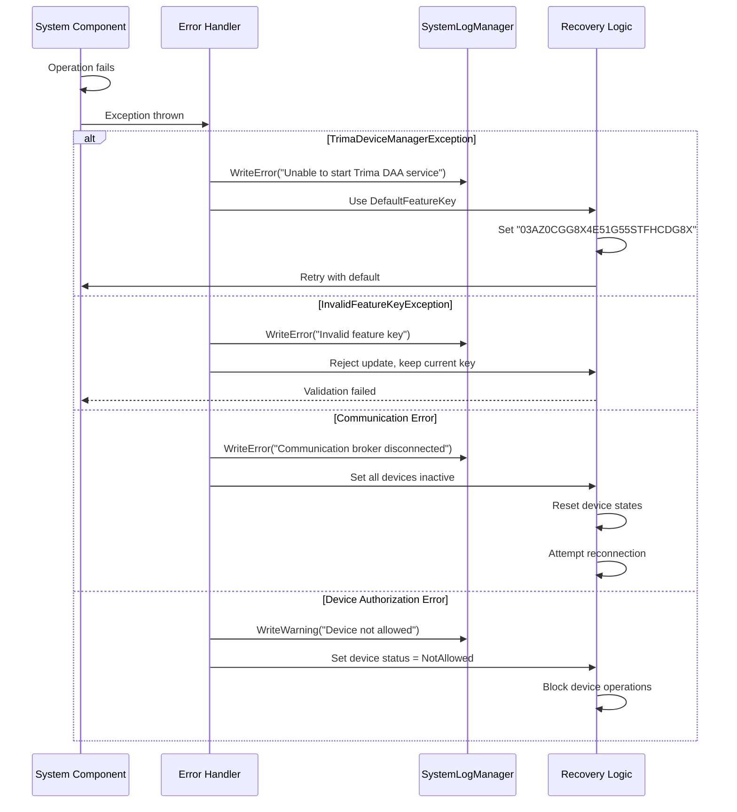

## Component Dependencies

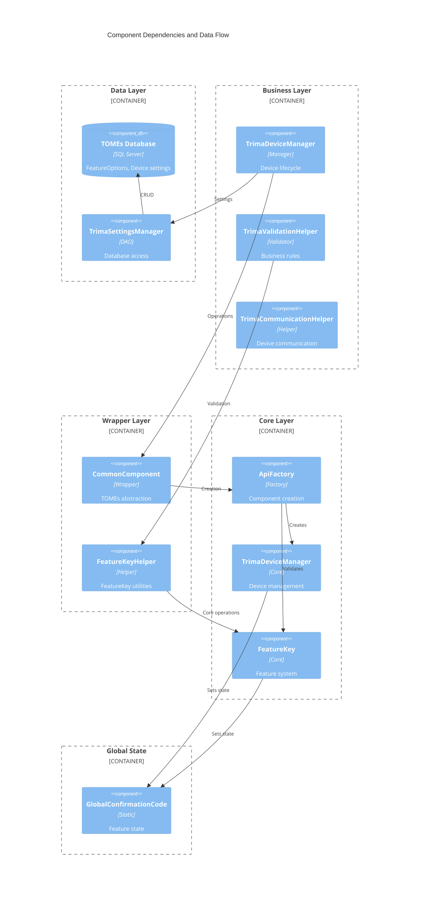

## Summary Architecture

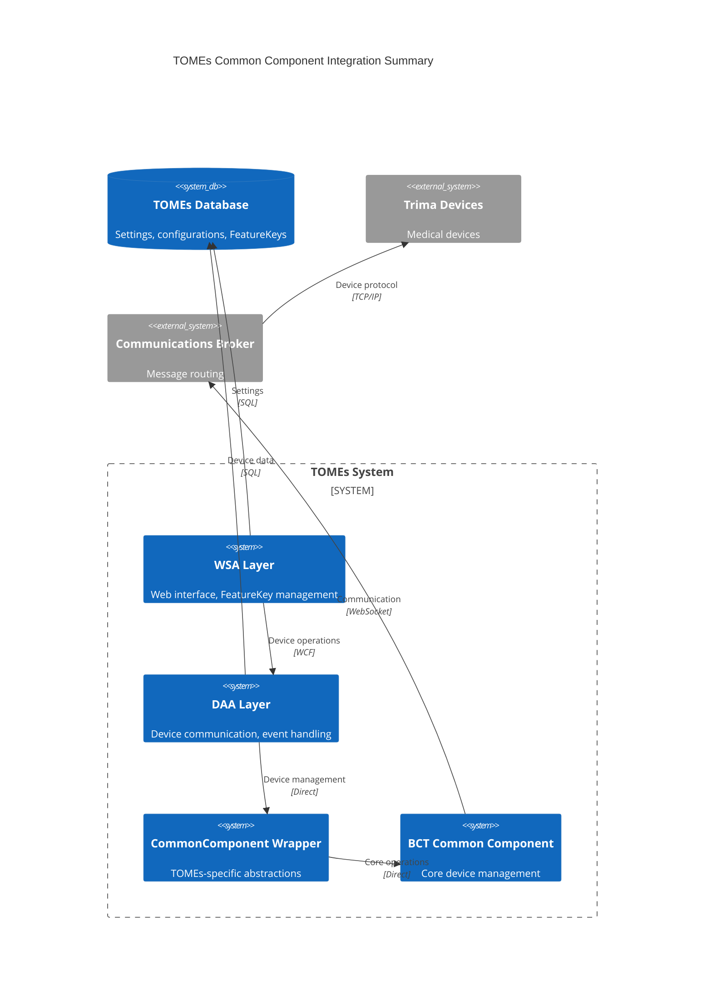