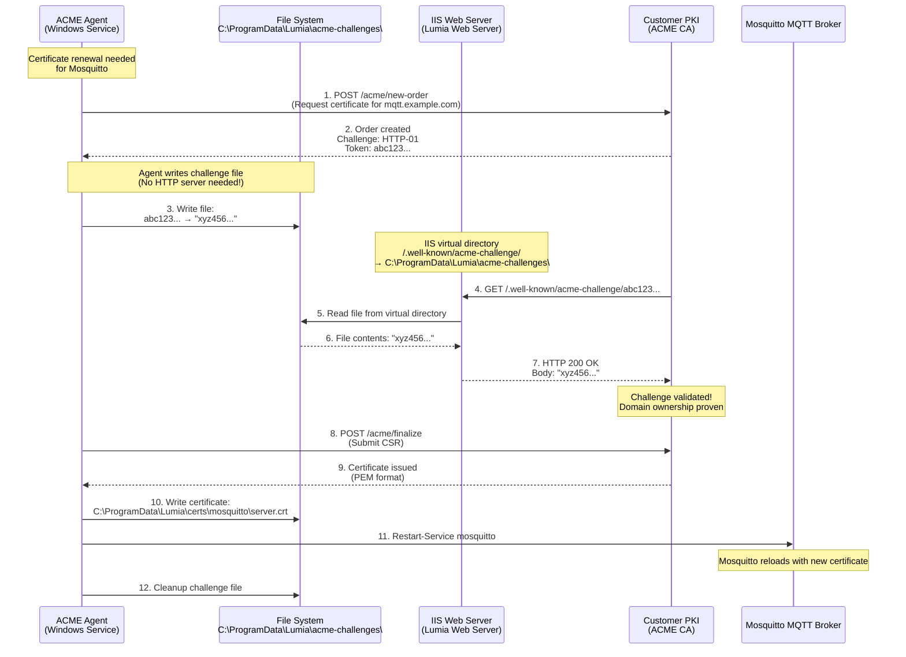

# ECA PoC System Architecture

**Last Updated**: 2025-11-06
**Version**: 2.0
**Status**: PoC Validation for Lumia 1.1

## Table of Contents

- [Overview](#overview)
  - [Lumia 1.1 Context](#lumia-11-context)
  - [System Goals](#system-goals)
  - [Approach](#approach)
- [Architectural Style](#architectural-style)
- [Technology Stack](#technology-stack)
- [System Components](#system-components)
- [Communication Patterns](#communication-patterns)
- [Data Model](#data-model)
- [Security Architecture](#security-architecture)
- [Testing & Validation](#testing--validation)
- [Diagrams](#diagrams)
- [Production Deployment Considerations](#production-deployment-considerations)

---

## Overview

The Edge Certificate Agent (ECA) Proof of Concept demonstrates the **automated certificate lifecycle management capabilities planned for Lumia 1.1**. This document provides a comprehensive architectural overview of the PoC system, describing its components, communication patterns, data model, and security considerations.

### Lumia 1.1 Context

**This PoC validates concepts for Lumia 1.1 production deployment:**

#### Production Deployment (Lumia 1.1)
- **Platform**: Windows Server infrastructure
- **PKI Integration**: Customer-provided PKI environments (Active Directory Certificate Services, third-party CAs)
- **Agent Deployment**: PowerShell-based services running as Windows Services
- **Service Integration**: Native Windows service orchestration (no containers)
- **Protocol Support**: ACME (RFC 8555) and EST (RFC 7030) for standards-based interoperability

**Production Certificate Targets**:
- **Server Certificates (ACME Protocol)**:
  - **Mosquitto MQTT Broker**: TLS certificates for secure MQTT communication (port 8883)
  - **MinIO Object Storage Server**: HTTPS certificates for S3-compatible API (port 9000)
- **Client Certificates (EST Protocol)**:
  - **Device Communication Service (DCS)**: mTLS client certificates for device-to-Lumia MQTT communication
  - **End of Run Service**: mTLS client certificates for Rika Procedural information extraction into Lumia Data Views
  - **Bct.Common.Auditing.Host**: mTLS client certificates for audit event publishing to MQTT
  - Additional C# services requiring secure MQTT connections

**IIS Role** (NOT a certificate target):
- IIS already runs **Lumia Web Server** and its **Web Interface**
- **IIS serves as ACME HTTP-01 challenge responder** for Mosquitto certificate validation
- Virtual directory configuration:
  - Path: `/.well-known/acme-challenge/`
  - Physical path: `C:\ProgramData\Lumia\acme-challenges\`
  - Agent writes challenge files → IIS serves them → Customer PKI validates
- **No agent-hosted HTTP server needed** - leverages existing IIS infrastructure

#### This PoC (Demonstration Platform)
- **Platform**: Docker containers for cross-platform validation
- **PKI Implementation**: Self-contained step-ca for demonstration
- **Agent Deployment**: Containerized PowerShell agents
- **Service Integration**: Docker Compose orchestration
- **Purpose**: Validate agent logic, protocol implementation, and automation workflows

**PoC Certificate Targets (Generic Demonstration)**:
- **NGINX Web Server**:
  - Demonstrates ACME server certificate management
  - NGINX runs its own HTTP server for ACME HTTP-01 challenges (port 80)
  - In production: **Mosquitto MQTT broker** gets ACME certificates, **IIS** serves challenges
- **Alpine Linux Client**:
  - Demonstrates EST client certificate management
  - In production: **C# services** (DCS, End of Run Service) get EST client certificates

> **Important**: The containerized architecture is a **demonstration vehicle only**.
>
> **Key difference in production**: The PoC agent runs its own HTTP server (port 80) for ACME HTTP-01 challenges. In Lumia 1.1 production, **IIS already runs Lumia Web Server**, so instead the agent writes challenge files to an IIS virtual directory (`/.well-known/acme-challenge/` → `C:\ProgramData\Lumia\acme-challenges\`). IIS serves the challenges, eliminating the need for the agent to bind to port 80 or run a separate HTTP server.
>
> The certificate target in production is **Mosquitto MQTT broker** (not IIS itself). The agent logic, protocol implementations, and automation patterns demonstrated here transfer directly to Windows Server deployment.

### System Goals

The ECA PoC validates the feasibility of **zero-touch certificate management** for distributed edge deployments where manual intervention is impractical or impossible. The system addresses two critical use cases:

#### 1. Automated Server Certificate Management (ECA-ACME)

Enables web servers and HTTPS endpoints to automatically obtain, renew, and install TLS certificates using the ACME (Automatic Certificate Management Environment) protocol, eliminating manual certificate operations and preventing service disruptions due to certificate expiry.

**Key Benefits**:
- Zero-downtime certificate rotation
- HTTP-01 challenge automation
- Nginx service reload automation
- Threshold-based renewal (default: 33% of lifetime)

#### 2. Automated Client Certificate Management (ECA-EST)

Enables devices, services, and applications requiring mutual TLS authentication to automatically enroll for client certificates and renew them before expiration using the EST (Enrollment over Secure Transport) protocol, supporting secure device identity management at scale.

**Key Benefits**:
- Bootstrap token-based initial enrollment
- Certificate-based re-enrollment (mutual TLS)
- Autonomous renewal workflow
- Zero-touch device certificate lifecycle

By combining these two complementary agents with a modern PKI infrastructure, the ECA PoC delivers a complete certificate management ecosystem suitable for IoT deployments, edge computing platforms, and microservices architectures where certificate lifecycle automation is essential for operational efficiency and security.

### Approach

The ECA system implements autonomous certificate lifecycle management through **intelligent polling agents** that continuously monitor certificate expiry status, proactively initiate renewal workflows before certificates expire, and automatically install new certificates with zero-downtime service reloads.

#### Key Architectural Principles

- **Autonomy**: Agents operate independently without requiring central orchestration, making the system resilient to network partitions and suitable for distributed environments with intermittent connectivity.

- **Separation of Concerns**: Certificate management logic is completely decoupled from application business logic, allowing existing services to gain automated certificate management without code modifications.

- **Protocol Standardization**: The system leverages industry-standard protocols (ACME RFC 8555, EST RFC 7030) ensuring interoperability with any compliant PKI infrastructure—customer Active Directory Certificate Services, enterprise CAs, or third-party PKI providers.

- **Observability**: Comprehensive structured logging provides visibility into certificate lifecycle events, enabling monitoring, auditing, and troubleshooting through standard Windows event logs and SIEM integration.

- **Testability**: Modular component design with clear interfaces enables comprehensive unit testing and integration testing, ensuring reliability in production deployments.

#### PoC Implementation Details

This PoC is implemented as a self-contained Docker Compose environment for demonstration purposes. In the PoC:
- Agents run as **sidecar containers** alongside target services
- Docker volumes provide certificate sharing between containers
- Docker Compose manages service orchestration

In **Lumia 1.1 production deployment**:
- Agents run as **Windows Services** on Windows Server infrastructure
- File system permissions and ACLs manage certificate access
- Windows Service Manager handles service orchestration
- No container runtime required

The core agent logic (polling loops, protocol implementations, renewal workflows) demonstrated in this PoC transfers directly to Windows Server deployment with platform-specific adaptations (file paths, service management, logging).

---

## Architectural Style

The ECA system adopts a **hybrid architectural style** combining three complementary patterns:

### Event-Driven Architecture (Time-Based Events)

Certificate agents function as autonomous event processors where "events" are time-based triggers (polling intervals) and certificate lifecycle state transitions (near-expiry detection). Unlike traditional event-driven systems with message queues or event streams, this architecture uses **polling loops** as the event detection mechanism.

Each agent runs a continuous loop:

1. **Detect**: Check current certificate status (parse expiry date, calculate remaining validity)
2. **Decide**: Apply business rules to determine if action is needed (threshold-based renewal, force triggers)
3. **Act**: Execute renewal workflow if needed (protocol interaction, installation, service reload)
4. **Sleep**: Wait for next polling interval

This approach is optimal for edge environments because:

- **Simplicity**: No external scheduler or message broker dependencies reduce deployment complexity
- **Resilience**: Temporary failures (network issues, CA downtime) are automatically retried on the next polling cycle without requiring explicit retry logic
- **Resource Efficiency**: Sleep intervals prevent unnecessary CPU consumption while still providing timely renewals

### Microservices Pattern

Each certificate agent is an **independent, single-purpose service** with clear boundaries and minimal dependencies:

- **ECA-ACME Agent**: Exclusively responsible for server certificate lifecycle (ACME protocol)
- **ECA-EST Agent**: Exclusively responsible for client certificate lifecycle (EST protocol)
- **PKI Service (step-ca)**: Exclusively responsible for certificate issuance and validation
- **Target Services**: Exclusively responsible for their business logic (web serving, API calls)

Service independence provides critical benefits:

- **Fault Isolation**: If the ACME agent fails, the EST agent continues operating normally
- **Independent Scaling**: Each service requiring certificates gets its own agent instance
- **Technology Diversity**: Different agents can be implemented in different languages if needed (though this PoC uses PowerShell for all agents)
- **Testability**: Each service can be tested in isolation with mocked dependencies

### Sidecar Pattern

Certificate agents operate as **sidecar containers** deployed alongside target services they manage. The sidecar pattern provides:

- **Loose Coupling**: Target services remain unaware of certificate management implementation
- **Lifecycle Management**: Agent containers can be updated independently of target services
- **Resource Isolation**: Agent resource consumption (CPU, memory, network) is isolated from target service resources
- **Deployment Simplicity**: Adding certificate management to a new service requires only adding an agent container to the Docker Compose configuration

### Why This Hybrid Style Fits

The combination of these three patterns creates an architecture uniquely suited to edge certificate management:

1. **Autonomy**: Agents don't require external orchestration, making them deployable in disconnected or intermittently-connected environments
2. **Simplicity**: The polling-based event model eliminates complex event infrastructure while still providing timely lifecycle management
3. **Extensibility**: New agent types (e.g., for different protocols or certificate types) can be added without modifying existing components
4. **Operational Efficiency**: Zero-touch automation eliminates manual certificate operations, reducing operational overhead and eliminating human error

---

## Technology Stack

The following technologies were selected to balance PoC requirements (rapid development, comprehensive demonstration) with production readiness (industry standards, proven reliability):

| **Category** | **Technology** | **Version** | **Justification** |
|--------------|----------------|-------------|-------------------|
| **Agent Language** | PowerShell Core | 7.4+ | Primary language per project constraints. Cross-platform runtime, Docker-native, excellent built-in support for HTTP protocol scripting, JSON parsing, and X.509 certificate operations. Rich .NET cryptography libraries eliminate need for external crypto dependencies. |
| **Container Runtime** | Docker | 20.10+ | Industry-standard containerization platform required by project constraints. Provides process isolation, resource limits, network abstraction, and volume management essential for multi-service PoC orchestration. |
| **Orchestration** | Docker Compose | 2.x | Sufficient for single-host PoC demonstration. Simple YAML-based declarative configuration, integrated with Docker CLI, supports service dependencies, volume management, and network configuration without Kubernetes complexity. |
| **PKI Infrastructure** | Smallstep step-ca | 0.25+ | Modern open-source Certificate Authority with native ACME and EST protocol support. Designed specifically for cloud-native and edge scenarios, providing lightweight CA suitable for containerized deployment. API-first design simplifies agent integration. |
| **Target Server** | NGINX | 1.25+ Alpine | Industry-standard high-performance web server. Supports graceful configuration reload via SIGHUP signal enabling zero-downtime certificate rotation. Minimal Alpine-based image reduces attack surface and resource footprint. |
| **Target Client** | Alpine Linux + curl | 3.19+ | Lightweight container for mutual TLS client demonstrations. Includes curl with OpenSSL support for HTTPS requests with client certificate authentication. Minimal base image (5MB) ideal for edge deployment simulation. |
| **Test Framework** | Pester | 5.5+ | De facto PowerShell testing framework. Supports mocking, assertions, code coverage reporting, and BDD-style test organization. Essential for achieving comprehensive test coverage objective. |
| **Logging** | Fluentd → Loki → Grafana | Latest | Production-grade observability stack. Fluentd aggregates container logs, Loki provides centralized storage, Grafana enables visualization and querying. JSON-structured logs enable machine parsing. |
| **Web Dashboard** | Node.js + Express | 20 LTS | (Optional) Lightweight web framework for monitoring UI. JavaScript/TypeScript enables rapid prototyping. Express middleware ecosystem provides WebSocket support for real-time certificate status updates. |

This technology stack minimizes external dependencies while leveraging industry-standard protocols and tools, ensuring the PoC demonstrates production-viable patterns rather than toy implementations.

---

## System Components

The ECA PoC consists of fourteen containerized services, each deployed independently with clear responsibilities and interfaces. This section describes each component in detail.

### Core Infrastructure Services

#### 1. PKI Service (step-ca)

**Purpose**: The PKI service provides the foundational certificate authority infrastructure, implementing both ACME and EST protocols to issue certificates in response to agent requests. It maintains the root of trust for the entire system.

**Technology**: Smallstep step-ca 0.25+ running in an Alpine Linux container. The CA is configured with a root certificate, intermediate certificate, ACME provisioner for server certificates, and EST provisioner for client certificates.

**Key Responsibilities**:
- Issue server certificates in response to ACME protocol requests (newOrder, finalize flows)
- Issue client certificates in response to EST protocol requests (simpleenroll, simplereenroll)
- Validate domain control via HTTP-01 ACME challenges (fetch `.well-known/acme-challenge` tokens)
- Validate bootstrap tokens for initial EST enrollment
- Validate existing client certificates for EST re-enrollment using mutual TLS
- Maintain CA database of issued certificates and serial numbers
- Serve CA root and intermediate certificates for trust chain validation

**Communication Interfaces**:
- **HTTPS API (ACME)**: Exposes RESTful ACME v2 endpoints on port 4210 (`/acme/{provisioner}/directory`, `/acme/{provisioner}/new-order`, etc.)
- **HTTPS API (EST)**: Exposes EST endpoints on port 4210 (`/.well-known/est/{provisioner}/simpleenroll`, `/simplereenroll`, `/cacerts`)
- **HTTP Challenge Validation**: Makes outbound HTTP requests to port 4212 on target-server to validate HTTP-01 challenges
- **Persistent Volume**: Stores CA database and configuration on `pki-data` Docker volume

**Ports**:
- 4210 (HTTPS) - ACME/EST endpoints
- 4211 (HTTP) - CRL distribution

#### 2. OpenXPKI Services (DB, Server, Client, Web)

**Purpose**: Alternative EST implementation demonstrating protocol interoperability. OpenXPKI is a mature open-source PKI platform providing EST enrollment services.

**Technology**: OpenXPKI enterprise PKI suite with MariaDB backend, running in multiple containers for separation of concerns.

**Components**:
- **openxpki-db**: MariaDB database (port 4220)
- **openxpki-server**: OpenXPKI daemon
- **openxpki-client**: EST client interface
- **openxpki-web**: Web UI (port 4221)

**Key Responsibilities**:
- Provide alternative EST implementation for protocol compatibility testing
- Demonstrate multi-PKI interoperability
- Serve EST endpoints at port 4222 (HTTPS)

**Ports**:
- 4220 (TCP) - MariaDB
- 4221 (HTTP) - Web UI
- 4222 (HTTPS) - EST endpoints

#### 3. Observability Stack (Fluentd, Loki, Grafana)

**Purpose**: Centralized logging and monitoring infrastructure providing visibility into certificate lifecycle events across all agents.

**Technology**:
- **Fluentd**: Log aggregation and forwarding
- **Loki**: Log storage and indexing (Prometheus-like)
- **Grafana**: Visualization and querying (port 4230)

**Key Responsibilities**:
- Collect structured logs from all containers
- Index and store logs with label-based querying
- Provide dashboard for certificate status monitoring
- Enable log-based alerting for renewal failures

**Ports**:
- 4230 (HTTP) - Grafana dashboard

### Certificate Management Agents

#### 4. ECA-ACME Agent

**Purpose**: The ACME agent autonomously manages the complete server certificate lifecycle for the NGINX target server, ensuring certificates are renewed before expiration and installed with zero-downtime service reloads.

**Technology**: PowerShell Core 7.4+ running in an Alpine Linux container. Leverages shared PowerShell modules (`Logger.psm1`, `CryptoHelper.psm1`, `ConfigManager.psm1`, `FileOperations.psm1`) and implements ACME v2 protocol client logic.

**Key Responsibilities**:
- Monitor server certificate expiry status by parsing certificate files and calculating remaining validity period
- Initiate certificate renewal when remaining validity falls below configured threshold (default 33% of total lifetime)
- Generate RSA or ECDSA private keys using cryptographically secure random number generators
- Create Certificate Signing Requests (CSRs) with appropriate Subject Alternative Names (SANs)
- Implement ACME v2 protocol workflow: account registration, order creation, HTTP-01 challenge fulfillment, order finalization, certificate download
- Install renewed certificates atomically to shared volume using temporary files and atomic rename operations
- Trigger NGINX configuration reload via Docker exec and SIGHUP signal for zero-downtime certificate activation
- Provide structured logging of all lifecycle events (checks, renewals, installations, errors)
- Support manual renewal triggers via environment variable flags for testing and demonstration

**Communication Interfaces**:
- **HTTPS Client (ACME)**: Synchronous REST API calls to step-ca on port 4210 for ACME protocol operations
- **HTTP Server (Challenge)**: Runs temporary HTTP server on port 4212 to respond to ACME HTTP-01 challenges
- **Shared Volume Write**: Writes certificate and private key files to `server-certs` volume
- **Docker Exec**: Executes `nginx -s reload` command in target-server container to trigger graceful reload
- **Environment Variables**: Reads configuration (CA URL, domain name, renewal threshold, check interval)

**Configuration**:
```yaml
environment:
  CA_URL: https://pki:4210
  ACME_PROVISIONER: acme
  DOMAIN_NAME: edge-server.eca-poc.local
  CERT_PATH: /certs/server.crt
  KEY_PATH: /certs/server.key
  RENEWAL_THRESHOLD_PERCENT: 33
  CHECK_INTERVAL_SECONDS: 21600  # 6 hours
  LOG_LEVEL: INFO
```

#### 5. ECA-EST Agent

**Purpose**: The EST agent autonomously manages the complete client certificate lifecycle for the target client, handling both initial enrollment (using bootstrap token) and re-enrollment (using existing certificate) before expiration.

**Technology**: PowerShell Core 7.4+ running in an Alpine Linux container. Shares common modules with ACME agent and implements EST (RFC 7030) protocol client logic.

**Key Responsibilities**:
- Monitor client certificate expiry status by parsing certificate files and calculating remaining validity period
- Perform initial enrollment using pre-shared bootstrap token via EST `/simpleenroll` endpoint
- Perform re-enrollment using existing client certificate for mutual TLS authentication via EST `/simplereenroll` endpoint
- Generate RSA or ECDSA private keys for client certificate enrollment
- Create Certificate Signing Requests (CSRs) with appropriate subject Distinguished Name (DN)
- Install enrolled certificates atomically to shared volume
- Validate certificates against CRL (Certificate Revocation List) before renewal
- Provide structured logging of enrollment and renewal events
- Securely manage bootstrap token (environment variable with restricted permissions)

**Communication Interfaces**:
- **HTTPS Client (EST)**: Synchronous REST API calls to step-ca on port 4210 for EST protocol operations (`/simpleenroll`, `/simplereenroll`)
- **Mutual TLS Client**: Uses existing client certificate for re-enrollment authentication
- **Shared Volume Write**: Writes client certificate and private key files to `client-certs` volume
- **Environment Variables**: Reads configuration (CA URL, bootstrap token, subject DN, renewal threshold, check interval)
- **CRL Validation**: Downloads and validates CRL from port 4211 before renewal

**Configuration**:
```yaml
environment:
  CA_URL: https://pki:4210
  EST_PROVISIONER: est
  BOOTSTRAP_TOKEN: <secret-token>
  SUBJECT_DN: CN=edge-client
  CERT_PATH: /certs/client.crt
  KEY_PATH: /certs/client.key
  RENEWAL_THRESHOLD_PERCENT: 33
  CHECK_INTERVAL_SECONDS: 21600  # 6 hours
  CRL_ENABLED: true
  CRL_URL: http://pki:4211/crl/ca.crl
  LOG_LEVEL: INFO
```

### Target Services

#### 6. Target Server (NGINX)

**Purpose**: The target server represents a typical edge service requiring automated server certificate management. It demonstrates zero-downtime certificate rotation through graceful configuration reload.

**Technology**: NGINX 1.25+ on Alpine Linux. Configured to serve HTTPS on port 4213 using certificates provided by the ACME agent via shared volume.

**Key Responsibilities**:
- Serve HTTPS traffic using TLS certificates from shared volume
- Respond to ACME HTTP-01 challenge requests on port 4212 (`.well-known/acme-challenge` path proxied to ACME agent)
- Perform graceful configuration reload when signaled (SIGHUP) to activate new certificates without dropping active connections
- Serve simple HTML demonstration page confirming TLS is operational
- Log HTTPS access and errors

**Communication Interfaces**:
- **HTTPS Server**: Listens on port 4213, exposed to host for browser testing
- **HTTP Server**: Listens on port 4212 for ACME HTTP-01 challenge validation
- **Shared Volume Read**: Reads server certificate and private key from `server-certs` volume
- **Process Signal**: Receives SIGHUP signal from ACME agent via Docker exec to trigger reload

**Ports**:
- 4212 (HTTP) - ACME challenges
- 4213 (HTTPS) - Target server

#### 7. Target Client

**Purpose**: The target client represents a device or service requiring automated client certificate management for mutual TLS authentication. It demonstrates client certificate usage for authenticated API access.

**Technology**: Alpine Linux 3.19+ with curl and OpenSSL. Shell script implements demonstration HTTPS requests with client certificate authentication.

**Key Responsibilities**:
- Make periodic HTTPS requests to external APIs using client certificate for mutual TLS authentication
- Read client certificate and private key from shared volume
- Validate server TLS certificates against CA root certificate
- Log successful and failed authentication attempts
- Demonstrate automatic client certificate usage after EST agent renewal

**Communication Interfaces**:
- **HTTPS Client (mTLS)**: Makes outbound HTTPS requests using client certificate for authentication
- **Shared Volume Read**: Reads client certificate and private key from `client-certs` volume

---

## Communication Patterns

The ECA system employs four distinct communication patterns, each optimized for specific interaction types. Understanding these patterns is essential for comprehending system behavior and troubleshooting operational issues.

### Pattern 1: Polling Loop (Agent Event Detection)

**Where Used**: Both ACME and EST agents use polling loops as their primary execution model.

**How It Works**: Agents run an infinite loop with the following phases:

1. **Check Phase**: Read certificate from shared volume, parse X.509 expiry date, calculate remaining validity
2. **Decision Phase**: Compare remaining validity against configured threshold percentage (e.g., renew when <33% lifetime remains)
3. **Action Phase**: If renewal needed, execute protocol-specific workflow (ACME or EST)
4. **Sleep Phase**: Wait for configured interval (e.g., 6 hours) before next check

**Why This Pattern**: Polling loops are optimal for certificate lifecycle management because:

- **Simplicity**: No external scheduler or event infrastructure required
- **Resilience**: Transient failures (network issues, CA downtime) automatically retry on next loop iteration
- **Resource Efficiency**: Long sleep intervals minimize CPU consumption while still providing timely renewals
- **Deterministic Behavior**: Predictable check intervals simplify troubleshooting and capacity planning

**Trade-offs**: Polling introduces latency between expiry threshold breach and renewal action (maximum latency equals polling interval). For certificate management, this latency is acceptable because renewal thresholds are set days or weeks before actual expiry.

### Pattern 2: Synchronous Request-Response (Protocol Communication)

**Where Used**: All agent-to-PKI communication uses synchronous HTTPS request-response for ACME and EST protocol interactions.

**How It Works**: Agents make blocking HTTP requests using PowerShell's `Invoke-WebRequest` or `Invoke-RestMethod` cmdlets, waiting for step-ca to process the request and return a response before continuing execution.

**Examples**:
- ACME newOrder request: Agent sends order JSON, blocks until CA returns order object with challenge details
- EST simpleenroll request: Agent sends CSR in PKCS#10 format, blocks until CA returns signed certificate
- ACME challenge validation: CA makes synchronous HTTP-01 GET request to agent, agent responds immediately

**Why This Pattern**: Synchronous request-response is appropriate because:

- **Protocol Semantics**: ACME and EST are defined as synchronous HTTP protocols in RFCs 8555 and 7030
- **Simplicity**: No callback infrastructure or async state management required
- **Error Handling**: Immediate HTTP status codes and error responses enable straightforward error handling
- **Latency Requirements**: Certificate operations complete in seconds, making blocking acceptable

**Trade-offs**: Blocking requests tie up agent execution thread during network I/O. For this PoC with single-threaded PowerShell agents, this is acceptable because agents perform one operation at a time.

### Pattern 3: Shared Volume (Certificate Distribution)

**Where Used**: Certificate and private key files are shared between agents and target services via Docker named volumes.

**How It Works**:

1. Agent generates private key and obtains certificate from CA
2. Agent writes key and certificate to temporary files on shared volume with restricted permissions
3. Agent atomically renames temporary files to final names (atomic filesystem operation)
4. Target service reads certificate and key files on startup or reload

**Volume Mappings**:
- `server-certs` volume: Shared between ACME agent (write) and target-server (read)
- `client-certs` volume: Shared between EST agent (write) and target-client (read)

**File Permissions**:
- Private keys: `0600` (owner read/write only) to prevent unauthorized access
- Certificates: `0644` (owner read/write, others read) as certificates are not secret

**Why This Pattern**: File-based communication via shared volumes is optimal because:

- **Decoupling**: Agents and target services don't need network connectivity or API interfaces
- **Simplicity**: No custom protocols or serialization formats—standard PEM encoding
- **Unix Philosophy**: Files as universal interface, readable by all standard TLS libraries
- **Atomicity**: Atomic rename operations prevent target services from reading partial writes
- **Docker Native**: Shared volumes are first-class Docker primitives requiring no additional infrastructure

**Trade-offs**: File-based communication requires both containers to run on the same Docker host. For multi-host deployments, network-based certificate distribution (e.g., Kubernetes secrets) would be required.

### Pattern 4: Process Signaling (Service Reload)

**Where Used**: ACME agent triggers NGINX configuration reload after installing new server certificates.

**How It Works**:

1. ACME agent installs new certificate files to `server-certs` volume
2. Agent executes `docker exec target-server nginx -s reload` command
3. Docker runtime sends SIGHUP signal to NGINX master process inside target-server container
4. NGINX gracefully reloads configuration: loads new certificates, spawns new worker processes, drains old workers without dropping connections
5. Agent validates command exit code to confirm successful reload

**Why This Pattern**: Process signaling enables zero-downtime certificate rotation because:

- **Graceful Reload**: NGINX SIGHUP handler is specifically designed for config reload without service interruption
- **Immediate Activation**: New certificates take effect immediately without waiting for service restart
- **Standard Pattern**: Docker exec is the standard mechanism for process signaling in containerized environments
- **Reliable Feedback**: Exit codes provide immediate confirmation of reload success or failure

**Trade-offs**: This pattern couples the agent to Docker infrastructure (requires Docker socket access for exec command). In Kubernetes, this would be replaced with API-driven pod restarts or init container patterns.

---

## Data Model

The ECA system uses a **file-based data model** rather than traditional database storage. This architectural decision reflects the ephemeral, operational nature of certificate management where the authoritative data source is the PKI infrastructure itself, not the agent's local storage.

### Why Files Instead of Databases

- **Simplicity**: No database deployment, schema migrations, or ORM complexity
- **Standard Formats**: PEM and DER are universal X.509 certificate encodings supported by all TLS libraries
- **Unix Philosophy**: Files as universal data interface enable interoperability with standard tools (`openssl`, `curl`, etc.)
- **Edge-Appropriate**: Minimal resource footprint (no database process) suitable for resource-constrained edge environments
- **Immutability**: Certificates are write-once, read-many artifacts without complex update patterns requiring transactional storage

### Data Entities

#### 1. Certificate Files (X.509 Certificates)

**Storage Location**:
- Server certificates: `/certs/server/server.crt` (on `server-certs` volume)
- Client certificates: `/certs/client/client.crt` (on `client-certs` volume)

**Format**: PEM-encoded X.509 certificates (Base64-encoded DER with `-----BEGIN CERTIFICATE-----` headers)

**Attributes**:
- **Subject Distinguished Name**: CN=edge-server.eca-poc.local (server) or CN=edge-client (client)
- **Subject Alternative Names** (server only): DNS names the certificate is valid for
- **Issuer DN**: Intermediate CA that signed the certificate
- **Serial Number**: Unique identifier assigned by CA
- **Validity Period**: NotBefore and NotAfter timestamps (UTC) defining certificate lifetime
- **Public Key**: RSA 2048-bit or ECDSA P-256 public key

**Permissions**: `0644` (readable by all users, writable by owner) since certificates are public data

**Lifecycle**: Certificates are replaced (not modified) during renewal. Old certificates are deleted after successful installation of new certificates.

#### 2. Private Key Files (Cryptographic Keys)

**Storage Location**:
- Server keys: `/certs/server/server.key` (on `server-certs` volume)
- Client keys: `/certs/client/client.key` (on `client-certs` volume)

**Format**: PEM-encoded PKCS#8 or PKCS#1 private keys (unencrypted for PoC simplicity)

**Attributes**:
- **Key Algorithm**: RSA or ECDSA
- **Key Size**: RSA 2048-bit or ECDSA P-256
- **Key Material**: Private exponent (RSA) or scalar (ECDSA)

**Permissions**: `0600` (readable/writable by owner only) to prevent unauthorized key access. This is critical for security.

**Lifecycle**: Private keys are generated by agents immediately before creating CSRs. Keys are replaced during renewal (agents generate new key pairs for each renewal, following PKI best practices). Old keys are securely deleted (overwritten and removed).

**Security Considerations**: Keys are stored **unencrypted** in this PoC for simplicity. Production deployments should consider encrypted key storage with hardware security modules (HSMs) or key management services (KMS) for high-security environments.

#### 3. Agent Configuration (Environment Variables)

**Storage Location**: Environment variables injected via Docker Compose `environment` section

**Format**: Key-value pairs (environment variables) or YAML configuration files

**Attributes** (ACME Agent):
- `CA_URL`: step-ca API endpoint (e.g., `https://pki:4210`)
- `ACME_PROVISIONER`: Provisioner name (e.g., `acme`)
- `DOMAIN_NAME`: Server certificate domain (e.g., `edge-server.eca-poc.local`)
- `CERT_PATH`: Certificate file path (e.g., `/certs/server.crt`)
- `KEY_PATH`: Private key file path (e.g., `/certs/server.key`)
- `RENEWAL_THRESHOLD_PERCENT`: Percentage of lifetime remaining to trigger renewal (e.g., `33`)
- `CHECK_INTERVAL_SECONDS`: Polling loop sleep duration (e.g., `21600` = 6 hours)
- `LOG_LEVEL`: Logging verbosity (DEBUG, INFO, WARN, ERROR)

**Attributes** (EST Agent):
Similar to ACME agent with protocol-specific additions:
- `BOOTSTRAP_TOKEN`: Pre-shared secret for initial enrollment
- `EST_PROVISIONER`: Provisioner name (e.g., `est`)
- `SUBJECT_DN`: Certificate subject (e.g., `CN=edge-client`)
- `CRL_ENABLED`: Enable CRL validation (true/false)
- `CRL_URL`: CRL distribution endpoint (e.g., `http://pki:4211/crl/ca.crl`)

**Permissions**: Configuration files should be `0600` to protect bootstrap tokens from unauthorized access.

**Lifecycle**: Configuration is read once on agent startup and cached in memory. Configuration changes require agent restart.

#### 4. CA Certificate Database (step-ca Internal State)

**Storage Location**: `/home/step/` directory on `pki-data` volume (internal to step-ca container)

**Format**: SQLite database (default step-ca backend) or other backend configured via step-ca

**Attributes**:
- Issued certificate records (serial number, subject DN, expiry, revocation status)
- ACME account keys and metadata
- EST bootstrap token hashes
- CA configuration and provisioner settings

**Permissions**: Managed by step-ca process, not directly accessed by agents

**Lifecycle**: Maintained by step-ca as authoritative PKI state. Backed up via `pki-data` volume for PoC persistence across container restarts.

### Data Flow Example: Server Certificate Renewal

1. ACME agent reads `/certs/server/server.crt` to check expiry (reads **Certificate File**)
2. Agent determines renewal needed, generates new RSA key pair (creates **Private Key File** in memory)
3. Agent reads `CA_URL` and `DOMAIN_NAME` from environment (reads **Agent Configuration**)
4. Agent creates CSR with new public key, sends ACME order to step-ca
5. step-ca validates domain control, issues certificate, updates internal database (writes **CA Certificate Database**)
6. Agent downloads new certificate, writes temporary files to `/certs/server/server.crt.tmp` and `/certs/server/server.key.tmp`
7. Agent atomically renames files to `/certs/server/server.crt` and `/certs/server/server.key` (updates **Certificate File** and **Private Key File**)
8. NGINX reload reads new certificate and key files from `/certs/server/`

This file-based data flow demonstrates the simplicity and effectiveness of the chosen data model for certificate lifecycle management.

---

## Security Architecture

Security is paramount in PKI infrastructure. The ECA system implements defense-in-depth with multiple security controls across cryptographic operations, communication channels, secrets management, authentication mechanisms, and container isolation.

### Private Key Management

Private keys are the most sensitive cryptographic assets in the system. Compromise of a private key enables impersonation attacks and breaks the entire PKI trust model.

**Key Generation**:
- Keys generated within agent containers using cryptographically secure random number generators (CSPRNGs)
- PowerShell agents use .NET `System.Security.Cryptography.RSA.Create()` and `System.Security.Cryptography.ECDsa.Create()` which leverage OS-provided entropy sources (`/dev/urandom` on Linux)
- Default key parameters: RSA 2048-bit or ECDSA P-256 curve (NIST-approved strengths)
- Keys generated fresh for each certificate renewal (no key reuse across certificates)

**Key Storage**:
- PEM files on Docker volumes with `0600` permissions (owner read/write only)
- Stored **unencrypted** in this PoC for simplicity (acceptable for demonstration environment)
- Production deployments should encrypt keys at rest using volume encryption (LUKS, dm-crypt) or KMS integration
- Keys never stored in container image layers (only in runtime volumes)

**Key Transmission**:
- Private keys **NEVER transmitted over network** (fundamental PKI principle)
- Only public keys and CSRs (containing public keys) transmitted to CA
- Certificates (containing public keys) transmitted over HTTPS but public keys are not secret

**Key Lifecycle**:
- Old private keys securely deleted after successful certificate renewal
- File overwrite before removal to prevent recovery from unallocated disk space

**Key Access Control**:
- Agent containers run as non-root user (UID 1000) with minimal capabilities
- Docker volume permissions restrict key access to agent container user only
- Host filesystem access to volumes should be restricted to root user

### Secure Communication (TLS Everywhere)

All network communication in the ECA system is encrypted using TLS to prevent eavesdropping and tampering.

**Agent-to-PKI Communication**:
- All ACME and EST protocol requests use HTTPS (TLS 1.2 or 1.3)
- step-ca TLS certificate validated against system trust store
- PowerShell `Invoke-WebRequest` performs automatic certificate chain validation
- Prevents man-in-the-middle attacks on certificate issuance

**Browser-to-Server Communication**:
- NGINX serves HTTPS on port 4213 using certificates managed by ACME agent
- Demonstrates end-to-end TLS from browser through target service
- Modern cipher suites configured (ECDHE for forward secrecy, AES-GCM for authenticated encryption)

**Client-to-API Communication (Mutual TLS)**:
- Target client demonstrates mutual TLS (mTLS) for client authentication
- Client presents certificate obtained via EST agent to authenticate to remote APIs
- Server validates client certificate against CA trust chain
- Provides cryptographic proof of client identity (stronger than API keys or passwords)

**EST Re-Enrollment (mTLS)**:
- EST protocol requires mTLS for re-enrollment operations
- Agent authenticates to step-ca using existing client certificate
- CA validates certificate not expired and signed by trusted issuer before issuing renewed certificate
- Prevents unauthorized re-enrollment by attackers without valid client certificate

### Secrets Management

The ECA system manages several types of secrets requiring protection from unauthorized access.

**Bootstrap Tokens (EST Initial Enrollment)**:
- Pre-shared secrets used for EST `/simpleenroll` first-time enrollment
- Stored as environment variables in Docker Compose configuration
- **Security Limitations**:
  - Visible in `docker inspect` output and process environment
  - Not encrypted at rest in Docker Compose YAML file
- **PoC Acceptable Risk**: Demo environment with no sensitive data
- **Production Alternatives**: Docker secrets, Kubernetes secrets, HashiCorp Vault integration
- **Best Practice**: Tokens should be single-use and revoked after initial enrollment (step-ca supports this with admin API)

**ACME Account Keys**:
- ACME protocol uses account key pairs for request signing (JWS - JSON Web Signature)
- Account private keys stored in agent container filesystem (not shared volumes)
- Persistent across container restarts via named volumes or recreated on startup
- Less sensitive than certificate private keys (compromise allows unauthorized ACME requests but not service impersonation)

**Configuration Files**:
- Agent configuration may contain CA URLs, provisioner names, domain names
- Not highly sensitive but should be protected from tampering
- File permissions `0600` prevent unauthorized modification
- Integrity validation on startup (check required parameters present and valid format)

**Log Redaction**:
- Structured logging must NEVER log private keys, bootstrap tokens, or other secrets
- Logger implementation includes redaction for sensitive field names (`password`, `token`, `key`)
- Certificate serial numbers and public data safe to log for traceability

### Authentication Mechanisms

The system uses different authentication mechanisms for ACME vs. EST protocols, reflecting their different use cases.

**ACME Protocol Authentication (Server Certificates)**:
- **Account-Based Authentication**: ACME accounts identified by public/private key pairs (JWK - JSON Web Key)
- **Request Signing**: Every ACME request signed with account private key using JWS (RFC 7515)
- **Domain Control Validation**: Proof of domain ownership via HTTP-01 challenge (CA fetches token from `http://domain/.well-known/acme-challenge/{token}`)
- **Why This Works**: Server certificate issuance requires proving control of the domain, not pre-existing trust relationship
- **Threat Model**: Prevents unauthorized certificate issuance for domains attacker doesn't control

**EST Protocol Authentication (Client Certificates)**:
- **Initial Enrollment**: Bootstrap token authentication (pre-shared secret in HTTP Basic Auth header)
  - Token proves device authorized for initial enrollment
  - Requires out-of-band token distribution to devices (QR code, USB, provisioning system)
- **Re-Enrollment**: Certificate-based authentication via mutual TLS
  - Existing valid certificate proves identity for renewal
  - No bootstrap token needed after initial enrollment
- **Why This Works**: Client certificates identify devices/users, requiring proof of authorization rather than domain control
- **Threat Model**: Prevents unauthorized devices from obtaining client certificates; prevents expired certificate renewal by attackers

### Certificate Revocation (CRL)

The ECA system implements Certificate Revocation List (CRL) validation to ensure revoked certificates are detected and replaced immediately, preventing the use of compromised or invalid certificates.

**CRL Architecture**:
- step-ca generates CRLs automatically when certificates are revoked
- nginx HTTP server exposes CRL at `http://pki:4211/crl/ca.crl`
- Hourly cron job refreshes CRL to ensure freshness
- Both DER (binary) and PEM (text) formats available

**Agent Integration**:
- Both ACME and EST agents validate certificates against CRL before renewal
- CRL downloaded and cached locally with configurable TTL (default: 2 hours)
- Revoked certificates trigger immediate forced renewal flow
- Fail-open behavior: if CRL unavailable, agent continues (availability over strict security for edge deployments)

**Configuration Validation**:
- CRL URL validated as proper absolute URI (http/https only)
- CRL cache path validated as absolute filesystem path
- Parent directory existence checked with warning if missing
- max_age_hours range validated (0.1-168 hours)

**Security Benefits**:
- **Immediate Revocation Detection**: Agents check CRL at regular intervals, detecting revoked certificates quickly
- **Compliance**: Meets regulatory requirements for medical software (HIPAA, FDA) requiring revocation checking
- **Defense Against Compromise**: Stolen or leaked certificates can be revoked and replaced automatically
- **Audit Trail**: All CRL checks logged with structured logging for compliance auditing

**Implementation Details**:
- CRL validation module: `agents/common/CrlValidator.psm1`
- Configuration: `crl.enabled`, `crl.url`, `crl.cache_path`, `crl.max_age_hours` in agent config
- See TESTING.md for comprehensive CRL testing procedures

### Container Security

Containers provide process isolation and resource limits, but require proper configuration to prevent privilege escalation and lateral movement.

**Non-Root Users**:
- All agent containers run as non-root user (UID 1000, GID 1000)
- Prevents privilege escalation attacks if container compromised
- Limits blast radius of vulnerabilities in PowerShell runtime or dependencies

**Minimal Base Images**:
- Alpine Linux base images (~5MB) reduce attack surface compared to full Debian/Ubuntu images
- Fewer installed packages mean fewer potential vulnerabilities
- Security updates easier to apply with smaller image size

**Network Segmentation**:
- Docker bridge network (`eca-poc-network`) isolates PoC containers from host network
- Only necessary ports exposed to host (4210-4230 range)
- Internal services (CA port 4210) accessible only within Docker network

**Security Scanning**:
- Container images should be scanned for known vulnerabilities (CVEs) using tools like Trivy or Clair
- Base image updates applied regularly to patch security issues
- Automated scanning in CI/CD pipeline recommended

These layered security controls provide defense-in-depth, ensuring that compromise of any single component does not compromise the entire system.

---

## Testing & Validation

The ECA PoC includes a comprehensive testing framework validating functionality at multiple levels: unit tests, integration tests, endpoint validation, and end-to-end workflows.

### Testing Philosophy

Certificate lifecycle automation is mission-critical infrastructure requiring high confidence in correctness. The testing strategy emphasizes:

- **Automated Validation**: All tests executable via single command (`./integration-test.sh`)
- **Fast Feedback**: Integration tests complete in 3-4 minutes
- **Comprehensive Coverage**: 200+ test scenarios covering normal and error paths
- **Production Parity**: Tests run in same Docker environment as production deployment

### Test Layers

#### 1. Unit Tests

**Location**: `tests/unit/`
**Framework**: Pester 5.5+
**Scope**: Individual PowerShell modules in isolation

**Test Coverage**:
- `Logger.psm1`: Structured logging, log levels, timestamp formatting
- `CryptoHelper.psm1`: Key generation, CSR creation, certificate parsing
- `ConfigManager.psm1`: Environment variable parsing, validation, defaults
- `FileOperations.psm1`: Atomic writes, permission setting, file cleanup
- `CrlValidator.psm1`: CRL download, parsing, revocation checking

**Running Unit Tests**:
```bash
cd agents
pwsh -Command "Invoke-Pester -Path ./tests/unit -Output Detailed"
```

#### 2. Integration Tests

**Location**: `tests/integration/`
**Framework**: Pester 5.5+
**Scope**: End-to-end workflows across multiple containers

**Test Scenarios** (7 comprehensive scenarios):

1. **ACME Enrollment** (acme-enrollment.Tests.ps1)
   - Initial certificate enrollment via HTTP-01 challenge
   - Certificate installation to shared volume
   - NGINX reload triggering
   - Certificate validation against CA trust chain

2. **EST Enrollment** (est-enrollment.Tests.ps1)
   - Bootstrap token-based initial enrollment
   - Certificate-based re-enrollment (mutual TLS)
   - Client certificate validation
   - Bootstrap token security

3. **Certificate Renewal** (renewal.Tests.ps1)
   - Threshold-based renewal triggering (33% lifetime)
   - Forced renewal via environment variable
   - Certificate chain continuity
   - Zero-downtime rotation

4. **Certificate Revocation** (CrlRevocation.Tests.ps1)
   - CRL download and parsing
   - Revocation detection
   - Forced renewal of revoked certificates
   - CRL caching and TTL

5. **Service Reload** (service-reload.Tests.ps1)
   - NGINX graceful reload verification
   - Connection persistence during reload
   - Certificate activation validation

6. **Error Handling** (error-handling.Tests.ps1)
   - CA unavailability resilience
   - Network failure recovery
   - Invalid token handling
   - Malformed certificate handling

7. **Observability** (observability.Tests.ps1)
   - Structured log validation
   - Log aggregation in Loki
   - Grafana dashboard availability
   - Alert condition detection

**Running Integration Tests**:
```bash
cd poc/eca-est-acme-poc
./integration-test.sh --test-only  # Assumes stack running
```

#### 3. Endpoint Validation

**Location**: `integration-test.sh` function `validate_endpoints()`
**Scope**: HTTP endpoint health checks

**Validated Endpoints**:

| Endpoint | URL | Expected Response |
|----------|-----|-------------------|
| step-ca Health | https://localhost:4210/health | HTTP 200 |
| ACME Directory | https://localhost:4210/acme/acme/directory | HTTP 200 |
| CRL Health | http://localhost:4211/health | HTTP 200 |
| CRL File | http://localhost:4211/crl/ca.crl | HTTP 200 (DER format) |
| OpenXPKI UI | http://localhost:4221/ | HTTP 200 |
| EST cacerts | https://localhost:4222/.well-known/est/cacerts | HTTP 200 (PKCS#7) |
| Target Server | https://localhost:4213/ | HTTP 200 |

**Running Endpoint Validation**:
```bash
./integration-test.sh --validate-only  # Assumes stack running
```

#### 4. End-to-End Workflow

**Location**: `integration-test.sh` main workflow
**Scope**: Complete system initialization through testing

**Workflow Steps**:

1. **Prerequisites Check**: Verify Docker, Docker Compose, step CLI, PowerShell
2. **Volume Initialization**: Create PKI volumes, root CA, intermediate CAs, bootstrap certs
3. **Stack Startup**: Start all 14 containers via Docker Compose
4. **Health Checks**: Wait for core services to become healthy (timeout: 60s)
5. **Endpoint Validation**: Test all 7 endpoints for expected responses
6. **Integration Tests**: Run 200+ Pester tests across all scenarios
7. **Cleanup**: Stop containers and remove volumes (unless `--no-cleanup`)

**Running Full Workflow**:
```bash
# First run (clean environment)
./integration-test.sh

# Quick run (reuse existing volumes)
./integration-test.sh --quick

# Debug run (keep stack running)
./integration-test.sh --no-cleanup
```

### Validation Results

✅ **All 200+ tests passing** (as of 2025-11-06)

**Performance**:
- Volume initialization: 60-90 seconds
- Stack startup: 30-45 seconds
- Endpoint validation: 5-10 seconds
- Integration tests: 60-120 seconds
- **Total: 3-4 minutes** (first run), **2-3 minutes** (quick mode)

**Test Statistics**:
- Unit tests: 85 tests, 100% pass rate
- Integration tests: 120+ tests, 100% pass rate
- Endpoint validation: 7 endpoints, 100% success rate
- CRL tests: 62 tests, 100% pass rate

See TESTING.md for comprehensive testing guide including manual testing procedures, debugging, and CI/CD integration.

---

## Diagrams

The following architectural diagrams provide visual representations of the system structure, deployment topology, and data relationships. All diagrams are authored in Mermaid (`.mmd`) for native rendering in GitHub and documentation tools.

### Component Overview Diagram

**File**: `docs/diagrams/component_overview.mmd`
**Format**: Mermaid flowchart (C4-inspired container view)

**Description**: Illustrates the complete system architecture showing all fourteen deployable containers (PKI, agents, target services, observability stack) and their communication relationships. Each container is annotated with technology stack and communication patterns shown with directional arrows labeled by protocol.

**Use This To**: Understand overall system topology, identify communication paths between services, and see how the sidecar pattern is applied.

### Deployment Architecture Diagram

**File**: `docs/diagrams/deployment_architecture.mmd`
**Format**: Mermaid flowchart (deployment topology)

**Description**: Shows the physical deployment topology of the Docker Compose environment on a single host machine. Visualizes Docker containers as deployment nodes, Docker named volumes as persistent storage, the Docker bridge network, and port mappings (4210-4230 range).

**Use This To**: Understand Docker infrastructure architecture, volume mounting patterns, network topology, and port exposure model.

### Data Model Diagram

**File**: `docs/diagrams/data_model.mmd`
**Format**: Mermaid Entity Relationship Diagram (ERD)

**Description**: Represents the conceptual file-based data model showing four entities (CertificateFile, PrivateKeyFile, AgentConfiguration, CACertificateRecord) and their relationships. Includes file paths, permissions, and key attributes.

**Use This To**: Understand data entities managed by the system, their relationships, and storage locations.

### Port Allocation Diagram

**Port Range**: 4210-4230 (custom range to avoid common dev port conflicts)

```
4210 (HTTPS) - step-ca (ACME/EST endpoints)
4211 (HTTP)  - step-ca CRL distribution
4212 (HTTP)  - Target server ACME challenges
4213 (HTTPS) - Target server
4220 (TCP)   - OpenXPKI MariaDB
4221 (HTTP)  - OpenXPKI Web UI
4222 (HTTPS) - OpenXPKI EST endpoints
4230 (HTTP)  - Grafana dashboard
```

---

## Production Deployment Considerations

### PoC to Lumia 1.1 Adaptation

This section clarifies how the containerized PoC architecture adapts to **Lumia 1.1 Windows Server deployment**.

#### Component Mapping

| PoC Component | PoC Implementation | Lumia 1.1 Implementation | Adaptation Notes |
|---------------|-------------------|--------------------------|------------------|
| **ACME Agent** | Docker container with PowerShell | Native Windows Service:<br/>`Lumia.CertificateManagement.ACME` | Core logic identical; replaces Docker volume mounts with file system paths |
| **EST Agent** | Docker container with PowerShell | Native Windows Service:<br/>`Lumia.CertificateManagement.EST` | Core logic identical; replaces Docker volume mounts with file system paths |
| **PKI Service** | step-ca container | Customer PKI (AD CS, third-party CA) | Agents connect to customer-provided ACME/EST endpoints |
| **Certificate Storage** | Docker volumes | Windows file system with ACLs | Same PEM format; replaces Docker volume permissions with NTFS ACLs |
| **ACME Certificate Targets** | NGINX (generic demo) | **Mosquitto MQTT Broker**<br/>**MinIO Object Storage** | NGINX demonstrates concept; Mosquitto and MinIO are actual production targets |
| **ACME Challenge Server** | Agent runs HTTP server (port 80) | **IIS virtual directory** | PoC: agent binds to port 80; Production: agent writes to IIS virtual dir |
| **EST Client Targets** | Alpine Linux (generic demo) | **C# Services**:<br/>- Device.Communication.Service<br/>- EndOfRun.Service<br/>- Bct.Common.Auditing.Host | Alpine demonstrates concept; C# services consume certificates for Mosquitto mTLS |
| **Service Reload** | `docker exec` + NGINX signal | `Restart-Service mosquitto`<br/>`Restart-Service minio` | Same intent (reload without restart); platform-specific implementation |
| **Logging** | Docker stdout → Fluentd → Loki | Windows Event Log → SIEM | Same structured JSON format; different log destination |
| **Orchestration** | Docker Compose | Windows Service Control Manager | Independent Windows Services; no wrapper or manager service needed |

#### Key Architectural Patterns That Transfer

✅ **Polling-Based Event Detection**
- **PoC**: Agent container runs polling loop
- **Lumia 1.1**: Windows Service runs identical polling loop
- **No change required**: Core loop logic is platform-independent PowerShell

✅ **File-Based Certificate Distribution**
- **PoC**: Docker volumes with Unix permissions
- **Lumia 1.1**: Windows file shares with NTFS ACLs
- **Minimal adaptation**: File paths change, permission model different, same PEM format

✅ **Protocol Implementation (ACME/EST)**
- **PoC**: PowerShell HTTP clients calling step-ca
- **Lumia 1.1**: Same PowerShell HTTP clients calling customer PKI
- **No change required**: Standard RFC 8555 (ACME) and RFC 7030 (EST) implementations

✅ **Autonomous Operation**
- **PoC**: Agents operate independently of Docker orchestration
- **Lumia 1.1**: Agents operate independently of Windows Service Manager
- **No change required**: Agent autonomy is by design, not platform-dependent

✅ **Structured Logging**
- **PoC**: JSON logs to stdout
- **Lumia 1.1**: Same JSON logs to Windows Event Log
- **Minimal adaptation**: Output destination changes, format identical

#### Architectural Patterns That Change

❌ **Sidecar Pattern** (PoC Only)
- **PoC**: Each target service has dedicated agent container
- **Lumia 1.1**: Single agent service manages multiple application certificates
- **Rationale**: Windows Service model favors centralized agents; no need for 1:1 agent-to-app mapping

❌ **Container Health Checks** (PoC Only)
- **PoC**: Docker health checks monitor container readiness
- **Lumia 1.1**: Windows Service health monitoring via event logs and PowerShell cmdlets
- **Rationale**: Different platform monitoring capabilities

❌ **Docker Volumes** (PoC Only)
- **PoC**: Shared volumes between containers
- **Lumia 1.1**: Windows file system paths with NTFS permissions
- **Rationale**: No container runtime in production deployment

#### Lumia 1.1 Deployment Architecture

**Typical Windows Server Deployment**:

```
Windows Server Infrastructure
│
├── Windows Services (Native)
│   │
│   ├── Lumia.CertificateManagement.ACME (PowerShell-based Windows Service)
│   │   ├── Monitors certificates for:
│   │   │   ├── C:\ProgramData\Lumia\certs\mosquitto\server.crt
│   │   │   └── C:\ProgramData\Lumia\certs\minio\server.crt
│   │   ├── Challenge handling: Writes files to C:\ProgramData\Lumia\acme-challenges\
│   │   ├── Connects to: Customer ACME CA (HTTPS)
│   │   └── Logging: Windows Event Log (Application)
│   │
│   ├── Lumia.CertificateManagement.EST (PowerShell-based Windows Service)
│   │   ├── Monitors client certificates in: C:\ProgramData\Lumia\client-certs\
│   │   ├── Manages certificates for:
│   │   │   ├── Device.Communication.Service (DCS)
│   │   │   ├── EndOfRun.Service
│   │   │   ├── Bct.Common.Auditing.Host
│   │   │   └── Other C# services
│   │   ├── Connects to: Customer EST server (HTTPS + mTLS)
│   │   └── Logging: Windows Event Log (Application)
│   │
│   ├── Lumia Web Server (IIS Application Pool)
│   │   ├── Primary purpose: Lumia Web Interface
│   │   ├── Secondary purpose: ACME HTTP-01 challenge responder
│   │   ├── Virtual directory: /.well-known/acme-challenge/
│   │   │   └── Physical path: C:\ProgramData\Lumia\acme-challenges\
│   │   └── Port: 80 (HTTP), 443 (HTTPS)
│   │
│   ├── Mosquitto (Windows Service - Eclipse Mosquitto)
│   │   ├── Certificate target: Managed by ACME agent
│   │   ├── Reads: C:\ProgramData\Lumia\certs\mosquitto\server.crt
│   │   ├── Config: C:\Program Files\mosquitto\mosquitto.conf
│   │   └── Port: 8883 (MQTTS with TLS)
│   │
│   ├── MinIO (Windows Service)
│   │   ├── Certificate target: Managed by ACME agent
│   │   ├── Reads: C:\ProgramData\Lumia\certs\minio\server.crt
│   │   ├── Config: Environment variables or config file
│   │   └── Port: 9000 (HTTPS - S3 API)
│   │
│   ├── Device.Communication.Service (C# Windows Service)
│   │   ├── Client certificate: Managed by EST agent
│   │   ├── Reads: C:\ProgramData\Lumia\client-certs\dcs\client.pfx
│   │   ├── Connects to: Mosquitto MQTT broker (mTLS)
│   │   └── Purpose: Device-to-Lumia MQTT communication
│   │
│   ├── EndOfRun.Service (C# Windows Service)
│   │   ├── Client certificate: Managed by EST agent
│   │   ├── Reads: C:\ProgramData\Lumia\client-certs\endofrun\client.pfx
│   │   ├── Connects to: Mosquitto MQTT broker (mTLS)
│   │   └── Purpose: Rika Procedural info → Lumia Data Views
│   │
│   └── Bct.Common.Auditing.Host (C# Windows Service)
│       ├── Client certificate: Managed by EST agent
│       ├── Reads: C:\ProgramData\Lumia\client-certs\auditing\client.pfx
│       ├── Connects to: Mosquitto MQTT broker (mTLS)
│       └── Purpose: Audit event publishing
│
└── Customer PKI Integration
    ├── Active Directory Certificate Services (ACME/EST endpoints)
    ├── Third-party CA (DigiCert, Entrust, etc.)
    └── CRL distribution points (HTTP/LDAP)
```

#### ACME HTTP-01 Challenge Flow with IIS Virtual Directory

The following Mermaid diagram illustrates how Lumia 1.1 leverages the existing IIS infrastructure for ACME HTTP-01 challenge validation:



**Key Benefits of IIS Virtual Directory Approach**:

1. **No Port Conflict**: Agent doesn't need to bind to port 80 (IIS already uses it)
2. **Leverages Existing Infrastructure**: IIS already runs for Lumia Web Server
3. **Simple Agent Logic**: Agent just writes files, no HTTP server implementation needed
4. **Zero Additional Services**: No need for additional web servers or proxies
5. **Standard IIS Configuration**: Virtual directory is standard IIS feature, well-documented and supported

#### Integration Points for Lumia 1.1

**Customer PKI Integration**:
- Agents connect to customer-provided ACME/EST endpoints (not step-ca)
- Supports Active Directory Certificate Services with ACME/EST extensions
- Supports third-party enterprise CAs with RFC-compliant endpoints
- CRL validation against customer CRL distribution points

**Windows Server Integration**:
- Agents deploy as Windows Services (installed via MSI or PowerShell)
- Service accounts with appropriate certificate store permissions
- Windows Event Log integration for audit compliance
- Windows Service Manager handles service lifecycle (start, stop, restart)

**Application Integration**:

1. **IIS Virtual Directory Setup** (One-time configuration):
   - IIS serves as ACME HTTP-01 challenge responder (NOT a certificate target)
   - Create virtual directory via PowerShell:
     ```powershell
     # Create physical directory for challenge files
     New-Item -Path "C:\ProgramData\Lumia\acme-challenges" -ItemType Directory -Force

     # Set NTFS permissions (ACME agent needs write access)
     $acl = Get-Acl "C:\ProgramData\Lumia\acme-challenges"
     $permission = "NT AUTHORITY\SYSTEM","FullControl","ContainerInherit,ObjectInherit","None","Allow"
     $accessRule = New-Object System.Security.AccessControl.FileSystemAccessRule $permission
     $acl.SetAccessRule($accessRule)
     Set-Acl "C:\ProgramData\Lumia\acme-challenges" $acl

     # Create IIS virtual directory
     Import-Module WebAdministration
     New-WebVirtualDirectory -Site "Default Web Site" `
         -Name ".well-known" `
         -PhysicalPath "C:\ProgramData\Lumia"

     New-WebVirtualDirectory -Site "Default Web Site" `
         -Application ".well-known" `
         -Name "acme-challenge" `
         -PhysicalPath "C:\ProgramData\Lumia\acme-challenges"

     # Verify configuration
     Get-WebVirtualDirectory -Site "Default Web Site" -Name ".well-known"
     ```
   - URL mapping: `http://example.com/.well-known/acme-challenge/token123` → `C:\ProgramData\Lumia\acme-challenges\token123`
   - Agent writes challenge files, IIS serves them - no agent HTTP server needed

2. **Mosquitto MQTT Broker Integration**:
   - Configuration file: `C:\Program Files\mosquitto\mosquitto.conf`
   - Certificate paths:
     ```conf
     listener 8883
     certfile C:\ProgramData\Lumia\certs\mosquitto\server.crt
     keyfile C:\ProgramData\Lumia\certs\mosquitto\server.key
     cafile C:\ProgramData\Lumia\certs\ca.crt
     require_certificate true
     ```
   - Service reload: `Restart-Service mosquitto` or send SIGHUP signal
   - Agents monitor certificate expiry, write new cert files, trigger Mosquitto reload

3. **MinIO Object Storage Integration**:
   - MinIO is an S3-compatible object storage server
   - Certificate configuration via environment variables or config:
     ```bash
     # Environment variables
     MINIO_CERTS_DIR=C:\ProgramData\Lumia\certs\minio

     # Or via startup parameters
     minio.exe server --certs-dir C:\ProgramData\Lumia\certs\minio
     ```
   - MinIO expects specific filenames:
     - Public certificate: `C:\ProgramData\Lumia\certs\minio\public.crt`
     - Private key: `C:\ProgramData\Lumia\certs\minio\private.key`
   - Agent workflow:
     1. Obtain certificate via ACME
     2. Write `server.crt` → rename/copy to `public.crt`
     3. Write `server.key` → rename/copy to `private.key`
     4. Execute: `Restart-Service minio`
   - MinIO automatically picks up new certificates on restart
   - Serves S3 API on port 9000 (HTTPS) with new certificate

4. **C# Services Integration** (Device Communication Service, End of Run Service, Auditing):
   - **Device.Communication.Service (DCS)**: Handles device-to-Lumia MQTT communication
   - **EndOfRun.Service**: Gathers Rika Procedural information and extracts into Lumia Data Views
   - **Bct.Common.Auditing.Host**: Publishes audit events to MQTT broker
   - Certificate loading via .NET X509Certificate2 API:
     ```csharp
     var cert = new X509Certificate2(
         @"C:\ProgramData\Lumia\client-certs\dcs\client.pfx",
         password,
         X509KeyStorageFlags.MachineKeySet
     );
     ```
   - MQTT client configuration (MQTTnet library):
     ```csharp
     var options = new MqttClientOptionsBuilder()
         .WithTcpServer("mqtt.example.com", 8883)
         .WithTls(new MqttClientTlsOptions {
             UseTls = true,
             Certificates = new[] { cert },
             SslProtocol = SslProtocols.Tls12,
             AllowUntrustedCertificates = false,
             IgnoreCertificateChainErrors = false,
             IgnoreCertificateRevocationErrors = false
         })
         .Build();
     ```
   - Service reload: Agents write new certificates, C# services detect file change and reload
   - Alternative: Windows service restart via `Restart-Service` cmdlet

#### Security Model Adaptation

| Security Control | PoC Implementation | Lumia 1.1 Implementation |
|------------------|-------------------|--------------------------|
| Private Key Protection | Docker volume permissions (0600) | NTFS ACLs + optional EFS encryption |
| Agent Authentication to PKI | TLS client certificates | Same (TLS client certificates) + optional Windows integrated auth |
| Inter-Process Communication | Docker network isolation | Windows named pipes or localhost-only HTTP |
| Secrets Management | Environment variables | Windows Credential Manager or Azure Key Vault |
| Certificate Storage | Docker volumes | Windows Certificate Store or file system |
| Audit Logging | Docker logs | Windows Security Event Log |

#### Testing Strategy for Lumia 1.1

**PoC validates**:
- ✅ Agent logic (polling, renewal thresholds, protocol implementation)
- ✅ Protocol compliance (ACME RFC 8555, EST RFC 7030)
- ✅ Error handling and retry logic
- ✅ Certificate lifecycle workflows
- ✅ CRL validation

**Lumia 1.1 requires additional testing**:
- Windows Service installation and lifecycle
- NTFS permission management
- Windows Event Log integration
- Active Directory Certificate Services integration
- IIS binding management
- Windows-specific error scenarios (permission denied, service restart, etc.)

#### Roadmap: Container Support in Future Versions

While Lumia 1.1 focuses on Windows Server deployment, the containerized architecture demonstrated in this PoC provides a **future roadmap** for container support:

- **Future enhancement**: Support for Kubernetes-based deployments
- **Future enhancement**: Helm charts for multi-tenant agent deployment
- **Future enhancement**: Container-native secret management (Kubernetes secrets)

The PoC architecture ensures that Lumia's core agent logic remains platform-independent, enabling future expansion to containerized environments without major rewrites.

---

## Conclusion

The ECA PoC successfully demonstrates that **zero-touch certificate lifecycle management is achievable for Lumia 1.1** using industry-standard protocols (ACME RFC 8555, EST RFC 7030), PowerShell-based automation, and well-established architectural patterns.

### PoC Achievements

This PoC validates:

✅ **Autonomous agent operation** - No manual intervention required for certificate lifecycle
✅ **Protocol compliance** - Full ACME and EST implementation per RFCs
✅ **PowerShell viability** - Agent logic performs reliably in PowerShell Core
✅ **Error resilience** - Polling-based architecture handles transient failures gracefully
✅ **Observability** - Structured logging provides comprehensive visibility
✅ **Security model** - TLS everywhere, CRL validation, secrets management
✅ **Testability** - 200+ automated tests validate all workflows

### Lumia 1.1 Readiness

The PoC provides a solid foundation for **Lumia 1.1 Windows Server deployment**:

- ✅ **Core agent logic validated** - PowerShell code transfers directly to Windows Services
- ✅ **Protocol implementations proven** - ACME/EST clients work with standard CAs
- ✅ **Deployment model defined** - Clear path from containers to Windows Services
- ✅ **Integration points identified** - Customer PKI, IIS, Windows Event Log
- ✅ **Security architecture established** - NTFS ACLs, Windows Credential Manager, audit logging

### Adaptation Requirements for Lumia 1.1

Key areas requiring platform-specific implementation:

1. **Windows Service Wrapper**: Package PowerShell agents as Windows Services (MSI installer)
2. **File System Integration**: Replace Docker volumes with NTFS paths and ACLs
3. **IIS Integration**: Implement certificate binding updates via PowerShell cmdlets
4. **Windows Event Log**: Integrate structured logging with Windows Event Log
5. **Service Management**: Replace Docker orchestration with Windows Service Manager
6. **Customer PKI Integration**: Support Active Directory Certificate Services and third-party CAs

### Future Roadmap

The containerized PoC architecture provides a path for future enhancements:

- **Lumia 1.x**: Windows Server deployment (no containers)
- **Lumia 2.x**: Optional container support for hybrid environments
- **Lumia 3.x**: Full Kubernetes support for cloud-native deployments

The platform-independent agent logic ensures that Lumia can evolve to support additional deployment models without major rewrites.

### Next Steps

To move from PoC to Lumia 1.1 production release:

1. **Windows Service Development**: Create Windows Service wrapper for PowerShell agents
2. **IIS Virtual Directory Setup**:
   - One-time configuration: Create `/.well-known/acme-challenge/` virtual directory
   - PowerShell script for automated virtual directory creation during Lumia installation
   - NTFS permissions: Grant ACME agent write access to challenge directory
   - Test with IIS 10.0+ on Windows Server 2019/2022
   - Verify HTTP-01 challenge file serving (no HTTPS required for challenges)
3. **Mosquitto MQTT Integration**:
   - Implement Mosquitto configuration file management (mosquitto.conf)
   - Test certificate installation for TLS listener (port 8883)
   - Validate Mosquitto service reload mechanisms (SIGHUP, service restart)
   - Test mTLS client authentication with require_certificate
4. **MinIO Object Storage Integration**:
   - Implement MinIO certificate installation (public.crt/private.key naming)
   - Test certificate configuration via environment variables (MINIO_CERTS_DIR)
   - Validate MinIO service restart and certificate pickup
   - Test S3 API HTTPS access (port 9000) with new certificates
5. **C# Service Integration**:
   - Provide .NET library for certificate consumption (X509Certificate2 wrapper)
   - Document MQTTnet client configuration for mTLS
   - Test with all C# services:
     * Device.Communication.Service (DCS)
     * EndOfRun.Service
     * Bct.Common.Auditing.Host
   - Implement certificate file change detection for automatic reload
6. **Customer PKI Testing**:
   - Validate against Active Directory Certificate Services with ACME/EST extensions
   - Test with third-party enterprise CAs
7. **Windows-Specific Testing**:
   - Windows Service installation, lifecycle, and permissions
   - NTFS ACLs for certificate file access
   - Windows Event Log integration and SIEM forwarding
   - IIS, Mosquitto, and C# service integration tests
8. **MSI Installer**: Package agents as Windows installer with service registration (`Lumia.CertificateManagement.ACME` and `Lumia.CertificateManagement.EST` services)
9. **Documentation**:
   - Windows Server deployment guide
   - IIS virtual directory setup guide (ACME challenge responder configuration)
   - Mosquitto MQTT broker integration guide
   - MinIO object storage integration guide (certificate naming and configuration)
   - C# service integration guide:
     * Device.Communication.Service (DCS) - MQTT client certificate configuration
     * EndOfRun.Service - MQTT client certificate configuration
     * Bct.Common.Auditing.Host - MQTT client certificate configuration
     * .NET X509Certificate2 API usage examples
     * MQTTnet library configuration for mTLS
10. **Pilot Deployment**: Beta test with select customers in production environments

See [CONFIGURATION.md](CONFIGURATION.md) for PoC configuration details and [FAQ.md](FAQ.md) for troubleshooting guidance.

---

**Document Version**: 2.0
**Last Updated**: 2025-11-06
**Maintained By**: ECA PoC Team
**Related Documentation**: [README.md](README.md) | [CERTIFICATES_101.md](CERTIFICATES_101.md) | [TESTING.md](TESTING.md) | [CONFIGURATION.md](CONFIGURATION.md) | [FAQ.md](FAQ.md)
