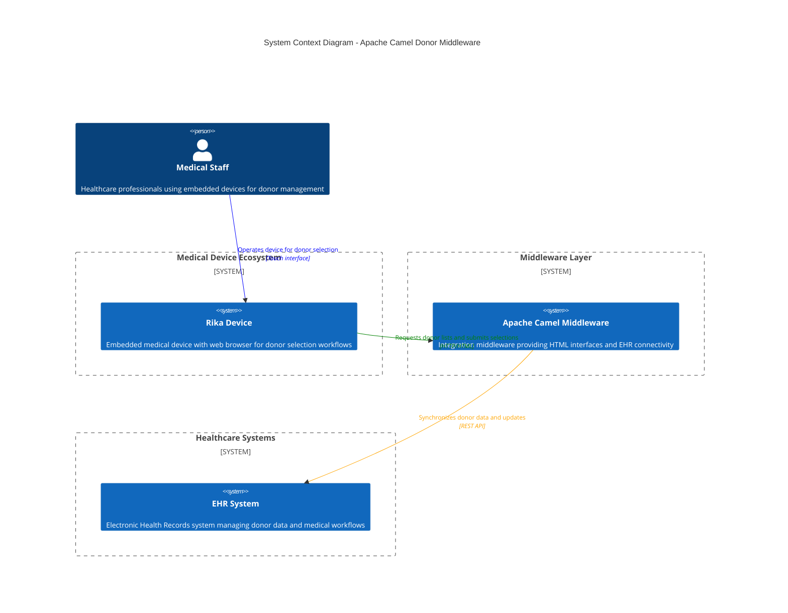
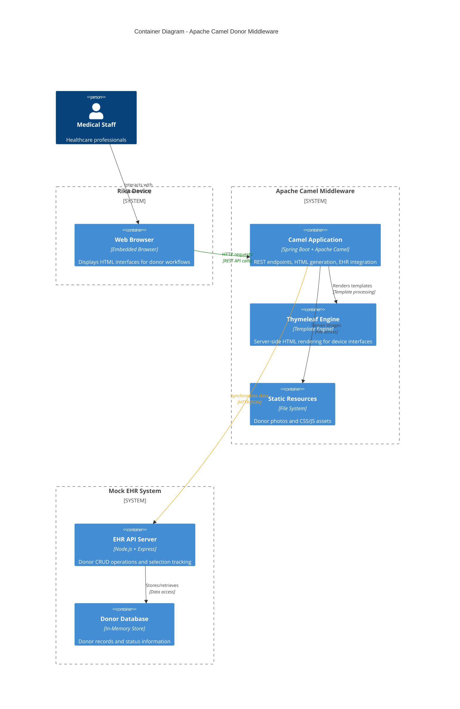

# Apache Camel Donor Middleware

A proof-of-concept demonstrating how embedded medical devices can interact with EHR systems through Apache Camel middleware to manage donor workflows with dynamic HTML interfaces.

## What This Proves

This PoC demonstrates:
- **EHR Integration**: Apache Camel middleware connecting embedded devices to EHR systems
- **Dynamic HTML Generation**: Server-side HTML rendering for embedded device displays
- **Medical Device Workflow**: Complete donor selection and confirmation process
- **Containerized Deployment**: Docker-based solution for easy deployment

## Features

- **Responsive Donor List**: Mobile-friendly interface optimized for embedded devices
- **Donor Details & Confirmation**: Two-step workflow with photo display and confirmation
- **EHR Synchronization**: Real-time updates to EHR system when donors are selected
- **Cookie Management**: Browser cookie storage for donor selection tracking
- **Image Serving**: Static image serving for donor photos

## Quick Start

### Using the Helper Script (Recommended)

```bash
# Start all services
./run.sh start

# Access the application
# Donor List: http://localhost:8080/donors/donor/list

# Run health checks
./run.sh test

# View logs
./run.sh logs

# Stop services
./run.sh stop
```

### Manual Docker Commands

```bash
# Start services
docker-compose up --build -d

# Stop services
docker-compose down

# View logs
docker-compose logs -f
```

## Architecture

### C4 Context Diagram



### Container Diagram



### Key Components

1. **Apache Camel Middleware** (Port 8080)
   - REST API endpoints for donor workflows
   - HTML generation using Thymeleaf templates
   - EHR integration via HTTP routes
   - Static image serving for donor photos
   - Cookie-based session management

2. **Mock EHR Server** (Port 3001)
   - Simulates real EHR system behavior
   - Donor CRUD operations
   - Selection tracking and status updates
   - RESTful API for middleware integration
   - **Web Interface** for donor management and EOR data browsing

## Workflow

### Device Workflow (Camel Middleware)
1. **Browse Donors**: Device loads donor list with photos and status
2. **Select Donor**: Click on donor card to view details
3. **Confirm Selection**: Review details and confirm to update EHR
4. **Cookie Storage**: Donor ID stored in browser cookie for tracking

### EHR Management Workflow (Mock EHR Web Interface)
1. **Dashboard**: Access main dashboard at http://localhost:3001
2. **Donor Management**: Add new donors with comprehensive form including:
   - Full name, first/last name
   - Date of birth, blood group
   - Status (not-available, checked-in, donating, donated)
   - Category (Individual/Corporate)
3. **EOR Data Browser**: View and manage End of Run data:
   - Browse all EOR records in a table format
   - View detailed JSON data in modal popups
   - Delete individual records or clear all data
   - Real-time refresh capabilities

## API Endpoints

### Apache Camel Middleware (Port 8080)

| Method | Endpoint | Description |
|--------|----------|-------------|
| GET | `/donors/donor/list` | HTML donor list page |
| GET | `/donors/donor/{id}/details` | HTML donor details page |
| GET | `/donors/donor/{id}` | JSON donor data |
| POST | `/donors/select/donor` | Donor selection API |
| GET | `/donors/images/{filename}` | Serve donor photos |

### Mock EHR Web Interface (Port 3001)

| Method | Endpoint | Description |
|--------|----------|-------------|
| GET | `/` | Main dashboard with navigation |
| GET | `/donors-interface` | Donor management interface |
| GET | `/eor-interface` | EOR data browser |
| GET | `/api-docs` | API documentation |

### Mock EHR REST API (Port 3001)

| Method | Endpoint | Description |
|--------|----------|-------------|
| GET | `/donors` | Get all donors |
| GET | `/donors/:id` | Get donor by ID |
| POST | `/donors` | Add new donor |
| PUT | `/donors/:id` | Update donor |
| DELETE | `/donors/:id` | Delete donor |
| POST | `/donors/select` | Select donor for processing |
| GET | `/eor` | Get all EOR data |
| POST | `/eor` | Submit EOR data |
| DELETE | `/eor` | Clear all EOR data |

## Run Script Operations

The `run.sh` script provides these operations:

- `start` - Start all services with Docker Compose
- `stop` - Stop all services
- `restart` - Restart all services
- `logs [service]` - Show logs (optionally for specific service)
- `test` - Run health checks and basic tests
- `status` - Show service status and port usage
- `clean` - Stop services and clean up Docker resources
- `open` - Open the donor list in browser
- `reset-donors` - Reset all donors to 'checked-in' status
- `help` - Show help message

## Development

### Prerequisites
- Docker and Docker Compose
- Java 17+ (for local development)
- Node.js 18+ (for local development)
- Maven 3.6+ (for local development)

### Local Development
```bash
# Start Mock EHR
cd mock-ehr
npm install
npm start

# In another terminal, start Camel Middleware
cd camel
mvn spring-boot:run
```

### Project Structure
```
├── camel/                          # Apache Camel Middleware
│   ├── src/main/java/com/terumo/camel/
│   │   ├── model/                  # Data models
│   │   ├── routes/                 # Camel routes
│   │   └── processor/              # Custom processors
│   ├── src/main/resources/
│   │   ├── templates/              # Thymeleaf templates
│   │   ├── static/images/          # Donor photos
│   │   └── application*.yml        # Configuration
│   ├── pom.xml                     # Maven configuration
│   └── Dockerfile                  # Camel container build
├── mock-ehr/                       # Mock EHR Server
│   ├── mock-ehr.js                 # Node.js EHR server
│   ├── package.json                # NPM configuration
│   └── Dockerfile                  # EHR container build
├── docker-compose.yml              # Docker orchestration
├── run.sh                          # Helper script
├── README.md                       # Project documentation
└── Camel.md                        # Apache Camel concepts
```

## Configuration

Key environment variables:
- `EHR_BASE_URL` - Mock EHR server URL (default: http://localhost:3001)
- `SPRING_PROFILES_ACTIVE` - Spring profile (default/docker)

## Troubleshooting

### Common Issues

1. **Port Conflicts**: Change ports in `docker-compose.yml`
2. **EHR Connection**: Verify `EHR_BASE_URL` configuration
3. **Images Not Loading**: Check donor photos in `camel/src/main/resources/static/images/`

### View Logs
```bash
# All services
./run.sh logs

# Specific service
./run.sh logs camel-middleware
./run.sh logs mock-ehr