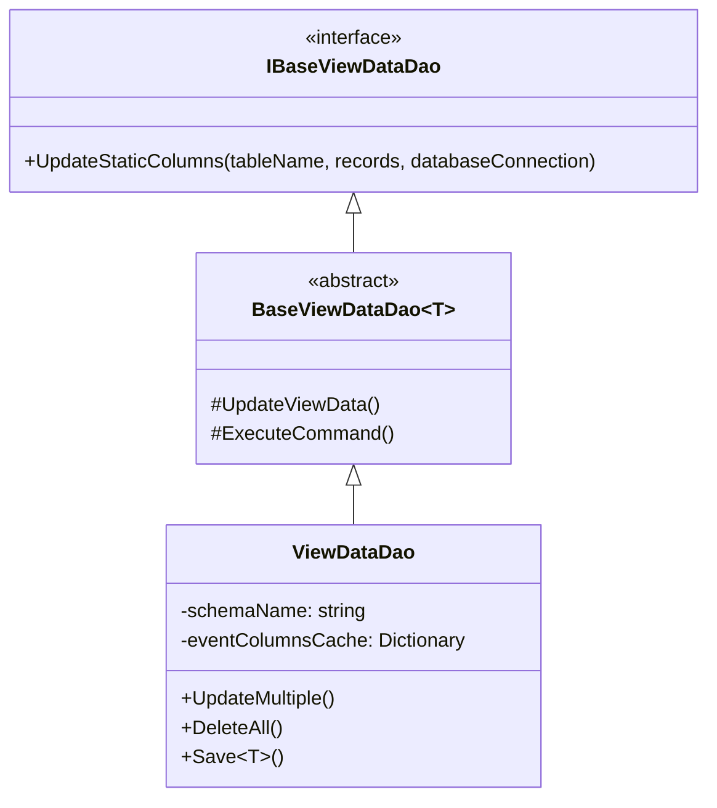
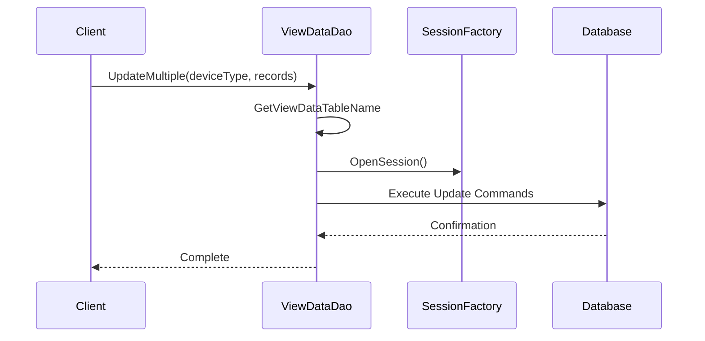
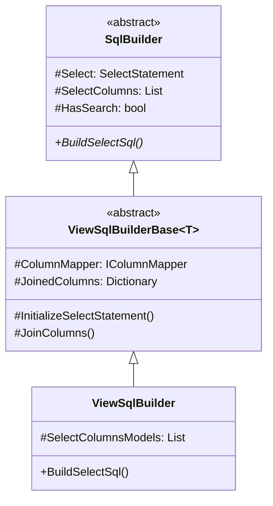
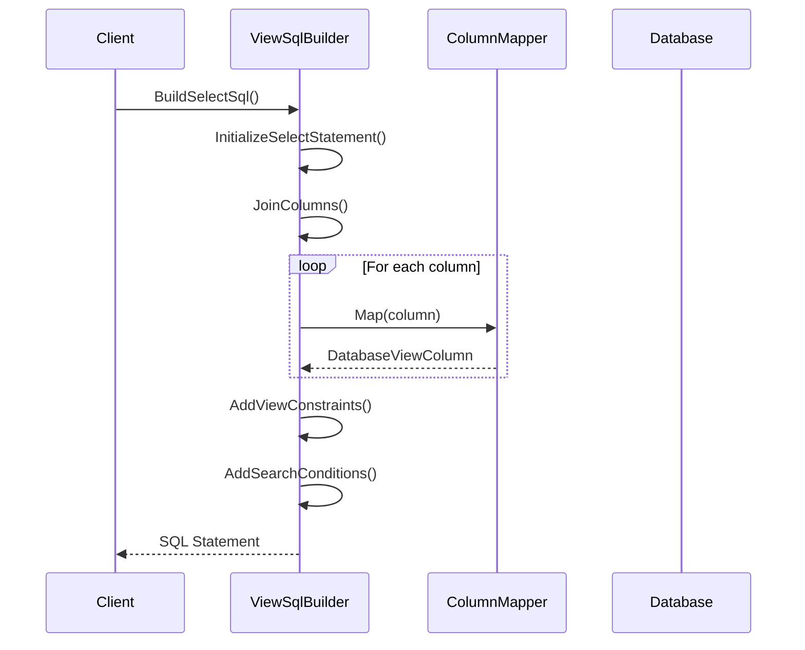
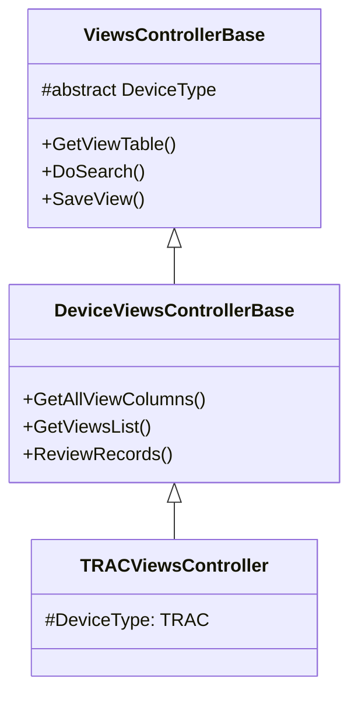
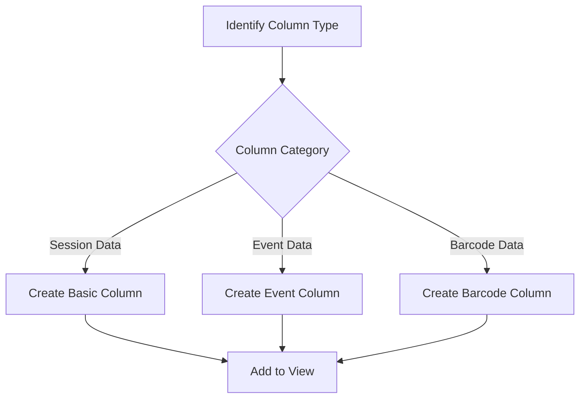
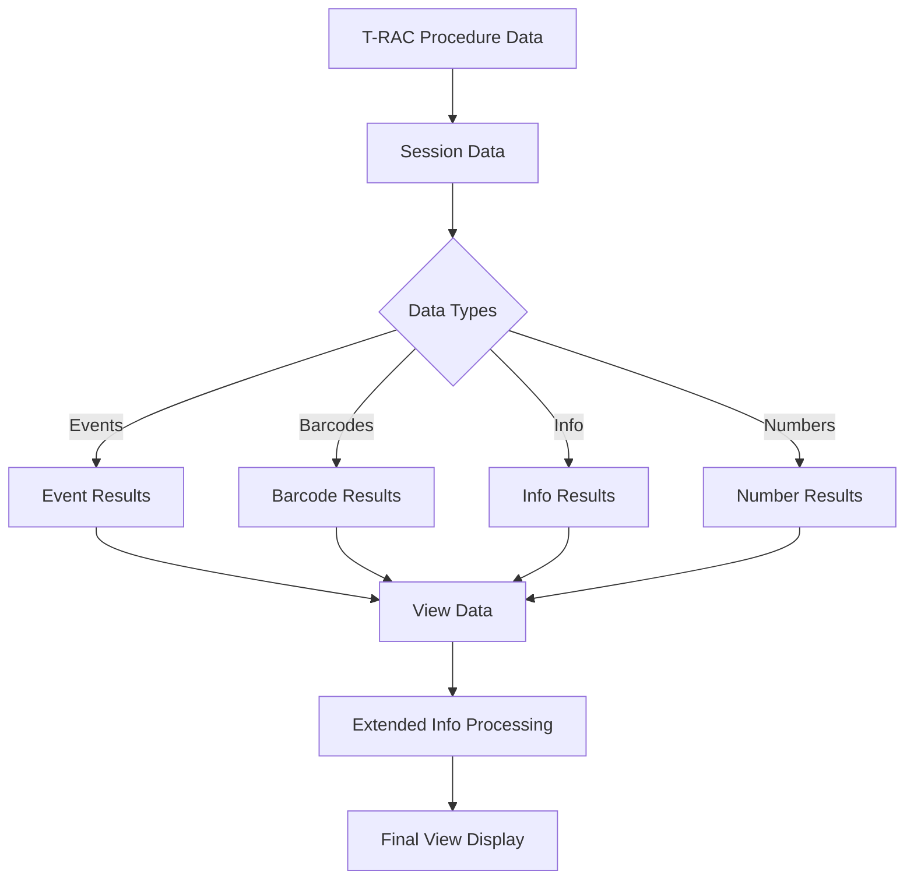

# TOMEs Views System Technical Analysis 📊

## 1. Base Architecture Analysis ⚙️

### Core Components 🏗️

The Views system is built on a robust hierarchical architecture with clear separation of concerns:



### Key Architectural Patterns 🎯

1. **Generic Singleton Pattern**
   - `BaseViewDataDao<T>` implements a generic singleton pattern
   - Ensures single instance per view data type
   - Allows for device-specific implementations while sharing common functionality

2. **Data Access Layer Design**
   - Clear separation between interface (`IBaseViewDataDao`) and implementation
   - Abstract base class provides common functionality
   - Concrete implementation (`ViewDataDao`) handles specific data operations

3. **Transaction Management**
   - Uses NHibernate for database operations
   - Supports both transactional and non-transactional operations
   - Proper session management with `using` blocks

### Data Flow Patterns 🔄

1. **View Data Processing**


2. **Session Data Handling**
   - Supports batch processing of session data
   - Dynamic column management for different device types
   - Event-based data tracking system

### Key Technical Aspects �

1. **Column Management**
- Dynamic column addition capability
- Thread-safe column cache management
- Schema-aware operations

2. **Performance Optimizations**
- Caching of event columns
- Batch processing support
- Efficient SQL command generation

3. **Error Handling and Safety**
- Thread-safe operations with proper locking
- Transaction management
- Resource cleanup with `using` statements

### Database Integration 🗄️

1. **Schema Management**
- Default schema configuration
- Dynamic table name generation
- Support for events table structure

2. **SQL Operations**
- Dynamic SQL generation
- Parameterized queries for safety
- Support for bulk operations

## 2. Implementation Details 🛠️

### Core Classes Responsibilities

1. **IBaseViewDataDao**
   - Defines basic view data operations
   - Focus on static column updates
   - Database connection awareness

2. **BaseViewDataDao<T>**
   - Implements core data access functionality
   - Handles SQL command execution
   - Manages database sessions and transactions
   - Provides protected methods for derived classes

3. **ViewDataDao**
   - Implements device-specific operations
   - Manages event column caching
   - Handles batch operations
   - Supports dynamic column addition

### Notable Features 🌟

1. **Dynamic Schema Support**
   - Tables can be dynamically extended
   - Support for device-specific schemas
   - Automatic column management

2. **Event Tracking**
   - Separate event tables per view
   - Cached column definitions
   - Thread-safe operations

3. **Performance Considerations**
   - Column caching mechanism
   - Batch processing support
   - Optimized SQL generation

## 3. SQL Generation System 🔨

### Core SQL Building Architecture



### SQL Generation Pipeline

1. **Initialization Phase**
   - Device-specific table name resolution
   - Schema configuration loading
   - Column mapper initialization
   - Database connection setup

2. **Build Process**


### Advanced Features

1. **Time Zone Management**
   - DateTime and Time column support
   - Configurable timezone handling
   - Local/UTC time conversion

2. **Dynamic Column Handling**
   ```csharp
   protected virtual void JoinDynamicColumn(
       ViewColumnSqlModel column, 
       DatabaseViewColumn dbColumn, 
       DatabaseViewColumn selectDbColumn)
   {
       // Column name generation
       // Events table joining
       // Prefix/suffix handling
   }
   ```

3. **Search & Filtering**
   - Complex search conditions
   - Dynamic constraint building
   - Parameter sanitization

### Performance Optimizations

1. **Column Management**
   - Cached column definitions
   - Efficient join tracking
   - Smart column existence verification

2. **Query Construction**
   - Optimized left joins
   - Smart where clause generation
   - Parameterized query support

### Security Measures

1. **SQL Injection Prevention**
   - Parameter binding
   - Name quoting
   - Input validation

2. **Error Handling**
   - Column existence validation
   - Type safety checks
   - Detailed error reporting

## 4. T-RAC View Implementation Deep Dive 🔬

### View Controller Layer 🌐



1. **Controller Hierarchy** 🏗️
   - Base controller provides common view operations
   - Device controller adds device-specific operations
   - T-RAC controller implements device-specific logic

2. **Security & Authorization** 🔐
   ```csharp
   [AuthorizeDeviceType(DeviceType.TRAC)]
   [AuthorizePermissionsApi(DeviceType.Unknown, PermissionType.Data, Permission.Read)]
   ```
   - Device-type authorization
   - Operation-level permissions
   - Role-based access control

### Data Management Layer ⚙️

1. **T-RAC Views Manager**
   ```csharp
   public class TRACViewsManager : ViewsManager {
       protected override string ColumnsLocalizationResourceFile
           => LocalizationConstants.TRACColumnsLocalizationResourceFile;
       public override DeviceType DeviceType => DeviceType.TRAC;
   }
   ```
   - Manages T-RAC specific view operations
   - Handles localization
   - Implements device-specific logic

2. **View Column Types** 📊
   ```csharp
   public static class TRACViewConstants {
       internal const string SessionDataClass = "SessionData";
       public const string BarcodeResultClass = "BarcodeResults";
       internal const string EventResultClass = "EventResults";
       internal const string InfoResultClass = "InfoResults";
   }
   ```
   - Core session data
   - Barcode handling
   - Event tracking
   - Information management

### Column Construction 🏗️

1. **Column Generation Process**


2. **Device-Specific Columns** 📋
   - Device Information
     ```csharp
     new ViewColumn {
         ColumnName = "TOMEsSerialNumber",
         Type = ViewColumnType.Text,
         CategoryKey = ViewsConstants.DeviceCategory
     }
     ```
   - Process Data
     ```csharp
     new ViewColumn {
         ColumnName = "CollectedVolume",
         Type = ViewColumnType.Integer,
         CategoryKey = ViewsConstants.ProcessCategory
     }
     ```

### Data Flow Integration 🔄

1. **T-RAC Session Data Flow**


2. **Extended Info Processing**
   ```csharp
   public class TRACViewExtendedInfo : TRACExtendedInfo {
       protected override IExtendedInfoFormatter GetAlarmsCountFormatter() {
           return new ViewAlarmsCountFormatter(ExtendedInfoProvider);
       }
       // Additional formatters for incidents, flow info
   }
   ```
   - Alarms aggregation and formatting
   - Incidents tracking
   - Flow information processing
   - HTML-based presentation

3. **Data Transformation Pipeline**
   - Raw session data capture
   - Event type categorization
   - Column mapping and calculations

4. **Column Mapping Process** 📊
   ```mermaid
   graph TD
       A[View Column] --> B{Column Type}
       B -->|Session Data| C[Map Duration/Basic Data]
       B -->|Event Result| D[Map Event Data]
       B -->|Barcode| E[Map Barcode Data]
       C --> F[Apply SQL Formula]
       D --> F
       E --> F
       F --> G[Database View Column]
   ```

5. **Special Column Handling** ⚡
   ```csharp
   // Duration calculation using multiple timestamps
   private DatabaseViewColumn MapDurationColumn(ViewColumn viewColumn, string tableName) {
       return new DatabaseViewColumn(
           tableName,
           new List<string> {
               "StartDonationTimeColumnName",
               "StartFlowTimeColumnName",
               "StopFlowTimeColumnName"
           },
           viewColumn
       ) {
           Formula = "DURATION_CALCULATION_FORMULA"
       };
   }
   ```

6. **Data Enrichment** 🔄
   - Extended info calculation
   - Custom formula application
   - Dynamic column generation

### T-RAC Example View Generation 📊

1. **Typical T-RAC View**
   ```sql
   SELECT
       s.TOMEsSerialNumber,
       s.StartTime,
       s.CollectedVolume,
       CASE
           WHEN s.StartDonationTime IS NOT NULL
           AND s.StopFlowTime IS NOT NULL
           THEN DATEDIFF(minute, s.StartDonationTime, s.StopFlowTime)
       END as Duration,
       e.ResultValue as WeightCheck,
       b.BarcodeValue as DonorID
   FROM SessionData s
   LEFT JOIN EventResults e ON s.Id = e.SessionId
   LEFT JOIN BarcodeResults b ON s.Id = b.SessionId
   ```

2. **Common T-RAC Views**
   - Procedure Overview
     * Basic session information
     * Duration and volumes
     * Key events (Weight Check, Program Choice)
   - Barcode Analysis
     * Donor identification
     * Product tracking
     * BBMS integration
   - Flow Analysis
     * Start/stop times
     * Flow rates
     * Alarms and incidents

## 5. Integration Points �

1. **Session Management**
   - Integration with NHibernate
   - Custom session factory usage
   - Transaction support

2. **Configuration**
   - Database connection management
   - Schema configuration
   - Device-specific settings

3. **Data Models**
   - View data column models
   - Session data integration
   - Event data tracking

## 6. Technical Observations 🔍

### Strengths 💪
1. Well-structured class hierarchy
2. Thread-safe implementation
3. Efficient caching mechanism
4. Support for dynamic schema evolution
5. Clean separation of concerns

### Areas for Attention ⚠️
1. Cache invalidation complexity
2. Potential for database schema drift
3. Transaction boundary management
4. Thread synchronization overhead

## 7. Next Steps 🎯

1. Advanced Query Analysis
   - Complex join patterns
   - Performance optimization
   - Query plan analysis

2. Extended Feature Implementation
   - Additional column types
   - Custom event handlers
   - Enhanced filtering

3. Integration Enhancements
   - Cross-device view support
   - Real-time data updates
   - Advanced search capabilities