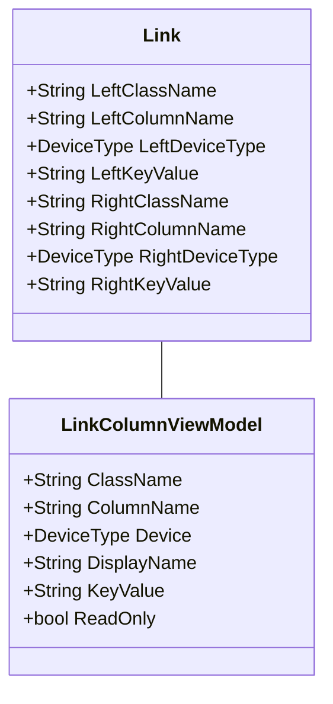
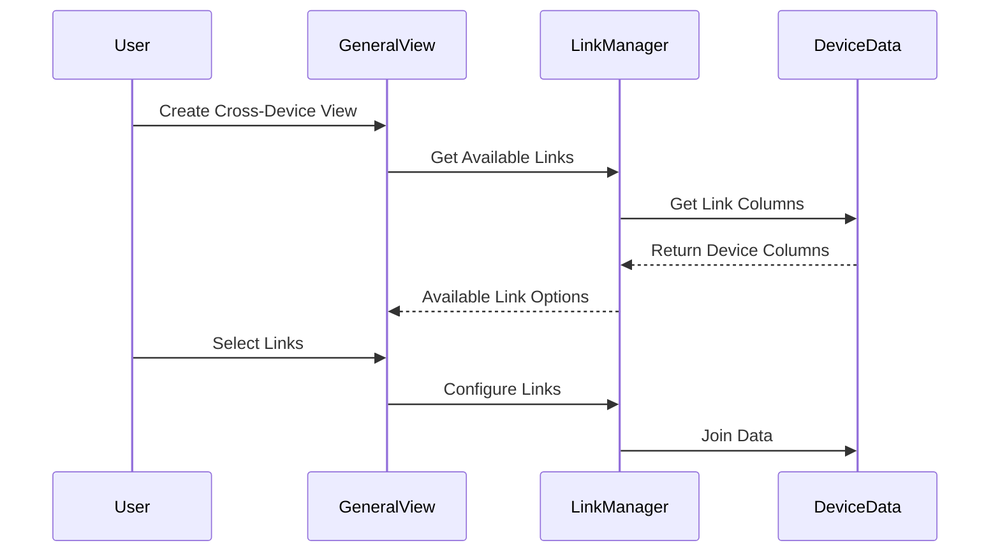
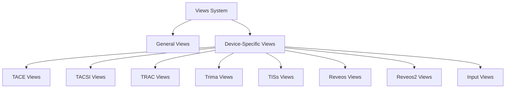
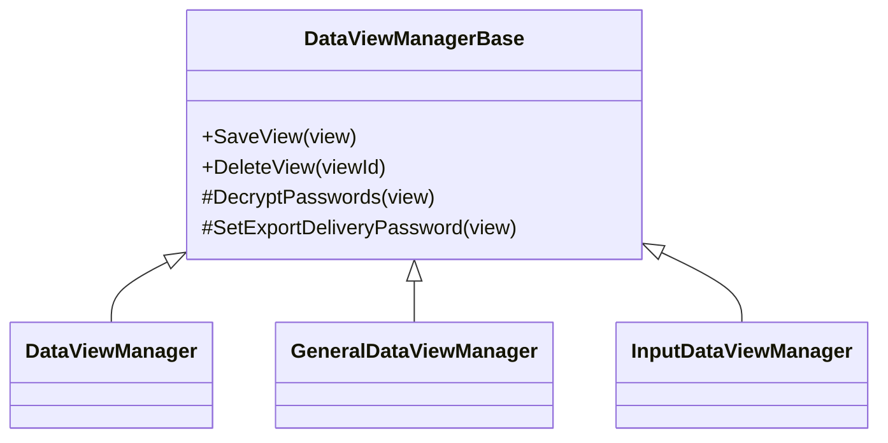

# TOMEs Views System Technical Design 🔍

## Overview 📋

The TOMEs Views System is a sophisticated reporting mechanism that provides configurable views across multiple device types. The system supports both device-specific views and general views that can combine data from multiple devices through a powerful linking system.

## Cross-Device Linking System 🔗

### Link Structure

### Link Components

#### 1. Link Definition
- **Two-sided Structure**
  - Left side (source): Device type, class, column info
  - Right side (target): Device type, class, column info
- **Key Values**: Unique identifiers for link relationships
- **Class Names**: Data classification/categorization

#### 2. Link Column Management
- **Display Names**: Localized column representations
- **Read-only Status**: Column modification control
- **Key Value Mapping**: Link relationship tracking

#### 3. Device Linking Features
- Cross-device data relationships
- Automatic column mapping
- Relationship validation
- Dynamic link resolution

### Linking Process

### Link Types

1. **Direct Links**
   - One-to-one device relationships
   - Exact column matches
   - Direct value comparisons

2. **Compound Links**
   - Multiple column relationships
   - Complex join conditions
   - Cross-device data aggregation

3. **Dynamic Links**
   - Runtime relationship resolution
   - Conditional linking
   - Context-aware connections

## Device Type Support 📱

### Supported Devices

### Device-Specific Features
1. Custom column definitions
2. Specialized validation rules
3. Device-specific data formats
4. Unique linking capabilities

## View Architecture 🏗️

### 1. Base Components 

### 2. Data Management
1. **Column Management**
   - Dynamic columns
   - Link columns
   - Device-specific columns
   - Export status columns

2. **Data Access**
   - Device-specific tables
   - Link relationships
   - Event data storage
   - Performance optimization

### 3. Security 
1. **Access Control**
   - Device licensing
   - View permissions
   - Link restrictions

2. **Data Protection**
   - Password encryption
   - Secure delivery
   - Audit logging

## Implementation Best Practices 💡

### 1. Link Configuration
- Validate link relationships
- Ensure proper column mapping
- Maintain link documentation
- Monitor link performance

### 2. Performance Optimization
- Cache link definitions
- Optimize join operations
- Monitor query performance
- Implement efficient caching

### 3. Security Considerations
- Validate link permissions
- Secure cross-device access
- Maintain audit trails
- Encrypt sensitive data

### 4. Error Handling
- Validate link integrity
- Handle missing relationships
- Provide clear error messages
- Log link failures

## Integration Points 🔌

### 1. Device Systems
- Device data access
- Column mapping
- Event synchronization
- Link validation

### 2. Security Systems
- Authentication
- Authorization
- Audit logging
- License validation

### 3. Export Systems
- Data formatting
- File generation
- Delivery handling
- Status tracking

## Best Practices 💡

### 1. Link Management
- Document link relationships
- Validate data integrity
- Monitor link performance
- Maintain link documentation

### 2. Performance
- Optimize join operations
- Cache link definitions
- Monitor query execution
- Implement efficient indexing

### 3. Security
- Validate permissions
- Secure data access
- Maintain audit logs
- Protect sensitive data