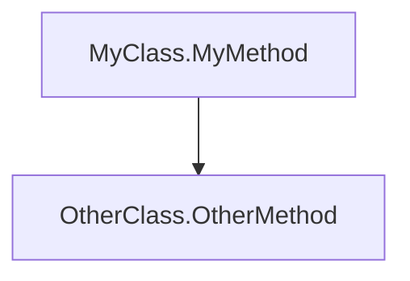

# CSEA - Code Structure Extraction and Analysis

CSEA is a .NET Core tool for analyzing C# codebases. It extracts structural information about classes, interfaces, methods, and their relationships, and can optionally strip code while preserving structure.

## Features

- Extract code structure from .cs files, .csproj projects, and .sln solutions
- Generate detailed analysis reports including:
  - Abstract classes and their members
  - Interfaces and their methods
  - Method call graphs
  - NuGet package dependencies
- Strip code while preserving structure (useful for sharing code samples)
- Generate Mermaid.js flowcharts for method call graphs

## Installation

### As a Global Tool
1. Ensure you have .NET 6.0 or later installed
2. From the root directory, install the tool:
```bash
dotnet tool install --global --add-source src/CSEA.Core/nupkg csea
```

### From Source
1. Clone this repository
2. Navigate to the tools/CSEA directory
3. Build the tool:
```bash
dotnet build
```

## Usage

### Basic Analysis
To analyze a single C# file:
```bash
csea --path MyFile.cs --output ./output
```

To analyze a project:
```bash
csea --path MyProject.csproj --output ./output
```

To analyze a solution:
```bash
csea --path MySolution.sln --output ./output
```

### Code Stripping
To strip code while preserving structure:
```bash
csea --path MyFile.cs --output ./output --strip-code
```

### Command Line Options

| Option                  | Description                                      | Required |
|-------------------------|--------------------------------------------------|----------|
| `--path`                | Path to .cs file, .csproj project, or .sln file  | Yes      |
| `--output`              | Output directory for analysis reports            | Yes      |
| `--strip-code`          | Strip code while preserving structure            | No       |
| `--include-tests`       | Include test projects in analysis                | No       |
| `--verbose`             | Show detailed error information                  | No       |
| `--include-namespaces`  | Comma-separated namespaces to include in analysis| No       |
| `--exclude-namespaces`  | Comma-separated namespaces to exclude from analysis | No     |

## Output Format

The tool generates a markdown report with the following sections:

1. **Abstract Classes** - Lists abstract classes with their methods and properties
2. **Interfaces** - Lists interfaces with their method signatures
3. **Method Call Graph** - Visualizes method call relationships using Mermaid.js
4. **NuGet Packages** - Lists NuGet package dependencies by project

Example report structure:
```markdown
# Solution Analysis

## Abstract Classes
### MyAbstractClass
- Namespace: MyNamespace
- Location: src/MyFile.cs
- Methods:
  - public abstract void MyMethod(string param)

## Interfaces
### IMyInterface
- Namespace: MyNamespace
- Location: src/MyFile.cs
- Methods:
  - void MyMethod(string param)

## Method Call Graph


## NuGet Packages
### MyProject.csproj
- Newtonsoft.Json
- Microsoft.Extensions.Logging
```

## Requirements

- .NET 6.0 or later
- MSBuild (for project/solution analysis)
- Roslyn compiler services

## License

MIT License
